# Chapter 27: Assessment and Validation - Evaluating System Performance

## Learning Objectives
- Evaluate the performance of the integrated robotics system
- Implement comprehensive testing methodologies for complex systems
- Analyze system behavior under various conditions and scenarios
- Validate system safety, reliability, and performance metrics
- Document and report assessment results

## Introduction
Assessment and validation are critical phases in any robotics project, especially for complex integrated systems. This chapter covers methodologies for evaluating system performance, conducting comprehensive testing, and validating that the implemented system meets all requirements and specifications.

## Core Concepts

### 1. Performance Metrics
Quantitative measures used to evaluate system effectiveness, including accuracy, precision, response time, and resource utilization.

### 2. Validation vs Verification
Validation ensures the system meets user needs, while verification ensures the system meets its specifications.

### 3. Safety Assessment
Systematic evaluation of safety measures and risk mitigation strategies.

### 4. Stress Testing
Testing system behavior under extreme conditions to identify failure points and performance limits.

## Architecture/Flow Diagram

```mermaid
graph TD
    A[System Assessment] --> B[Performance Testing]
    A --> C[Safety Validation]
    A --> D[Reliability Testing]
    A --> E[Stress Testing]
    A --> F[Acceptance Testing]

    B --> B1[Accuracy Metrics]
    B --> B2[Response Time]
    B --> B3[Resource Usage]
    B --> B4[Throughput Analysis]

    C --> C1[Hazard Analysis]
    C --> C2[Safety Protocols]
    C --> C3[Emergency Procedures]
    C --> C4[Risk Assessment]

    D --> D1[Failure Rate]
    D --> D2[Mean Time Between Failures]
    D --> D3[System Availability]
    D --> D4[Recovery Procedures]

    E --> E1[Load Testing]
    E --> E2[Stress Limits]
    E --> E3[Bottleneck Analysis]
    E --> E4[Degradation Patterns]

    F --> F1[Requirement Validation]
    F --> F2[User Acceptance]
    F --> F3[Scenario Testing]
    F --> F4[Compliance Checking]

    B1 --> G[Performance Report]
    C1 --> G
    D1 --> G
    E1 --> G
    F1 --> G
```



## Practical Tutorials

### Tutorial 1: Implementing a Comprehensive Assessment Framework

Let's create a framework for assessing the integrated robotics system:

```python
import json
import datetime
import statistics
from typing import Dict, List, Any, Optional, Callable
from dataclasses import dataclass, field
from enum import Enum
import time
import threading
import numpy as np
import matplotlib.pyplot as plt
import pandas as pd

class AssessmentType(Enum):
    PERFORMANCE = "performance"
    SAFETY = "safety"
    RELIABILITY = "reliability"
    STRESS = "stress"
    ACCEPTANCE = "acceptance"

class AssessmentStatus(Enum):
    NOT_STARTED = "not_started"
    RUNNING = "running"
    COMPLETED = "completed"
    FAILED = "failed"

@dataclass
class TestResult:
    test_id: str
    name: str
    type: AssessmentType
    status: AssessmentStatus
    start_time: datetime.datetime
    end_time: Optional[datetime.datetime] = None
    metrics: Dict[str, Any] = field(default_factory=dict)
    details: Dict[str, Any] = field(default_factory=dict)
    error_message: Optional[str] = None

@dataclass
class PerformanceMetric:
    name: str
    value: float
    unit: str
    target: Optional[float] = None
    pass_threshold: Optional[float] = None

class AssessmentFramework:
    """Comprehensive framework for assessing robotics system performance."""

    def __init__(self, system_name: str):
        self.system_name = system_name
        self.test_results: List[TestResult] = []
        self.metrics: List[PerformanceMetric] = []
        self.assessment_running = False
        self.assessment_thread: Optional[threading.Thread] = None

    def add_performance_metric(self, metric: PerformanceMetric) -> None:
        """Add a performance metric to track."""
        self.metrics.append(metric)

    def run_performance_test(self, test_name: str, test_func: Callable) -> TestResult:
        """Run a performance test and record results."""
        test_id = f"perf_{len(self.test_results) + 1:03d}"
        start_time = datetime.datetime.now()

        result = TestResult(
            test_id=test_id,
            name=test_name,
            type=AssessmentType.PERFORMANCE,
            status=AssessmentStatus.RUNNING,
            start_time=start_time
        )

        try:
            test_metrics = test_func()
            result.metrics = test_metrics
            result.status = AssessmentStatus.COMPLETED
        except Exception as e:
            result.status = AssessmentStatus.FAILED
            result.error_message = str(e)
            result.metrics = {}

        result.end_time = datetime.datetime.now()
        self.test_results.append(result)

        return result

    def run_safety_assessment(self, test_name: str, test_func: Callable) -> TestResult:
        """Run a safety assessment test."""
        test_id = f"safety_{len(self.test_results) + 1:03d}"
        start_time = datetime.datetime.now()

        result = TestResult(
            test_id=test_id,
            name=test_name,
            type=AssessmentType.SAFETY,
            status=AssessmentStatus.RUNNING,
            start_time=start_time
        )

        try:
            safety_metrics = test_func()
            result.metrics = safety_metrics
            result.status = AssessmentStatus.COMPLETED
        except Exception as e:
            result.status = AssessmentStatus.FAILED
            result.error_message = str(e)
            result.metrics = {}

        result.end_time = datetime.datetime.now()
        self.test_results.append(result)

        return result

    def run_reliability_test(self, test_name: str, test_func: Callable) -> TestResult:
        """Run a reliability test."""
        test_id = f"reliab_{len(self.test_results) + 1:03d}"
        start_time = datetime.datetime.now()

        result = TestResult(
            test_id=test_id,
            name=test_name,
            type=AssessmentType.RELIABILITY,
            status=AssessmentStatus.RUNNING,
            start_time=start_time
        )

        try:
            reliability_metrics = test_func()
            result.metrics = reliability_metrics
            result.status = AssessmentStatus.COMPLETED
        except Exception as e:
            result.status = AssessmentStatus.FAILED
            result.error_message = str(e)
            result.metrics = {}

        result.end_time = datetime.datetime.now()
        self.test_results.append(result)

        return result

    def run_stress_test(self, test_name: str, test_func: Callable) -> TestResult:
        """Run a stress test."""
        test_id = f"stress_{len(self.test_results) + 1:03d}"
        start_time = datetime.datetime.now()

        result = TestResult(
            test_id=test_id,
            name=test_name,
            type=AssessmentType.STRESS,
            status=AssessmentStatus.RUNNING,
            start_time=start_time
        )

        try:
            stress_metrics = test_func()
            result.metrics = stress_metrics
            result.status = AssessmentStatus.COMPLETED
        except Exception as e:
            result.status = AssessmentStatus.FAILED
            result.error_message = str(e)
            result.metrics = {}

        result.end_time = datetime.datetime.now()
        self.test_results.append(result)

        return result

    def calculate_composite_score(self) -> float:
        """Calculate a composite assessment score based on all tests."""
        if not self.test_results:
            return 0.0

        # Calculate scores for each assessment type
        scores = {
            AssessmentType.PERFORMANCE: [],
            AssessmentType.SAFETY: [],
            AssessmentType.RELIABILITY: [],
            AssessmentType.STRESS: [],
            AssessmentType.ACCEPTANCE: []
        }

        for result in self.test_results:
            if result.status == AssessmentStatus.COMPLETED:
                # Calculate a basic score based on metrics
                score = self._calculate_test_score(result)
                scores[result.type].append(score)

        # Calculate weighted average
        weights = {
            AssessmentType.PERFORMANCE: 0.25,
            AssessmentType.SAFETY: 0.30,  # Safety gets higher weight
            AssessmentType.RELIABILITY: 0.25,
            AssessmentType.STRESS: 0.10,
            AssessmentType.ACCEPTANCE: 0.10
        }

        total_score = 0.0
        for test_type, test_scores in scores.items():
            if test_scores:
                avg_score = sum(test_scores) / len(test_scores)
                total_score += avg_score * weights[test_type]

        return total_score

    def _calculate_test_score(self, result: TestResult) -> float:
        """Calculate a score for a single test result."""
        # This is a simplified scoring algorithm
        # In practice, this would be more sophisticated
        if result.status != AssessmentStatus.COMPLETED:
            return 0.0

        # Check if all metrics meet their targets
        if not result.metrics:
            return 1.0  # Default high score if no metrics to check

        # Example: check if metrics meet targets
        met_targets = 0
        total_targets = 0

        for metric_name, value in result.metrics.items():
            if isinstance(value, dict) and 'target' in value and 'value' in value:
                if value['value'] >= value['target']:
                    met_targets += 1
                total_targets += 1

        return met_targets / total_targets if total_targets > 0 else 1.0

    def generate_assessment_report(self) -> Dict[str, Any]:
        """Generate a comprehensive assessment report."""
        completed_tests = [r for r in self.test_results if r.status == AssessmentStatus.COMPLETED]
        failed_tests = [r for r in self.test_results if r.status == AssessmentStatus.FAILED]

        # Calculate metrics by type
        metrics_by_type = {}
        for test_type in AssessmentType:
            type_tests = [r for r in completed_tests if r.type == test_type]
            if type_tests:
                metrics_by_type[test_type.value] = {
                    'count': len(type_tests),
                    'average_duration': statistics.mean([
                        (r.end_time - r.start_time).total_seconds() for r in type_tests
                    ]) if type_tests else 0
                }

        # Calculate pass rates
        total_tests = len(self.test_results)
        passed_tests = len(completed_tests)
        pass_rate = passed_tests / total_tests if total_tests > 0 else 0

        # Calculate composite score
        composite_score = self.calculate_composite_score()

        report = {
            "system_name": self.system_name,
            "assessment_date": datetime.datetime.now().isoformat(),
            "total_tests": total_tests,
            "passed_tests": passed_tests,
            "failed_tests": len(failed_tests),
            "pass_rate": pass_rate,
            "composite_score": composite_score,
            "metrics_by_type": metrics_by_type,
            "detailed_results": [
                {
                    "test_id": r.test_id,
                    "name": r.name,
                    "type": r.type.value,
                    "status": r.status.value,
                    "duration": (r.end_time - r.start_time).total_seconds() if r.end_time else 0,
                    "metrics": r.metrics,
                    "error": r.error_message
                }
                for r in self.test_results
            ]
        }

        return report

    def export_results(self, filename: str) -> None:
        """Export assessment results to a file."""
        report = self.generate_assessment_report()

        with open(filename, 'w') as f:
            json.dump(report, f, indent=2, default=str)

        print(f"Assessment report exported to {filename}")

# Example usage
def example_assessment_framework():
    """Example of using the assessment framework."""

    # Create assessment framework
    framework = AssessmentFramework("Warehouse Robot System")

    # Define some example test functions
    def navigation_accuracy_test():
        """Test navigation accuracy."""
        # Simulate navigation test
        import random
        accuracy = random.uniform(0.05, 0.15)  # meters
        target_accuracy = 0.1  # meters

        return {
            "accuracy": {"value": accuracy, "target": target_accuracy, "unit": "meters"},
            "success_rate": {"value": 0.95, "target": 0.90, "unit": "ratio"}
        }

    def safety_response_test():
        """Test safety system response."""
        response_time = random.uniform(0.05, 0.12)  # seconds
        target_response = 0.1  # seconds

        return {
            "response_time": {"value": response_time, "target": target_response, "unit": "seconds"},
            "detection_rate": {"value": 0.98, "target": 0.95, "unit": "ratio"}
        }

    def system_reliability_test():
        """Test system reliability."""
        uptime = random.uniform(0.98, 0.999)  # 98-99.9%
        target_uptime = 0.98

        return {
            "uptime": {"value": uptime, "target": target_uptime, "unit": "ratio"},
            "mean_time_between_failures": {"value": 120, "target": 100, "unit": "hours"}
        }

    # Run tests
    print("Running performance tests...")
    framework.run_performance_test("Navigation Accuracy", navigation_accuracy_test)
    framework.run_performance_test("Path Planning Efficiency", lambda: {
        "planning_time": {"value": 0.05, "target": 0.1, "unit": "seconds"},
        "path_optimality": {"value": 0.92, "target": 0.90, "unit": "ratio"}
    })

    print("Running safety tests...")
    framework.run_safety_assessment("Emergency Stop Response", safety_response_test)
    framework.run_safety_assessment("Collision Avoidance", lambda: {
        "detection_distance": {"value": 1.2, "target": 1.0, "unit": "meters"},
        "avoidance_success_rate": {"value": 0.99, "target": 0.98, "unit": "ratio"}
    })

    print("Running reliability tests...")
    framework.run_reliability_test("System Uptime", system_reliability_test)
    framework.run_reliability_test("Component Failover", lambda: {
        "failover_time": {"value": 2.5, "target": 5.0, "unit": "seconds"},
        "recovery_success_rate": {"value": 1.0, "target": 0.95, "unit": "ratio"}
    })

    # Generate and print report
    report = framework.generate_assessment_report()
    print(f"\nAssessment Report:")
    print(f"System: {report['system_name']}")
    print(f"Pass Rate: {report['pass_rate']:.2%}")
    print(f"Composite Score: {report['composite_score']:.2f}")
    print(f"Total Tests: {report['total_tests']}")
    print(f"Passed: {report['passed_tests']}, Failed: {report['failed_tests']}")

    # Export results
    framework.export_results("assessment_report.json")

    return framework

if __name__ == "__main__":
    example_assessment_framework()
```

### Tutorial 2: Implementing Scenario-Based Testing

Let's create a scenario-based testing framework for validating system behavior in real-world situations:

```python
from dataclasses import dataclass
from typing import Dict, List, Any, Callable
import random
import time
from enum import Enum

class ScenarioType(Enum):
    NAVIGATION = "navigation"
    MANIPULATION = "manipulation"
    PERCEPTION = "perception"
    SAFETY = "safety"
    COORDINATION = "coordination"

class ScenarioStatus(Enum):
    NOT_STARTED = "not_started"
    RUNNING = "running"
    COMPLETED = "completed"
    FAILED = "failed"
    ABORTED = "aborted"

@dataclass
class ScenarioStep:
    step_id: str
    description: str
    action: Callable
    expected_outcome: str
    timeout: float = 30.0
    critical: bool = False

@dataclass
class TestScenario:
    scenario_id: str
    name: str
    type: ScenarioType
    description: str
    steps: List[ScenarioStep]
    environment_conditions: Dict[str, Any]
    success_criteria: List[str]

class ScenarioBasedTester:
    """Framework for scenario-based testing of robotics systems."""

    def __init__(self, assessment_framework: AssessmentFramework):
        self.assessment_framework = assessment_framework
        self.scenarios: List[TestScenario] = []
        self.current_scenario: Optional[TestScenario] = None
        self.scenario_results: List[Dict[str, Any]] = []

    def add_scenario(self, scenario: TestScenario) -> None:
        """Add a test scenario."""
        self.scenarios.append(scenario)
        print(f"Scenario '{scenario.name}' added to test suite")

    def run_scenario(self, scenario_id: str) -> Dict[str, Any]:
        """Run a specific test scenario."""
        scenario = next((s for s in self.scenarios if s.scenario_id == scenario_id), None)
        if not scenario:
            return {"status": "error", "message": f"Scenario {scenario_id} not found"}

        self.current_scenario = scenario
        start_time = datetime.datetime.now()

        result = {
            "scenario_id": scenario_id,
            "name": scenario.name,
            "type": scenario.type.value,
            "status": ScenarioStatus.RUNNING.value,
            "start_time": start_time.isoformat(),
            "steps_completed": 0,
            "steps_total": len(scenario.steps),
            "step_results": [],
            "environment_conditions": scenario.environment_conditions,
            "success_criteria_met": [],
            "failure_reasons": []
        }

        try:
            for step in scenario.steps:
                step_result = self._execute_scenario_step(step)
                result["step_results"].append(step_result)

                if step_result["status"] == "failed":
                    result["failure_reasons"].append(step_result["error"])
                    if step.critical:
                        result["status"] = ScenarioStatus.FAILED.value
                        break

            if result["status"] != ScenarioStatus.FAILED.value:
                # Check success criteria
                criteria_met = self._check_success_criteria(scenario)
                result["success_criteria_met"] = criteria_met
                result["status"] = ScenarioStatus.COMPLETED.value if all(criteria_met) else ScenarioStatus.FAILED.value

        except Exception as e:
            result["status"] = ScenarioStatus.FAILED.value
            result["error"] = str(e)

        result["end_time"] = datetime.datetime.now().isoformat()
        result["duration"] = (datetime.datetime.fromisoformat(result["end_time"]) -
                             datetime.datetime.fromisoformat(result["start_time"])).total_seconds()

        self.scenario_results.append(result)
        return result

    def _execute_scenario_step(self, step: ScenarioStep) -> Dict[str, Any]:
        """Execute a single scenario step."""
        step_result = {
            "step_id": step.step_id,
            "description": step.description,
            "status": "executing",
            "start_time": datetime.datetime.now().isoformat()
        }

        try:
            # Execute the step action
            action_result = step.action()

            # Check if the outcome matches expectations
            # This would typically involve checking system state, sensor data, etc.
            success = self._verify_step_outcome(action_result, step.expected_outcome)

            step_result["status"] = "completed" if success else "failed"
            step_result["action_result"] = action_result
            step_result["expected_outcome"] = step.expected_outcome
            step_result["actual_outcome"] = str(action_result)

        except Exception as e:
            step_result["status"] = "failed"
            step_result["error"] = str(e)

        step_result["end_time"] = datetime.datetime.now().isoformat()
        return step_result

    def _verify_step_outcome(self, actual_result: Any, expected_outcome: str) -> bool:
        """Verify that the step outcome matches expectations."""
        # This would be implemented based on the specific system and step
        # For now, we'll use a simple string comparison
        return str(actual_result) == expected_outcome

    def _check_success_criteria(self, scenario: TestScenario) -> List[bool]:
        """Check if scenario success criteria are met."""
        # This would involve checking the overall scenario outcome against success criteria
        # For now, we'll return a simple check
        results = []
        for criterion in scenario.success_criteria:
            # In a real implementation, this would check actual system behavior
            # against the success criterion
            results.append(random.choice([True, True, True, False]))  # 75% success rate for demo
        return results

    def run_all_scenarios(self) -> Dict[str, Any]:
        """Run all registered scenarios."""
        results = {
            "total_scenarios": len(self.scenarios),
            "completed_scenarios": 0,
            "failed_scenarios": 0,
            "scenario_results": []
        }

        for scenario in self.scenarios:
            print(f"Running scenario: {scenario.name}")
            result = self.run_scenario(scenario.scenario_id)
            results["scenario_results"].append(result)

            if result["status"] == ScenarioStatus.COMPLETED.value:
                results["completed_scenarios"] += 1
            else:
                results["failed_scenarios"] += 1

        results["success_rate"] = results["completed_scenarios"] / results["total_scenarios"] if results["total_scenarios"] > 0 else 0
        return results

# Example scenario definitions
def create_navigation_scenarios() -> List[TestScenario]:
    """Create navigation-related test scenarios."""

    def move_to_waypoint():
        """Simulate moving to a waypoint."""
        # In real implementation, this would interface with navigation system
        time.sleep(1)  # Simulate movement time
        success = random.choice([True, True, True, False])  # 75% success
        return {"success": success, "distance": random.uniform(0.05, 0.2), "time": random.uniform(10, 30)}

    def detect_obstacle():
        """Simulate obstacle detection."""
        time.sleep(0.5)  # Simulate detection time
        return {"detected": True, "distance": random.uniform(0.5, 2.0)}

    def avoid_collision():
        """Simulate collision avoidance."""
        time.sleep(1)  # Simulate avoidance maneuver
        success = random.choice([True, True, True, True, False])  # 80% success
        return {"success": success, "new_path": "safe_route", "time": random.uniform(2, 5)}

    scenarios = [
        TestScenario(
            scenario_id="nav_001",
            name="Basic Navigation to Waypoint",
            type=ScenarioType.NAVIGATION,
            description="Robot navigates from start to goal position",
            steps=[
                ScenarioStep("step_1", "Initialize navigation system", lambda: {"status": "ready"}, "ready", 10),
                ScenarioStep("step_2", "Set navigation goal", move_to_waypoint, "success", 45, critical=True),
                ScenarioStep("step_3", "Verify arrival", lambda: {"arrived": True}, "True", 10)
            ],
            environment_conditions={"floor_type": "smooth", "obstacles": "low", "lighting": "normal"},
            success_criteria=["reached_goal", "no_collision", "time_efficient"]
        ),
        TestScenario(
            scenario_id="nav_002",
            name="Obstacle Detection and Avoidance",
            type=ScenarioType.NAVIGATION,
            description="Robot detects and avoids obstacles during navigation",
            steps=[
                ScenarioStep("step_1", "Start navigation", move_to_waypoint, "success", 45),
                ScenarioStep("step_2", "Detect obstacle", detect_obstacle, "detected", 10, critical=True),
                ScenarioStep("step_3", "Execute avoidance", avoid_collision, "success", 20, critical=True),
                ScenarioStep("step_4", "Continue to goal", move_to_waypoint, "success", 45)
            ],
            environment_conditions={"floor_type": "smooth", "obstacles": "medium", "lighting": "normal"},
            success_criteria=["obstacle_detected", "collision_avoided", "goal_reached"]
        )
    ]

    return scenarios

def create_safety_scenarios() -> List[TestScenario]:
    """Create safety-related test scenarios."""

    def emergency_stop():
        """Simulate emergency stop."""
        time.sleep(0.1)  # Simulate stop time
        return {"stopped": True, "time": 0.1}

    def safety_zone_violation():
        """Simulate safety zone violation."""
        time.sleep(0.5)
        return {"violation_detected": True, "distance": 0.3}

    def safe_restart():
        """Simulate safe system restart after emergency."""
        time.sleep(2)  # Simulate restart time
        return {"restarted": True, "systems_ok": True}

    scenarios = [
        TestScenario(
            scenario_id="safety_001",
            name="Emergency Stop Response",
            type=ScenarioType.SAFETY,
            description="Robot responds correctly to emergency stop signal",
            steps=[
                ScenarioStep("step_1", "Start robot movement", lambda: {"moving": True}, "True", 10),
                ScenarioStep("step_2", "Trigger emergency stop", emergency_stop, "stopped", 5, critical=True),
                ScenarioStep("step_3", "Verify stopped state", lambda: {"status": "stopped"}, "stopped", 5)
            ],
            environment_conditions={"emergency_stop_available": True},
            success_criteria=["stopped_immediately", "no_damage", "safe_state"]
        )
    ]

    return scenarios

# Example usage of scenario-based testing
def example_scenario_testing():
    """Example of using the scenario-based testing framework."""

    # Create assessment framework
    assessment_framework = AssessmentFramework("Warehouse Robot System")

    # Create scenario tester
    scenario_tester = ScenarioBasedTester(assessment_framework)

    # Add navigation scenarios
    nav_scenarios = create_navigation_scenarios()
    for scenario in nav_scenarios:
        scenario_tester.add_scenario(scenario)

    # Add safety scenarios
    safety_scenarios = create_safety_scenarios()
    for scenario in safety_scenarios:
        scenario_tester.add_scenario(scenario)

    # Run all scenarios
    print("Running scenario-based tests...")
    results = scenario_tester.run_all_scenarios()

    print(f"\nScenario Test Results:")
    print(f"Total Scenarios: {results['total_scenarios']}")
    print(f"Completed: {results['completed_scenarios']}")
    print(f"Failed: {results['failed_scenarios']}")
    print(f"Success Rate: {results['success_rate']:.2%}")

    # Print detailed results for each scenario
    for result in results["scenario_results"]:
        print(f"\n  {result['name']}: {result['status']} ({result['duration']:.2f}s)")
        for step_result in result["step_results"]:
            print(f"    Step {step_result['step_id']}: {step_result['status']}")

    return scenario_tester

if __name__ == "__main__":
    example_scenario_testing()
```

## Code Snippets

### Statistical Analysis for Performance Metrics

```python
# statistical_analysis.py
import numpy as np
import pandas as pd
import matplotlib.pyplot as plt
from scipy import stats
from typing import Dict, List, Any
import json

class StatisticalAnalyzer:
    """Statistical analysis tools for robotics system performance data."""

    def __init__(self):
        self.data = {}

    def add_metric_data(self, metric_name: str, values: List[float]) -> None:
        """Add data for a specific metric."""
        self.data[metric_name] = np.array(values)

    def calculate_basic_stats(self, metric_name: str) -> Dict[str, float]:
        """Calculate basic statistics for a metric."""
        if metric_name not in self.data:
            return {}

        values = self.data[metric_name]
        return {
            "mean": float(np.mean(values)),
            "median": float(np.median(values)),
            "std": float(np.std(values)),
            "min": float(np.min(values)),
            "max": float(np.max(values)),
            "q25": float(np.percentile(values, 25)),
            "q75": float(np.percentile(values, 75)),
            "count": len(values)
        }

    def perform_t_test(self, metric1: str, metric2: str) -> Dict[str, Any]:
        """Perform t-test to compare two metrics."""
        if metric1 not in self.data or metric2 not in self.data:
            return {"error": "One or both metrics not found"}

        values1 = self.data[metric1]
        values2 = self.data[metric2]

        t_stat, p_value = stats.ttest_ind(values1, values2)

        return {
            "t_statistic": float(t_stat),
            "p_value": float(p_value),
            "significant": p_value < 0.05,
            "metric1_mean": float(np.mean(values1)),
            "metric2_mean": float(np.mean(values2))
        }

    def calculate_confidence_interval(self, metric_name: str, confidence: float = 0.95) -> Dict[str, float]:
        """Calculate confidence interval for a metric."""
        if metric_name not in self.data:
            return {}

        values = self.data[metric_name]
        mean = np.mean(values)
        std = np.std(values)
        n = len(values)

        # Calculate t-value for confidence interval
        t_value = stats.t.ppf((1 + confidence) / 2, n - 1)
        margin_error = t_value * (std / np.sqrt(n))

        return {
            "mean": float(mean),
            "std": float(std),
            "confidence": confidence,
            "lower_bound": float(mean - margin_error),
            "upper_bound": float(mean + margin_error),
            "margin_error": float(margin_error)
        }

    def detect_outliers(self, metric_name: str, method: str = "iqr") -> List[int]:
        """Detect outliers in metric data."""
        if metric_name not in self.data:
            return []

        values = self.data[metric_name]

        if method == "iqr":
            # Interquartile range method
            q75, q25 = np.percentile(values, [75, 25])
            iqr = q75 - q25
            lower_bound = q25 - 1.5 * iqr
            upper_bound = q75 + 1.5 * iqr

            outliers = np.where((values < lower_bound) | (values > upper_bound))[0].tolist()
        elif method == "zscore":
            # Z-score method
            z_scores = np.abs(stats.zscore(values))
            outliers = np.where(z_scores > 3)[0].tolist()
        else:
            return []

        return outliers

    def generate_performance_report(self) -> Dict[str, Any]:
        """Generate a comprehensive statistical report."""
        report = {
            "analysis_date": datetime.datetime.now().isoformat(),
            "metrics": {},
            "comparisons": {},
            "outliers": {}
        }

        for metric_name in self.data:
            # Basic statistics
            report["metrics"][metric_name] = self.calculate_basic_stats(metric_name)

            # Confidence intervals
            report["metrics"][metric_name]["confidence_interval"] = (
                self.calculate_confidence_interval(metric_name)
            )

            # Outlier detection
            outliers = self.detect_outliers(metric_name)
            report["outliers"][metric_name] = {
                "count": len(outliers),
                "indices": outliers,
                "values": [float(self.data[metric_name][i]) for i in outliers] if outliers else []
            }

        return report

    def create_visualization(self, metric_name: str, chart_type: str = "histogram") -> None:
        """Create visualization for a metric."""
        if metric_name not in self.data:
            print(f"Metric {metric_name} not found")
            return

        values = self.data[metric_name]

        plt.figure(figsize=(10, 6))

        if chart_type == "histogram":
            plt.hist(values, bins=30, edgecolor='black')
            plt.title(f'Distribution of {metric_name}')
            plt.xlabel(metric_name)
            plt.ylabel('Frequency')
        elif chart_type == "boxplot":
            plt.boxplot(values)
            plt.title(f'Box Plot of {metric_name}')
            plt.ylabel(metric_name)
        elif chart_type == "time_series":
            plt.plot(values)
            plt.title(f'Time Series of {metric_name}')
            plt.xlabel('Time')
            plt.ylabel(metric_name)

        plt.tight_layout()
        plt.savefig(f'{metric_name}_analysis.png')
        plt.show()

# Example usage
def example_statistical_analysis():
    """Example of using statistical analysis for robotics system assessment."""

    analyzer = StatisticalAnalyzer()

    # Add example performance data
    navigation_times = [12.5, 13.2, 11.8, 14.1, 12.9, 13.5, 12.1, 13.8, 12.6, 13.3]
    accuracy_measurements = [0.08, 0.09, 0.07, 0.11, 0.085, 0.095, 0.075, 0.105, 0.082, 0.092]

    analyzer.add_metric_data("navigation_time", navigation_times)
    analyzer.add_metric_data("position_accuracy", accuracy_measurements)

    # Generate statistical report
    report = analyzer.generate_performance_report()

    print("Statistical Analysis Report:")
    print(json.dumps(report, indent=2))

    # Perform t-test between metrics (just for demonstration)
    comparison = analyzer.perform_t_test("navigation_time", "position_accuracy")
    print(f"\nT-test comparison: {comparison}")

    # Create visualizations
    analyzer.create_visualization("navigation_time", "histogram")
    analyzer.create_visualization("position_accuracy", "boxplot")

if __name__ == "__main__":
    example_statistical_analysis()
```

## Validation and Testing

### Compliance and Standards Validation

```python
from typing import Dict, List, Any
import json

class ComplianceValidator:
    """Validator for ensuring system compliance with standards and regulations."""

    def __init__(self):
        self.compliance_standards = {
            "ISO_13482": {  # Personal care robots
                "safety_requirements": [
                    "emergency_stop",
                    "safe_speeds",
                    "collision_detection",
                    "safe_separation"
                ],
                "performance_requirements": [
                    "navigation_accuracy",
                    "response_time",
                    "reliability"
                ]
            },
            "ISO_18646": {  # Service robots
                "safety_requirements": [
                    "risk_assessment",
                    "safety_functions",
                    "protection_measures"
                ],
                "performance_requirements": [
                    "task_success_rate",
                    "energy_efficiency",
                    "human_robot_interaction"
                ]
            },
            "ISO_22442": {  # Medical robots
                "safety_requirements": [
                    "biocompatibility",
                    "sterility",
                    "electrical_safety"
                ],
                "performance_requirements": [
                    "precision",
                    "accuracy",
                    "repeatability"
                ]
            }
        }

    def validate_against_standard(self, standard_name: str, system_metrics: Dict[str, Any]) -> Dict[str, Any]:
        """Validate system against a specific standard."""
        if standard_name not in self.compliance_standards:
            return {"status": "error", "message": f"Standard {standard_name} not found"}

        standard = self.compliance_standards[standard_name]
        results = {
            "standard": standard_name,
            "compliance_check": {
                "safety_compliant": True,
                "performance_compliant": True,
                "safety_issues": [],
                "performance_issues": []
            }
        }

        # Check safety requirements
        for req in standard["safety_requirements"]:
            if req not in system_metrics:
                results["compliance_check"]["safety_compliant"] = False
                results["compliance_check"]["safety_issues"].append(f"Missing safety metric: {req}")
            else:
                # Check if safety requirement is met
                # This would be more sophisticated in a real implementation
                if not self._check_safety_requirement(req, system_metrics[req]):
                    results["compliance_check"]["safety_compliant"] = False
                    results["compliance_check"]["safety_issues"].append(f"Failed safety requirement: {req}")

        # Check performance requirements
        for req in standard["performance_requirements"]:
            if req not in system_metrics:
                results["compliance_check"]["performance_compliant"] = False
                results["compliance_check"]["performance_issues"].append(f"Missing performance metric: {req}")
            else:
                # Check if performance requirement is met
                if not self._check_performance_requirement(req, system_metrics[req]):
                    results["compliance_check"]["performance_compliant"] = False
                    results["compliance_check"]["performance_issues"].append(f"Failed performance requirement: {req}")

        # Overall compliance
        results["compliance_check"]["overall_compliant"] = (
            results["compliance_check"]["safety_compliant"] and
            results["compliance_check"]["performance_compliant"]
        )

        return results

    def _check_safety_requirement(self, req_name: str, value: Any) -> bool:
        """Check if a safety requirement is met."""
        # This would contain specific safety requirement checks
        # For example, emergency stop response time < 0.1 seconds
        safety_thresholds = {
            "emergency_stop": lambda x: x.get("response_time", float('inf')) < 0.1,
            "safe_speeds": lambda x: x.get("max_speed", 0) <= 1.0,  # m/s
            "collision_detection": lambda x: x.get("detection_rate", 0) >= 0.99,
            "safe_separation": lambda x: x.get("min_distance", float('inf')) >= 0.5  # meters
        }

        check_func = safety_thresholds.get(req_name)
        if check_func:
            return check_func(value)
        return True  # Default to compliant if no specific check

    def _check_performance_requirement(self, req_name: str, value: Any) -> bool:
        """Check if a performance requirement is met."""
        # This would contain specific performance requirement checks
        performance_thresholds = {
            "navigation_accuracy": lambda x: x.get("accuracy", float('inf')) <= 0.1,  # meters
            "response_time": lambda x: x.get("avg_response", float('inf')) <= 0.5,  # seconds
            "reliability": lambda x: x.get("uptime", 0) >= 0.98,  # 98%
            "task_success_rate": lambda x: x.get("success_rate", 0) >= 0.95,  # 95%
            "energy_efficiency": lambda x: x.get("efficiency", 0) >= 0.8,  # 80%
            "precision": lambda x: x.get("precision", float('inf')) <= 0.001,  # meters
            "accuracy": lambda x: x.get("accuracy", float('inf')) <= 0.002,  # meters
            "repeatability": lambda x: x.get("repeatability", float('inf')) <= 0.001  # meters
        }

        check_func = performance_thresholds.get(req_name)
        if check_func:
            return check_func(value)
        return True  # Default to compliant if no specific check

    def generate_compliance_report(self, system_metrics: Dict[str, Any]) -> Dict[str, Any]:
        """Generate a comprehensive compliance report."""
        report = {
            "report_date": datetime.datetime.now().isoformat(),
            "system_metrics": system_metrics,
            "standards_assessed": {},
            "overall_compliance": True,
            "recommendations": []
        }

        for standard_name in self.compliance_standards:
            validation_result = self.validate_against_standard(standard_name, system_metrics)
            report["standards_assessed"][standard_name] = validation_result

            if not validation_result["compliance_check"]["overall_compliant"]:
                report["overall_compliance"] = False
                report["recommendations"].append(f"System does not comply with {standard_name}")

        return report

# Example usage
def run_compliance_validation():
    """Run compliance validation on the system."""
    validator = ComplianceValidator()

    # Example system metrics (these would come from actual system testing)
    system_metrics = {
        "emergency_stop": {
            "response_time": 0.08,
            "success_rate": 1.0
        },
        "navigation_accuracy": {
            "accuracy": 0.08,
            "success_rate": 0.96
        },
        "collision_detection": {
            "detection_rate": 0.995,
            "false_positive_rate": 0.01
        },
        "reliability": {
            "uptime": 0.985,
            "mean_time_between_failures": 150
        }
    }

    # Validate against ISO 13482 (Personal care robots)
    iso_result = validator.validate_against_standard("ISO_13482", system_metrics)
    print("ISO 13482 Compliance Check:")
    print(json.dumps(iso_result, indent=2))

    # Generate comprehensive compliance report
    compliance_report = validator.generate_compliance_report(system_metrics)
    print(f"\nComprehensive Compliance Report:")
    print(json.dumps(compliance_report, indent=2))

    return compliance_report

if __name__ == "__main__":
    run_compliance_validation()
```

## Summary

This chapter provided a comprehensive approach to assessing and validating the integrated robotics system, covering:

1. Performance metrics and evaluation methodologies
2. A complete assessment framework with different test types (performance, safety, reliability, stress)
3. Scenario-based testing for real-world validation
4. Statistical analysis tools for performance data
5. Compliance validation against industry standards

The practical tutorials demonstrated how to build an assessment framework that can run different types of tests, implement scenario-based testing for complex real-world situations, perform statistical analysis on performance data, and validate system compliance with industry standards. We showed how to measure, analyze, and report on system performance in a systematic way.

## Mini-Quiz

1. What are the main types of assessments covered in the framework?
2. Why is scenario-based testing important for robotics systems?
3. What is the difference between validation and verification in system assessment?
4. How does the compliance validator check if safety requirements are met?
5. What statistical measures are important for analyzing performance metrics?

## Answers to Mini-Quiz

1. The main types of assessments are: Performance, Safety, Reliability, Stress, and Acceptance testing.

2. Scenario-based testing is important because it validates system behavior in realistic, complex situations that combine multiple capabilities and environmental factors.

3. Validation ensures the system meets user needs and intended use, while verification ensures the system meets its specifications and requirements.

4. The compliance validator checks safety requirements by comparing system metrics against predefined safety thresholds using specific check functions for each requirement.

5. Important statistical measures include: mean, median, standard deviation, confidence intervals, outliers detection, and comparative analysis (like t-tests) between different metrics or conditions.