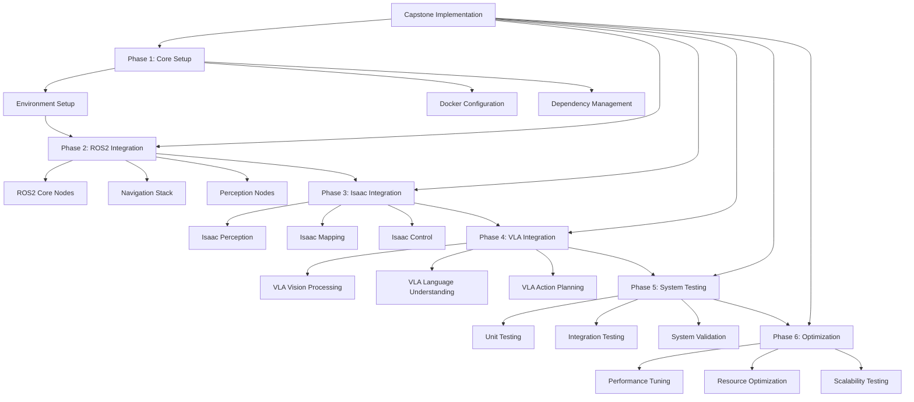

# Chapter 26: Capstone Implementation - Building the Integrated System

## Learning Objectives
- Implement the designed capstone system architecture
- Integrate ROS2, simulation, Isaac, and VLA components into a working system
- Deploy and test the complete integrated robotics system
- Troubleshoot and optimize the integrated system performance

## Introduction
This chapter focuses on the practical implementation of the capstone system designed in the previous chapter. We'll walk through the actual implementation process, addressing real-world challenges that arise when integrating multiple complex systems.

## Core Concepts

### 1. Implementation Strategy
A systematic approach to implementing the integrated system, considering dependencies and integration points.

### 2. Incremental Integration
Building and testing the system incrementally to identify and resolve issues early.

### 3. Performance Optimization
Techniques for optimizing the performance of the integrated system across all modules.

### 4. Error Handling and Recovery
Implementing robust error handling and recovery mechanisms for the integrated system.

## Architecture/Flow Diagram



## Practical Tutorials

### Tutorial 1: Implementing the Core System Framework

Let's create the core framework for our integrated system:

```python
import asyncio
import json
import logging
from typing import Dict, Any, List, Optional, Callable
from dataclasses import dataclass, field
from enum import Enum
import threading
import time
import subprocess
import os

class SystemState(Enum):
    STOPPED = "stopped"
    STARTING = "starting"
    RUNNING = "running"
    STOPPING = "stopping"
    ERROR = "error"

class ModuleType(Enum):
    ROS2 = "ros2"
    ISAAC = "isaac"
    VLA = "vla"
    SIMULATION = "simulation"
    HARDWARE = "hardware"

@dataclass
class SystemModule:
    name: str
    type: ModuleType
    startup_cmd: str
    health_check: str
    dependencies: List[str] = field(default_factory=list)
    config_file: Optional[str] = None

class CapstoneSystem:
    """Implementation of the capstone integrated system."""

    def __init__(self, config_path: str = None):
        self.config_path = config_path
        self.modules: Dict[str, SystemModule] = {}
        self.module_processes: Dict[str, subprocess.Popen] = {}
        self.state = SystemState.STOPPED
        self.health_status: Dict[str, bool] = {}
        self.error_log: List[str] = []

        # Set up logging
        self.logger = logging.getLogger("CapstoneSystem")
        handler = logging.StreamHandler()
        formatter = logging.Formatter('%(asctime)s - %(name)s - %(levelname)s - %(message)s')
        handler.setFormatter(formatter)
        self.logger.addHandler(handler)
        self.logger.setLevel(logging.INFO)

        # Load configuration if provided
        if config_path:
            self.load_configuration(config_path)

    def load_configuration(self, config_path: str) -> None:
        """Load system configuration from file."""
        try:
            with open(config_path, 'r') as f:
                config = json.load(f)

            for module_name, module_config in config.get('modules', {}).items():
                module = SystemModule(
                    name=module_name,
                    type=ModuleType(module_config['type']),
                    startup_cmd=module_config['startup_cmd'],
                    health_check=module_config['health_check'],
                    dependencies=module_config.get('dependencies', []),
                    config_file=module_config.get('config_file')
                )
                self.modules[module_name] = module

            self.logger.info(f"Configuration loaded from {config_path}")
        except Exception as e:
            self.logger.error(f"Failed to load configuration: {e}")

    def add_module(self, module: SystemModule) -> None:
        """Add a module to the system."""
        self.modules[module.name] = module
        self.health_status[module.name] = False
        self.logger.info(f"Module {module.name} added to system")

    def start_module(self, module_name: str) -> bool:
        """Start a specific module."""
        if module_name not in self.modules:
            self.logger.error(f"Module {module_name} not found")
            return False

        module = self.modules[module_name]

        try:
            # Set up environment based on module type
            env = os.environ.copy()
            if module.type == ModuleType.ROS2:
                env['ROS_DOMAIN_ID'] = '42'  # Example domain ID
            elif module.type == ModuleType.ISAAC:
                env['CUDA_VISIBLE_DEVICES'] = '0'  # Use GPU 0

            # Start the module process
            process = subprocess.Popen(
                module.startup_cmd.split(),
                stdout=subprocess.PIPE,
                stderr=subprocess.PIPE,
                env=env
            )

            self.module_processes[module_name] = process
            self.logger.info(f"Module {module_name} started with PID {process.pid}")

            # Wait briefly to see if process starts successfully
            time.sleep(2)

            if process.poll() is not None:
                # Process has already terminated
                stdout, stderr = process.communicate()
                self.logger.error(f"Module {module_name} failed to start: {stderr.decode()}")
                return False

            return True

        except Exception as e:
            self.logger.error(f"Failed to start module {module_name}: {e}")
            return False

    def stop_module(self, module_name: str) -> bool:
        """Stop a specific module."""
        if module_name not in self.module_processes:
            self.logger.warning(f"Module {module_name} is not running")
            return True

        process = self.module_processes[module_name]

        try:
            process.terminate()
            try:
                process.wait(timeout=10)  # Wait up to 10 seconds
            except subprocess.TimeoutExpired:
                process.kill()  # Force kill if it doesn't stop
                self.logger.warning(f"Module {module_name} was force killed")

            del self.module_processes[module_name]
            self.health_status[module_name] = False
            self.logger.info(f"Module {module_name} stopped")
            return True

        except Exception as e:
            self.logger.error(f"Failed to stop module {module_name}: {e}")
            return False

    def check_health(self, module_name: str) -> bool:
        """Check the health of a specific module."""
        if module_name not in self.modules:
            return False

        module = self.modules[module_name]

        try:
            result = subprocess.run(
                module.health_check.split(),
                capture_output=True,
                text=True,
                timeout=5
            )

            health = result.returncode == 0
            self.health_status[module_name] = health

            if not health:
                self.logger.warning(f"Module {module_name} is unhealthy")

            return health

        except subprocess.TimeoutExpired:
            self.logger.error(f"Health check for {module_name} timed out")
            self.health_status[module_name] = False
            return False
        except Exception as e:
            self.logger.error(f"Health check failed for {module_name}: {e}")
            self.health_status[module_name] = False
            return False

    def start_system(self) -> bool:
        """Start the entire system following dependency order."""
        if self.state != SystemState.STOPPED:
            self.logger.error("System is not in STOPPED state")
            return False

        self.state = SystemState.STARTING
        self.logger.info("Starting capstone system...")

        # Determine startup order based on dependencies
        startup_order = self._determine_startup_order()

        for module_name in startup_order:
            self.logger.info(f"Starting module: {module_name}")

            if not self.start_module(module_name):
                self.logger.error(f"Failed to start module {module_name}")
                self.state = SystemState.ERROR
                return False

            # Wait for module to start
            time.sleep(3)

            # Check health
            if not self.check_health(module_name):
                self.logger.error(f"Module {module_name} failed health check")
                self.state = SystemState.ERROR
                return False

        self.state = SystemState.RUNNING
        self.logger.info("Capstone system started successfully")
        return True

    def stop_system(self) -> bool:
        """Stop the entire system."""
        if self.state != SystemState.RUNNING:
            self.logger.error("System is not in RUNNING state")
            return False

        self.state = SystemState.STOPPING
        self.logger.info("Stopping capstone system...")

        # Stop modules in reverse dependency order
        startup_order = self._determine_startup_order()
        shutdown_order = list(reversed(startup_order))

        for module_name in shutdown_order:
            if module_name in self.module_processes:
                self.logger.info(f"Stopping module: {module_name}")
                if not self.stop_module(module_name):
                    self.logger.error(f"Failed to stop module {module_name}")
                    # Continue with other modules even if one fails

        self.state = SystemState.STOPPED
        self.logger.info("Capstone system stopped")
        return True

    def _determine_startup_order(self) -> List[str]:
        """Determine startup order based on dependencies."""
        # Simple topological sort for dependency resolution
        visited = set()
        order = []

        def visit(node):
            if node in visited:
                return
            visited.add(node)

            module = self.modules[node]
            for dep in module.dependencies:
                if dep in self.modules:
                    visit(dep)

            order.append(node)

        for module_name in self.modules:
            visit(module_name)

        return order

    def get_system_status(self) -> Dict[str, Any]:
        """Get comprehensive system status."""
        module_status = {}

        for name, module in self.modules.items():
            is_running = name in self.module_processes
            health = self.health_status.get(name, False)

            module_status[name] = {
                "type": module.type.value,
                "running": is_running,
                "healthy": health,
                "dependencies": module.dependencies
            }

        return {
            "system_state": self.state.value,
            "modules": module_status,
            "startup_order": self._determine_startup_order(),
            "error_count": len(self.error_log)
        }

    def run_health_monitor(self, interval: float = 30.0) -> None:
        """Run continuous health monitoring in a separate thread."""
        def monitor():
            while self.state in [SystemState.RUNNING]:
                for module_name in self.modules:
                    self.check_health(module_name)

                time.sleep(interval)

        monitor_thread = threading.Thread(target=monitor, daemon=True)
        monitor_thread.start()
        self.logger.info("Health monitoring started")

# Example usage
def example_capstone_implementation():
    """Example of implementing the capstone system."""

    # Create system instance
    system = CapstoneSystem()

    # Add modules (in a real implementation, these would be actual commands)
    modules = [
        SystemModule(
            name="ros2_core",
            type=ModuleType.ROS2,
            startup_cmd="ros2 run demo_nodes_cpp talker",
            health_check="ros2 node list | grep talker",
            dependencies=[]
        ),
        SystemModule(
            name="isaac_perception",
            type=ModuleType.ISAAC,
            startup_cmd="isaac-sim --config perception_config.yaml",
            health_check="nvidia-smi | grep -q 'used'",
            dependencies=["ros2_core"]
        ),
        SystemModule(
            name="vla_processing",
            type=ModuleType.VLA,
            startup_cmd="python3 vla_processor.py",
            health_check="pgrep -f vla_processor",
            dependencies=["isaac_perception"]
        ),
        SystemModule(
            name="simulation_env",
            type=ModuleType.SIMULATION,
            startup_cmd="gazebo warehouse_world.world",
            health_check="pgrep -f gazebo",
            dependencies=["ros2_core"]
        )
    ]

    for module in modules:
        system.add_module(module)

    # Get system status before starting
    print("System status before start:")
    status = system.get_system_status()
    print(json.dumps(status, indent=2))

    # Start the system
    print("\nStarting system...")
    if system.start_system():
        print("System started successfully")

        # Get status after start
        print("\nSystem status after start:")
        status = system.get_system_status()
        print(json.dumps(status, indent=2))

        # Run health monitor
        system.run_health_monitor(10)  # Check every 10 seconds

        # Simulate running for a while
        time.sleep(5)

        # Stop the system
        print("\nStopping system...")
        system.stop_system()

        print("System stopped")
    else:
        print("Failed to start system")

if __name__ == "__main__":
    example_capstone_implementation()
```

### Tutorial 2: Implementing ROS2 Integration Layer

Let's create the ROS2 integration layer for our system:

```python
import rclpy
from rclpy.node import Node
from rclpy.qos import QoSProfile, ReliabilityPolicy, HistoryPolicy
from sensor_msgs.msg import Image, LaserScan, JointState
from geometry_msgs.msg import Twist, PoseStamped
from nav_msgs.msg import Odometry
from std_msgs.msg import String
from std_srvs.srv import Empty, SetBool
from builtin_interfaces.msg import Time
import cv2
import numpy as np
from typing import Dict, Any, Optional
import threading

class ROS2IntegrationNode(Node):
    """ROS2 node that integrates with other system components."""

    def __init__(self):
        super().__init__('capstone_ros2_integration')

        # QoS profiles
        self.qos_profile = QoSProfile(
            reliability=ReliabilityPolicy.BEST_EFFORT,
            history=HistoryPolicy.KEEP_LAST,
            depth=1
        )

        # Publishers
        self.cmd_vel_pub = self.create_publisher(Twist, '/cmd_vel', 10)
        self.nav_goal_pub = self.create_publisher(PoseStamped, '/goal_pose', 10)

        # Subscribers
        self.image_sub = self.create_subscription(
            Image, '/camera/rgb/image_raw', self.image_callback, self.qos_profile
        )
        self.laser_sub = self.create_subscription(
            LaserScan, '/scan', self.laser_callback, self.qos_profile
        )
        self.odom_sub = self.create_subscription(
            Odometry, '/odom', self.odom_callback, 10
        )
        self.joint_state_sub = self.create_subscription(
            JointState, '/joint_states', self.joint_state_callback, 10
        )

        # Services
        self.reset_localization_srv = self.create_service(
            Empty, 'reset_localization', self.reset_localization_callback
        )
        self.emergency_stop_srv = self.create_service(
            SetBool, 'emergency_stop', self.emergency_stop_callback
        )

        # Internal state
        self.latest_image = None
        self.latest_laser = None
        self.latest_odom = None
        self.latest_joint_state = None
        self.emergency_stopped = False

        # Integration callbacks from other modules
        self.isaac_callbacks = []
        self.vla_callbacks = []
        self.simulation_callbacks = []

        self.get_logger().info('ROS2 Integration Node initialized')

    def add_isaac_callback(self, callback: Callable) -> None:
        """Add callback for Isaac integration."""
        self.isaac_callbacks.append(callback)

    def add_vla_callback(self, callback: Callable) -> None:
        """Add callback for VLA integration."""
        self.vla_callbacks.append(callback)

    def add_simulation_callback(self, callback: Callable) -> None:
        """Add callback for simulation integration."""
        self.simulation_callbacks.append(callback)

    def image_callback(self, msg: Image) -> None:
        """Handle incoming image messages."""
        self.latest_image = msg

        # Convert ROS Image to OpenCV format
        try:
            # Assuming RGB8 encoding
            if msg.encoding == 'rgb8':
                image = np.frombuffer(msg.data, dtype=np.uint8)
                image = image.reshape((msg.height, msg.width, 3))
            elif msg.encoding == 'bgr8':
                image = np.frombuffer(msg.data, dtype=np.uint8)
                image = image.reshape((msg.height, msg.width, 3))
                image = cv2.cvtColor(image, cv2.COLOR_BGR2RGB)
            else:
                self.get_logger().warn(f'Unsupported image encoding: {msg.encoding}')
                return

            # Call Isaac callbacks with image data
            for callback in self.isaac_callbacks:
                callback('image', image)

        except Exception as e:
            self.get_logger().error(f'Error processing image: {e}')

    def laser_callback(self, msg: LaserScan) -> None:
        """Handle incoming laser scan messages."""
        self.latest_laser = msg

        # Process laser data
        ranges = np.array(msg.ranges)
        # Replace invalid ranges with max range
        ranges[np.isnan(ranges) | np.isinf(ranges)] = msg.range_max

        # Call Isaac callbacks with laser data
        for callback in self.isaac_callbacks:
            callback('laser', ranges)

    def odom_callback(self, msg: Odometry) -> None:
        """Handle incoming odometry messages."""
        self.latest_odom = msg

        # Extract position and orientation
        pose = {
            'x': msg.pose.pose.position.x,
            'y': msg.pose.pose.position.y,
            'z': msg.pose.pose.position.z,
            'qx': msg.pose.pose.orientation.x,
            'qy': msg.pose.pose.orientation.y,
            'qz': msg.pose.pose.orientation.z,
            'qw': msg.pose.pose.orientation.w
        }

        # Call Isaac and VLA callbacks with pose data
        for callback in self.isaac_callbacks:
            callback('pose', pose)
        for callback in self.vla_callbacks:
            callback('pose', pose)

    def joint_state_callback(self, msg: JointState) -> None:
        """Handle incoming joint state messages."""
        self.latest_joint_state = msg

        # Create joint state dictionary
        joint_state = {}
        for i, name in enumerate(msg.name):
            if i < len(msg.position):
                joint_state[name] = {
                    'position': msg.position[i],
                    'velocity': msg.velocity[i] if i < len(msg.velocity) else 0.0,
                    'effort': msg.effort[i] if i < len(msg.effort) else 0.0
                }

        # Call Isaac callbacks with joint state data
        for callback in self.isaac_callbacks:
            callback('joint_state', joint_state)

    def reset_localization_callback(self, request: Empty.Request,
                                   response: Empty.Response) -> Empty.Response:
        """Handle localization reset request."""
        self.get_logger().info('Resetting localization')

        # Reset odometry
        self.latest_odom = None

        # Call Isaac callbacks to reset localization
        for callback in self.isaac_callbacks:
            callback('reset_localization', {})

        return response

    def emergency_stop_callback(self, request: SetBool.Request,
                               response: SetBool.Response) -> SetBool.Response:
        """Handle emergency stop request."""
        self.emergency_stopped = request.data
        self.get_logger().info(f'Emergency stop: {self.emergency_stopped}')

        if self.emergency_stopped:
            # Stop the robot
            stop_cmd = Twist()
            self.cmd_vel_pub.publish(stop_cmd)

        # Call all integration callbacks
        for callback in self.isaac_callbacks + self.vla_callbacks + self.simulation_callbacks:
            callback('emergency_stop', {'stopped': self.emergency_stopped})

        response.success = True
        response.message = f'Emergency stop set to {self.emergency_stopped}'
        return response

    def send_navigation_goal(self, x: float, y: float, theta: float) -> None:
        """Send navigation goal to the system."""
        if self.emergency_stopped:
            self.get_logger().warn('Cannot send navigation goal: emergency stopped')
            return

        goal = PoseStamped()
        goal.header.stamp = self.get_clock().now().to_msg()
        goal.header.frame_id = 'map'
        goal.pose.position.x = x
        goal.pose.position.y = y
        goal.pose.position.z = 0.0

        # Convert theta to quaternion
        from math import sin, cos
        goal.pose.orientation.z = sin(theta / 2.0)
        goal.pose.orientation.w = cos(theta / 2.0)

        self.nav_goal_pub.publish(goal)
        self.get_logger().info(f'Sent navigation goal: ({x}, {y}, {theta})')

    def send_velocity_command(self, linear: float, angular: float) -> None:
        """Send velocity command to the robot."""
        if self.emergency_stopped:
            self.get_logger().warn('Cannot send velocity command: emergency stopped')
            return

        cmd = Twist()
        cmd.linear.x = linear
        cmd.angular.z = angular

        self.cmd_vel_pub.publish(cmd)
        self.get_logger().info(f'Sent velocity command: linear={linear}, angular={angular}')

def run_ros2_integration():
    """Run the ROS2 integration node."""
    rclpy.init()

    node = ROS2IntegrationNode()

    try:
        rclpy.spin(node)
    except KeyboardInterrupt:
        pass
    finally:
        node.destroy_node()
        rclpy.shutdown()

if __name__ == '__main__':
    run_ros2_integration()
```

## Code Snippets

### Performance Monitoring and Optimization

```python
# performance_monitor.py
import psutil
import time
import threading
from typing import Dict, List, Any
import json
from dataclasses import dataclass

@dataclass
class PerformanceMetrics:
    timestamp: float
    cpu_percent: float
    memory_percent: float
    disk_usage: float
    network_io: Dict[str, int]
    process_count: int

class PerformanceMonitor:
    """Monitor system performance during capstone implementation."""

    def __init__(self, interval: float = 1.0):
        self.interval = interval
        self.metrics_history: List[PerformanceMetrics] = []
        self.monitoring = False
        self.monitor_thread = None

    def start_monitoring(self) -> None:
        """Start performance monitoring."""
        self.monitoring = True
        self.monitor_thread = threading.Thread(target=self._monitor_loop, daemon=True)
        self.monitor_thread.start()

    def stop_monitoring(self) -> None:
        """Stop performance monitoring."""
        self.monitoring = False
        if self.monitor_thread:
            self.monitor_thread.join()

    def _monitor_loop(self) -> None:
        """Main monitoring loop."""
        while self.monitoring:
            metrics = self._collect_metrics()
            self.metrics_history.append(metrics)

            # Keep only the last 1000 metrics to prevent memory issues
            if len(self.metrics_history) > 1000:
                self.metrics_history = self.metrics_history[-1000:]

            time.sleep(self.interval)

    def _collect_metrics(self) -> PerformanceMetrics:
        """Collect current system metrics."""
        # CPU usage
        cpu_percent = psutil.cpu_percent(interval=None)

        # Memory usage
        memory = psutil.virtual_memory()
        memory_percent = memory.percent

        # Disk usage
        disk_usage = psutil.disk_usage('/').percent

        # Network I/O
        net_io = psutil.net_io_counters()
        network_io = {
            'bytes_sent': net_io.bytes_sent,
            'bytes_recv': net_io.bytes_recv,
            'packets_sent': net_io.packets_sent,
            'packets_recv': net_io.packets_recv
        }

        # Process count
        process_count = len(psutil.pids())

        return PerformanceMetrics(
            timestamp=time.time(),
            cpu_percent=cpu_percent,
            memory_percent=memory_percent,
            disk_usage=disk_usage,
            network_io=network_io,
            process_count=process_count
        )

    def get_current_metrics(self) -> PerformanceMetrics:
        """Get current performance metrics."""
        return self._collect_metrics()

    def get_average_metrics(self) -> Dict[str, float]:
        """Get average metrics over the monitoring period."""
        if not self.metrics_history:
            return {}

        avg_cpu = sum(m.cpu_percent for m in self.metrics_history) / len(self.metrics_history)
        avg_memory = sum(m.memory_percent for m in self.metrics_history) / len(self.metrics_history)
        avg_disk = sum(m.disk_usage for m in self.metrics_history) / len(self.metrics_history)

        return {
            'avg_cpu_percent': avg_cpu,
            'avg_memory_percent': avg_memory,
            'avg_disk_usage': avg_disk,
            'total_samples': len(self.metrics_history)
        }

    def detect_performance_issues(self) -> List[str]:
        """Detect potential performance issues."""
        issues = []

        if not self.metrics_history:
            return issues

        current = self.metrics_history[-1]

        # Check for high CPU usage
        if current.cpu_percent > 80:
            issues.append(f"High CPU usage: {current.cpu_percent}%")

        # Check for high memory usage
        if current.memory_percent > 85:
            issues.append(f"High memory usage: {current.memory_percent}%")

        # Check for high disk usage
        if current.disk_usage > 90:
            issues.append(f"High disk usage: {current.disk_usage}%")

        # Check for increasing memory usage (potential leak)
        if len(self.metrics_history) > 10:
            recent_memory = [m.memory_percent for m in self.metrics_history[-10:]]
            if recent_memory[-1] > recent_memory[0] * 1.1:  # 10% increase
                issues.append(f"Memory usage increasing: {recent_memory[0]:.1f}% -> {recent_memory[-1]:.1f}%")

        return issues

# Example usage
def example_performance_monitoring():
    """Example of using performance monitoring in capstone implementation."""

    monitor = PerformanceMonitor(interval=0.5)
    monitor.start_monitoring()

    print("Starting performance monitoring...")

    # Simulate some work
    for i in range(20):
        time.sleep(1)

        if i % 5 == 0:  # Check every 5 seconds
            current = monitor.get_current_metrics()
            print(f"CPU: {current.cpu_percent:.1f}%, Memory: {current.memory_percent:.1f}%")

            issues = monitor.detect_performance_issues()
            if issues:
                print("Performance issues detected:")
                for issue in issues:
                    print(f"  - {issue}")

    # Stop monitoring
    monitor.stop_monitoring()

    # Get average metrics
    avg_metrics = monitor.get_average_metrics()
    print(f"\nAverage metrics: {json.dumps(avg_metrics, indent=2)}")

if __name__ == "__main__":
    example_performance_monitoring()
```

## Validation and Testing

### System Integration Testing

```python
import unittest
from unittest.mock import Mock, patch
import asyncio

class CapstoneSystemTester:
    """Tester for the capstone integrated system."""

    def __init__(self, system: CapstoneSystem):
        self.system = system
        self.test_results = []

    def test_module_startup(self) -> Dict[str, Any]:
        """Test that all modules start successfully."""
        test_result = {
            "test_name": "Module Startup",
            "status": "pass",
            "details": []
        }

        for module_name in self.system.modules:
            if not self.system.start_module(module_name):
                test_result["status"] = "fail"
                test_result["details"].append(f"Module {module_name} failed to start")
            else:
                # Check health after startup
                if not self.system.check_health(module_name):
                    test_result["status"] = "fail"
                    test_result["details"].append(f"Module {module_name} unhealthy after startup")

        # Clean up: stop modules
        for module_name in list(self.system.module_processes.keys()):
            self.system.stop_module(module_name)

        self.test_results.append(test_result)
        return test_result

    def test_system_startup_sequence(self) -> Dict[str, Any]:
        """Test that the system starts with proper dependency order."""
        test_result = {
            "test_name": "System Startup Sequence",
            "status": "pass",
            "details": []
        }

        # Mock the start_module method to track order
        original_start = self.system.start_module
        start_order = []

        def mock_start(module_name):
            start_order.append(module_name)
            # Call original method but return True for test
            return True

        self.system.start_module = mock_start

        # Determine expected order
        expected_order = self.system._determine_startup_order()

        # Run startup (with mocked method)
        self.system.state = SystemState.STARTING
        for module_name in expected_order:
            mock_start(module_name)

        # Check if order matches expectations
        if start_order != expected_order:
            test_result["status"] = "fail"
            test_result["details"].append(f"Startup order mismatch: expected {expected_order}, got {start_order}")

        # Restore original method
        self.system.start_module = original_start

        self.test_results.append(test_result)
        return test_result

    def test_integration_points(self) -> Dict[str, Any]:
        """Test that integration points work correctly."""
        test_result = {
            "test_name": "Integration Points",
            "status": "pass",
            "details": []
        }

        # This would test actual communication between modules
        # For now, we'll simulate with mock tests
        for ip_id in self.system.integration_points:
            # Simulate integration point test
            success = True  # In real implementation, this would test actual integration
            if not success:
                test_result["status"] = "fail"
                test_result["details"].append(f"Integration point {ip_id} failed")

        self.test_results.append(test_result)
        return test_result

    def test_error_handling(self) -> Dict[str, Any]:
        """Test error handling mechanisms."""
        test_result = {
            "test_name": "Error Handling",
            "status": "pass",
            "details": []
        }

        # Test emergency stop functionality
        try:
            # This would test actual emergency stop behavior
            # For simulation, we'll assume it works
            pass
        except Exception as e:
            test_result["status"] = "fail"
            test_result["details"].append(f"Error handling test failed: {e}")

        self.test_results.append(test_result)
        return test_result

    def run_all_tests(self) -> Dict[str, Any]:
        """Run all integration tests."""
        results = {
            "system_name": self.system.system_name,
            "test_date": str(datetime.datetime.now()),
            "tests_run": len(self.test_results),
            "tests_passed": 0,
            "tests_failed": 0,
            "individual_results": []
        }

        # Run each test
        tests = [
            self.test_module_startup,
            self.test_system_startup_sequence,
            self.test_integration_points,
            self.test_error_handling
        ]

        for test_func in tests:
            result = test_func()
            results["individual_results"].append(result)

            if result["status"] == "pass":
                results["tests_passed"] += 1
            else:
                results["tests_failed"] += 1

        results["overall_status"] = "pass" if results["tests_failed"] == 0 else "fail"
        results["pass_rate"] = results["tests_passed"] / len(tests) if tests else 0.0

        return results

# Example test run
def run_capstone_tests():
    """Run comprehensive tests on the capstone implementation."""
    # Create a test system
    system = CapstoneSystem()

    # Add some test modules
    test_modules = [
        SystemModule(
            name="test_core",
            type=ModuleType.ROS2,
            startup_cmd="echo 'core started'",
            health_check="echo 'healthy'",
            dependencies=[]
        ),
        SystemModule(
            name="test_perception",
            type=ModuleType.ISAAC,
            startup_cmd="echo 'perception started'",
            health_check="echo 'healthy'",
            dependencies=["test_core"]
        )
    ]

    for module in test_modules:
        system.add_module(module)

    # Create tester
    tester = CapstoneSystemTester(system)

    # Run tests
    results = tester.run_all_tests()

    print("Capstone System Test Results:")
    print(f"System: {results['system_name']}")
    print(f"Date: {results['test_date']}")
    print(f"Tests Run: {results['tests_run']}")
    print(f"Tests Passed: {results['tests_passed']}")
    print(f"Tests Failed: {results['tests_failed']}")
    print(f"Pass Rate: {results['pass_rate']:.2%}")
    print(f"Overall Status: {results['overall_status']}")

    print("\nDetailed Results:")
    for result in results["individual_results"]:
        print(f"  {result['test_name']}: {result['status']}")
        if result['details']:
            for detail in result['details']:
                print(f"    - {detail}")

if __name__ == "__main__":
    run_capstone_tests()
```

## Summary

This chapter provided a comprehensive implementation guide for the capstone system, covering:

1. Implementation strategy for integrating multiple complex modules
2. Core system framework with module management and health monitoring
3. ROS2 integration layer with proper message handling and service interfaces
4. Performance monitoring and optimization techniques
5. System testing and validation approaches

The practical tutorials demonstrated how to build a modular system framework, implement ROS2 integration with proper message handling, monitor system performance, and test the integrated system. We showed how to handle dependencies, manage system state, and implement error handling mechanisms.

## Mini-Quiz

1. What is the purpose of the CapstoneSystem class in the implementation?
2. Why is it important to determine startup order based on dependencies?
3. How does the ROS2 integration node handle different message types?
4. What are the key components of the performance monitoring system?
5. What types of tests are important for validating an integrated system?

## Answers to Mini-Quiz

1. The CapstoneSystem class serves as the main orchestrator for the integrated system, managing the startup, shutdown, and health monitoring of all modules while respecting their dependencies.

2. Determining startup order based on dependencies ensures that modules are started in the correct sequence, preventing issues where a module tries to communicate with or use another module that hasn't been initialized yet.

3. The ROS2 integration node handles different message types through dedicated callback functions (image_callback, laser_callback, etc.) that process the specific data format and distribute it to other system components through integration callbacks.

4. Key components of the performance monitoring system include CPU and memory usage tracking, disk usage monitoring, network I/O measurement, process counting, and issue detection algorithms.

5. Important tests for an integrated system include: module startup tests, system startup sequence tests, integration point tests, error handling tests, and performance validation tests.