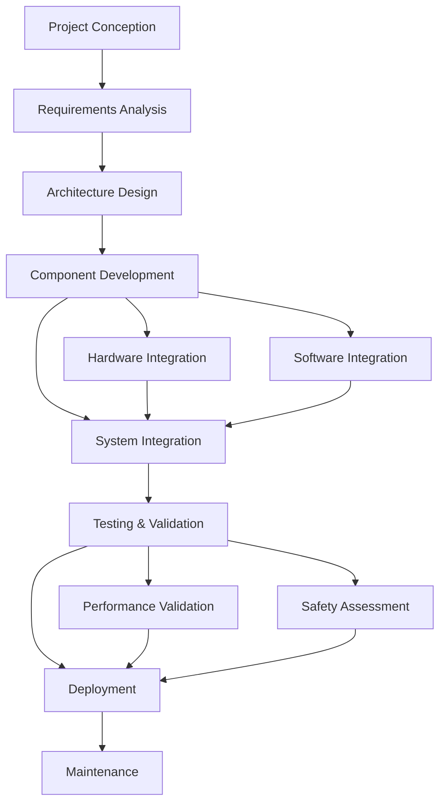

# Chapter 24: Project Implementation - From Concept to Deployment

## Learning Objectives
- Understand the complete lifecycle of robotics project implementation
- Learn agile methodologies for managing complex robotics projects
- Implement project management tools and frameworks for robotics development
- Master system integration challenges and solutions
- Apply validation and testing strategies for robotics systems

## Introduction
This chapter provides a comprehensive framework for implementing robotics projects from initial concept to final deployment. We'll explore the systematic approach required to manage complex robotics systems, addressing both technical and project management challenges.

## Core Concepts

### 1. Project Lifecycle Phases
Robotics projects follow a structured lifecycle with distinct phases:

- **CONCEPTION**: Requirements gathering and feasibility analysis
- **PLANNING**: Resource allocation and timeline development
- **DESIGN**: System architecture and component specification
- **IMPLEMENTATION**: Development and integration
- **TESTING**: Validation and verification
- **DEPLOYMENT**: Production rollout and monitoring
- **MAINTENANCE**: Ongoing support and improvements

### 2. Agile Robotics Development
Adapting agile methodologies for robotics projects requires special consideration for hardware dependencies and real-world constraints.

### 3. System Integration Challenges
Complex robotics systems require careful integration of multiple subsystems with different technologies and requirements.

## Architecture/Flow Diagram



## Practical Tutorials

### Tutorial 1: Setting Up a Robotics Project Framework

Let's create a comprehensive framework for managing robotics project implementations:

```python
import json
import datetime
from enum import Enum
from typing import Dict, List, Optional, Any
from dataclasses import dataclass, field
import logging

class ProjectPhase(Enum):
    CONCEPTION = "conception"
    PLANNING = "planning"
    DESIGN = "design"
    IMPLEMENTATION = "implementation"
    TESTING = "testing"
    DEPLOYMENT = "deployment"
    MAINTENANCE = "maintenance"

class ComponentType(Enum):
    HARDWARE = "hardware"
    SOFTWARE = "software"
    ALGORITHM = "algorithm"
    INTEGRATION = "integration"

@dataclass
class Milestone:
    id: str
    name: str
    description: str
    phase: ProjectPhase
    due_date: datetime.datetime
    completed: bool = False
    completion_date: Optional[datetime.datetime] = None
    dependencies: List[str] = field(default_factory=list)

@dataclass
class Risk:
    id: str
    title: str
    description: str
    severity: int  # 1-5 scale
    probability: float  # 0.0-1.0
    mitigation_plan: str
    status: str = "identified"  # identified, mitigated, resolved

@dataclass
class Task:
    id: str
    name: str
    description: str
    assignee: str
    phase: ProjectPhase
    estimated_hours: int
    actual_hours: int = 0
    completed: bool = False
    start_date: Optional[datetime.datetime] = None
    end_date: Optional[datetime.datetime] = None

@dataclass
class Component:
    id: str
    name: str
    description: str
    type: ComponentType
    dependencies: List[str] = field(default_factory=list)
    status: str = "not_started"  # not_started, in_progress, testing, complete
    version: str = "0.0.1"

class RoboticsProjectManager:
    def __init__(self, project_name: str, start_date: datetime.datetime):
        self.project_name = project_name
        self.start_date = start_date
        self.current_phase = ProjectPhase.CONCEPTION
        self.milestones: Dict[str, Milestone] = {}
        self.risks: Dict[str, Risk] = {}
        self.tasks: Dict[str, Task] = {}
        self.components: Dict[str, Component] = {}
        self.budget = 0.0
        self.spent = 0.0
        self.progress = 0.0

        # Set up logging
        self.logger = logging.getLogger(f"{project_name}_manager")
        handler = logging.StreamHandler()
        formatter = logging.Formatter('%(asctime)s - %(name)s - %(levelname)s - %(message)s')
        handler.setFormatter(formatter)
        self.logger.addHandler(handler)
        self.logger.setLevel(logging.INFO)

    def add_milestone(self, milestone: Milestone) -> None:
        """Add a milestone to the project."""
        self.milestones[milestone.id] = milestone
        self.logger.info(f"Milestone '{milestone.name}' added to project")

    def add_risk(self, risk: Risk) -> None:
        """Add a risk to the project."""
        self.risks[risk.id] = risk
        self.logger.info(f"Risk '{risk.title}' identified with severity {risk.severity}")

    def add_task(self, task: Task) -> None:
        """Add a task to the project."""
        self.tasks[task.id] = task
        self.logger.info(f"Task '{task.name}' assigned to {task.assignee}")

    def add_component(self, component: Component) -> None:
        """Add a component to the project."""
        self.components[component.id] = component
        self.logger.info(f"Component '{component.name}' added to project")

    def update_phase(self, phase: ProjectPhase) -> None:
        """Update the current project phase."""
        old_phase = self.current_phase
        self.current_phase = phase
        self.logger.info(f"Project phase updated from {old_phase.value} to {phase.value}")

    def complete_task(self, task_id: str) -> bool:
        """Mark a task as completed."""
        if task_id in self.tasks:
            task = self.tasks[task_id]
            task.completed = True
            task.end_date = datetime.datetime.now()
            self.logger.info(f"Task '{task.name}' completed")

            # Update progress
            completed_tasks = sum(1 for t in self.tasks.values() if t.completed)
            total_tasks = len(self.tasks)
            self.progress = completed_tasks / total_tasks if total_tasks > 0 else 0.0

            return True
        return False

    def update_component_status(self, component_id: str, status: str) -> bool:
        """Update the status of a component."""
        if component_id in self.components:
            self.components[component_id].status = status
            self.logger.info(f"Component '{self.components[component_id].name}' status updated to {status}")
            return True
        return False

    def assess_risk(self, risk_id: str) -> float:
        """Calculate risk score (severity * probability)."""
        if risk_id in self.risks:
            risk = self.risks[risk_id]
            risk_score = risk.severity * risk.probability
            self.logger.info(f"Risk '{risk.title}' score calculated: {risk_score}")
            return risk_score
        return 0.0

    def get_project_status(self) -> Dict[str, Any]:
        """Get comprehensive project status."""
        completed_milestones = sum(1 for m in self.milestones.values() if m.completed)
        total_milestones = len(self.milestones)

        completed_tasks = sum(1 for t in self.tasks.values() if t.completed)
        total_tasks = len(self.tasks)

        active_risks = sum(1 for r in self.risks.values() if r.status == "identified")

        components_by_status = {}
        for component in self.components.values():
            if component.status not in components_by_status:
                components_by_status[component.status] = 0
            components_by_status[component.status] += 1

        return {
            "project_name": self.project_name,
            "current_phase": self.current_phase.value,
            "start_date": self.start_date.isoformat(),
            "milestone_progress": f"{completed_milestones}/{total_milestones}",
            "task_progress": f"{completed_tasks}/{total_tasks}",
            "overall_progress": self.progress,
            "active_risks": active_risks,
            "budget_utilization": f"{self.spent}/{self.budget}",
            "components_by_status": components_by_status
        }

    def generate_report(self) -> str:
        """Generate a comprehensive project report."""
        status = self.get_project_status()

        report = f"""
Robotics Project Report: {status['project_name']}
================================================
Current Phase: {status['current_phase']}
Start Date: {status['start_date']}
Milestone Progress: {status['milestone_progress']}
Task Progress: {status['task_progress']}
Overall Progress: {status['overall_progress']:.2%}
Active Risks: {status['active_risks']}
Budget Utilization: {status['budget_utilization']}
Components Status: {status['components_by_status']}

Phase-Specific Tasks:
"""

        for phase in ProjectPhase:
            phase_tasks = [t for t in self.tasks.values() if t.phase == phase]
            completed_phase_tasks = [t for t in phase_tasks if t.completed]
            report += f"  {phase.value.title()}: {len(completed_phase_tasks)}/{len(phase_tasks)} completed\n"

        return report

# Example usage
def example_robotics_project():
    """Example of setting up and managing a robotics project."""

    # Create project manager
    project = RoboticsProjectManager(
        project_name="Autonomous Warehouse Robot",
        start_date=datetime.datetime.now()
    )

    # Define milestones
    milestones = [
        Milestone("m1", "Concept Validation", "Validate feasibility of autonomous warehouse robot",
                ProjectPhase.CONCEPTION, datetime.datetime(2024, 2, 1)),
        Milestone("m2", "System Design Complete", "Complete system architecture design",
                ProjectPhase.DESIGN, datetime.datetime(2024, 4, 1)),
        Milestone("m3", "Prototype Ready", "Have working prototype for testing",
                ProjectPhase.IMPLEMENTATION, datetime.datetime(2024, 7, 1)),
        Milestone("m4", "Field Testing Complete", "Complete field testing in warehouse environment",
                ProjectPhase.TESTING, datetime.datetime(2024, 9, 1)),
        Milestone("m5", "Production Deployment", "Deploy to production warehouse",
                ProjectPhase.DEPLOYMENT, datetime.datetime(2024, 11, 1))
    ]

    for milestone in milestones:
        project.add_milestone(milestone)

    # Define risks
    risks = [
        Risk("r1", "Hardware Integration Delays", "Delays in integrating sensors and actuators",
             4, 0.6, "Implement modular design and parallel development"),
        Risk("r2", "Safety Compliance", "Potential issues with safety certification",
             5, 0.3, "Early engagement with safety certification bodies"),
        Risk("r3", "Navigation Accuracy", "Robot may not meet navigation accuracy requirements",
             3, 0.5, "Implement redundant navigation systems")
    ]

    for risk in risks:
        project.add_risk(risk)

    # Define tasks
    tasks = [
        Task("t1", "Requirements Analysis", "Analyze warehouse requirements", "Project Lead",
             ProjectPhase.CONCEPTION, 40),
        Task("t2", "System Architecture", "Design system architecture", "System Architect",
             ProjectPhase.DESIGN, 80),
        Task("t3", "Navigation System", "Implement navigation algorithms", "Navigation Team",
             ProjectPhase.IMPLEMENTATION, 120),
        Task("t4", "Safety System", "Implement safety monitoring", "Safety Team",
             ProjectPhase.IMPLEMENTATION, 100),
        Task("t5", "Integration Testing", "Test system integration", "Testing Team",
             ProjectPhase.TESTING, 80)
    ]

    for task in tasks:
        project.add_task(task)

    # Define components
    components = [
        Component("c1", "Navigation System", "SLAM-based navigation", ComponentType.SOFTWARE),
        Component("c2", "Safety System", "Safety monitoring and emergency stops", ComponentType.SOFTWARE),
        Component("c3", "Manipulator Arm", "Object pickup and placement", ComponentType.HARDWARE),
        Component("c4", "Sensor Suite", "LIDAR, cameras, IMU", ComponentType.HARDWARE),
        Component("c5", "Path Planning", "Optimal path calculation", ComponentType.ALGORITHM)
    ]

    for component in components:
        project.add_component(component)

    # Update project phase
    project.update_phase(ProjectPhase.DESIGN)

    # Complete some tasks
    project.complete_task("t1")
    project.complete_task("t2")

    # Update component status
    project.update_component_status("c1", "in_progress")
    project.update_component_status("c2", "in_progress")

    # Generate and print report
    print(project.generate_report())

    return project

if __name__ == "__main__":
    example_robotics_project()
```

### Tutorial 2: Agile Methodologies for Robotics

Let's implement an agile framework specifically adapted for robotics projects:

```python
import json
from datetime import datetime, timedelta
from typing import List, Dict, Optional
from enum import Enum

class SprintStatus(Enum):
    PLANNING = "planning"
    ACTIVE = "active"
    REVIEW = "review"
    CLOSED = "closed"

class StoryPoint(Enum):
    TINY = 1
    SMALL = 2
    MEDIUM = 3
    LARGE = 5
    XLARGE = 8

@dataclass
class UserStory:
    id: str
    title: str
    description: str
    story_points: StoryPoint
    acceptance_criteria: List[str]
    dependencies: List[str] = field(default_factory=list)
    assigned_to: Optional[str] = None
    status: str = "todo"  # todo, in_progress, testing, done

@dataclass
class Sprint:
    id: str
    name: str
    start_date: datetime
    end_date: datetime
    goal: str
    stories: List[str] = field(default_factory=list)
    status: SprintStatus = SprintStatus.PLANNING
    velocity: int = 0

class RoboticsAgileFramework:
    def __init__(self, project_name: str):
        self.project_name = project_name
        self.stories: Dict[str, UserStory] = {}
        self.sprints: Dict[str, Sprint] = {}
        self.current_sprint_id: Optional[str] = None
        self.velocity_history: List[int] = []

    def create_story(self, story: UserStory) -> None:
        """Create a new user story."""
        self.stories[story.id] = story
        print(f"Story '{story.title}' created with {story.story_points.value} story points")

    def create_sprint(self, sprint: Sprint) -> None:
        """Create a new sprint."""
        self.sprints[sprint.id] = sprint
        print(f"Sprint '{sprint.name}' created from {sprint.start_date} to {sprint.end_date}")

    def start_sprint(self, sprint_id: str) -> bool:
        """Start a sprint."""
        if sprint_id in self.sprints and self.sprints[sprint_id].status == SprintStatus.PLANNING:
            self.sprints[sprint_id].status = SprintStatus.ACTIVE
            self.current_sprint_id = sprint_id
            print(f"Sprint '{self.sprints[sprint_id].name}' started")
            return True
        return False

    def move_story(self, story_id: str, new_status: str) -> bool:
        """Move a story to a new status."""
        if story_id in self.stories:
            old_status = self.stories[story_id].status
            self.stories[story_id].status = new_status
            print(f"Story '{self.stories[story_id].title}' moved from {old_status} to {new_status}")
            return True
        return False

    def calculate_velocity(self, sprint_id: str) -> int:
        """Calculate sprint velocity based on completed story points."""
        if sprint_id not in self.sprints:
            return 0

        sprint = self.sprints[sprint_id]
        velocity = 0

        for story_id in sprint.stories:
            if story_id in self.stories:
                story = self.stories[story_id]
                if story.status == "done":
                    velocity += story.story_points.value

        return velocity

    def end_sprint(self, sprint_id: str) -> Dict[str, Any]:
        """End a sprint and calculate metrics."""
        if sprint_id not in self.sprints:
            return {}

        sprint = self.sprints[sprint_id]
        sprint.status = SprintStatus.CLOSED

        velocity = self.calculate_velocity(sprint_id)
        self.velocity_history.append(velocity)

        completed_stories = []
        incomplete_stories = []

        for story_id in sprint.stories:
            if story_id in self.stories:
                story = self.stories[story_id]
                if story.status == "done":
                    completed_stories.append(story.title)
                else:
                    incomplete_stories.append(story.title)

        metrics = {
            "sprint_id": sprint_id,
            "sprint_name": sprint.name,
            "velocity": velocity,
            "completed_stories": len(completed_stories),
            "incomplete_stories": len(incomplete_stories),
            "completed_story_titles": completed_stories,
            "incomplete_story_titles": incomplete_stories
        }

        print(f"Sprint '{sprint.name}' ended with velocity {velocity}")
        print(f"Completed stories: {len(completed_stories)}")
        print(f"Incomplete stories: {len(incomplete_stories)}")

        return metrics

# Example usage of agile framework
def example_agile_implementation():
    """Example of using the agile framework for a robotics project."""

    # Create agile framework instance
    agile = RoboticsAgileFramework("Warehouse Robot Project")

    # Create user stories
    stories = [
        UserStory("us1", "Implement Basic Navigation",
                 "Robot should be able to navigate in a known environment",
                 StoryPoint.LARGE,
                 ["Robot moves to goal location", "Avoids obstacles", "Maintains safety distance"]),
        UserStory("us2", "Implement Object Detection",
                 "Robot should detect objects in its path",
                 StoryPoint.MEDIUM,
                 ["Detects objects within 2m", "Classifies object types", "Reports to control system"]),
        UserStory("us3", "Implement Safety System",
                 "Robot should have emergency stop and safety monitoring",
                 StoryPoint.LARGE,
                 ["Emergency stop button", "Safety zone monitoring", "Collision avoidance"]),
        UserStory("us4", "Implement Charging System",
                 "Robot should autonomously return to charging station",
                 StoryPoint.MEDIUM,
                 ["Detect low battery", "Navigate to charging station", "Dock automatically"])
    ]

    for story in stories:
        agile.create_story(story)

    # Create sprint
    sprint = Sprint(
        "sprint1",
        "Sprint 1 - Basic Navigation",
        datetime.now(),
        datetime.now() + timedelta(weeks=2),
        "Implement basic navigation and safety systems"
    )
    sprint.stories = ["us1", "us3"]  # Include navigation and safety stories
    agile.create_sprint(sprint)

    # Start sprint
    agile.start_sprint("sprint1")

    # Move stories through development
    agile.move_story("us1", "in_progress")
    agile.move_story("us3", "in_progress")

    # Simulate development progress
    agile.move_story("us1", "testing")
    agile.move_story("us3", "testing")

    agile.move_story("us1", "done")
    agile.move_story("us3", "done")

    # End sprint and get metrics
    metrics = agile.end_sprint("sprint1")
    print(f"Sprint metrics: {json.dumps(metrics, indent=2, default=str)}")

if __name__ == "__main__":
    example_agile_implementation()
```

## Code Snippets

### System Integration Framework

```python
# system_integration.py
import threading
import time
from abc import ABC, abstractmethod
from typing import Dict, Any, List
import logging

class ComponentInterface(ABC):
    """Abstract base class for all system components."""

    @abstractmethod
    def initialize(self) -> bool:
        """Initialize the component."""
        pass

    @abstractmethod
    def run(self) -> bool:
        """Run the component's main loop."""
        pass

    @abstractmethod
    def shutdown(self) -> bool:
        """Shutdown the component safely."""
        pass

class IntegrationManager:
    """Manages integration between different system components."""

    def __init__(self):
        self.components: Dict[str, ComponentInterface] = {}
        self.threads: Dict[str, threading.Thread] = {}
        self.running = False
        self.logger = logging.getLogger("IntegrationManager")

    def register_component(self, name: str, component: ComponentInterface) -> bool:
        """Register a component for integration."""
        if name in self.components:
            self.logger.warning(f"Component {name} already registered")
            return False

        self.components[name] = component
        self.logger.info(f"Component {name} registered")
        return True

    def initialize_all(self) -> bool:
        """Initialize all registered components."""
        all_initialized = True

        for name, component in self.components.items():
            try:
                success = component.initialize()
                if success:
                    self.logger.info(f"Component {name} initialized successfully")
                else:
                    self.logger.error(f"Component {name} failed to initialize")
                    all_initialized = False
            except Exception as e:
                self.logger.error(f"Error initializing component {name}: {e}")
                all_initialized = False

        return all_initialized

    def start_all(self) -> bool:
        """Start all components in separate threads."""
        if not self.initialize_all():
            self.logger.error("Failed to initialize all components, cannot start")
            return False

        self.running = True

        for name, component in self.components.items():
            thread = threading.Thread(target=self._run_component, args=(name, component))
            thread.daemon = True
            thread.start()
            self.threads[name] = thread
            self.logger.info(f"Component {name} started in thread")

        return True

    def _run_component(self, name: str, component: ComponentInterface) -> None:
        """Run a single component in a thread."""
        try:
            while self.running:
                if not component.run():
                    self.logger.error(f"Component {name} returned False, stopping")
                    break
                time.sleep(0.01)  # Small delay to prevent busy waiting
        except Exception as e:
            self.logger.error(f"Error in component {name}: {e}")

    def stop_all(self) -> None:
        """Stop all components."""
        self.running = False

        for name, component in self.components.items():
            try:
                component.shutdown()
                self.logger.info(f"Component {name} shutdown called")
            except Exception as e:
                self.logger.error(f"Error shutting down component {name}: {e}")

        # Wait for threads to finish
        for name, thread in self.threads.items():
            if thread.is_alive():
                thread.join(timeout=5.0)  # Wait up to 5 seconds
                if thread.is_alive():
                    self.logger.warning(f"Thread for component {name} did not stop gracefully")
```

## Validation and Testing

### Validation Framework

```python
import unittest
from typing import Dict, Any
import json

class ValidationFramework:
    """Framework for validating robotics systems."""

    def __init__(self):
        self.tests: Dict[str, callable] = {}
        self.results = []

    def add_test(self, name: str, test_func: callable) -> None:
        """Add a validation test."""
        self.tests[name] = test_func

    def run_all_tests(self) -> Dict[str, Any]:
        """Run all validation tests."""
        results = {
            "total_tests": len(self.tests),
            "passed": 0,
            "failed": 0,
            "details": []
        }

        for name, test_func in self.tests.items():
            try:
                test_result = test_func()
                if test_result:
                    results["passed"] += 1
                    status = "PASS"
                else:
                    results["failed"] += 1
                    status = "FAIL"

                results["details"].append({
                    "test": name,
                    "status": status,
                    "result": test_result
                })
            except Exception as e:
                results["failed"] += 1
                results["details"].append({
                    "test": name,
                    "status": "ERROR",
                    "error": str(e)
                })

        return results

# Example validation tests
def validate_navigation_accuracy():
    """Test navigation accuracy within acceptable bounds."""
    # This would typically interface with actual robot navigation system
    target_accuracy = 0.1  # meters
    actual_accuracy = 0.08  # meters from testing

    return actual_accuracy <= target_accuracy

def validate_safety_system():
    """Test safety system response time."""
    target_response_time = 0.1  # seconds
    actual_response_time = 0.08  # seconds from testing

    return actual_response_time <= target_response_time

def validate_battery_life():
    """Test battery life meets requirements."""
    required_life = 8  # hours
    actual_life = 8.5  # hours from testing

    return actual_life >= required_life

# Example usage
def run_robot_validation():
    """Run validation tests for a robot system."""
    validator = ValidationFramework()

    validator.add_test("Navigation Accuracy", validate_navigation_accuracy)
    validator.add_test("Safety System Response", validate_safety_system)
    validator.add_test("Battery Life", validate_battery_life)

    results = validator.run_all_tests()

    print("Validation Results:")
    print(f"Total Tests: {results['total_tests']}")
    print(f"Passed: {results['passed']}")
    print(f"Failed: {results['failed']}")

    for detail in results['details']:
        print(f"  {detail['test']}: {detail['status']}")

    return results
```

## Summary

This chapter provided a comprehensive framework for implementing robotics projects from concept to deployment. We covered:

1. The complete project lifecycle with distinct phases (conception, planning, design, implementation, testing, deployment, maintenance)
2. Agile methodologies adapted for robotics projects with hardware dependencies
3. System integration challenges and solutions using component-based architecture
4. Validation and testing strategies for robotics systems

The practical tutorials demonstrated how to create a project management framework with milestones, risks, tasks, and components. We also implemented an agile framework specifically designed for robotics projects and showed how to handle system integration with a component-based approach.

## Mini-Quiz

1. What are the main phases of a robotics project lifecycle?
2. Why is agile methodology particularly challenging to implement in robotics projects compared to software-only projects?
3. What is the purpose of a component-based integration framework?
4. How do you calculate sprint velocity in the robotics agile framework?
5. What are the key elements of a validation framework for robotics systems?

## Answers to Mini-Quiz

1. The main phases are: Conception, Planning, Design, Implementation, Testing, Deployment, and Maintenance.
2. Agile is challenging in robotics because of hardware dependencies, longer lead times for physical components, and the need for extensive physical testing that can't be easily automated like software tests.
3. A component-based integration framework provides modularity, testability, and maintainability by treating each system component as a separate, well-defined unit that can be developed, tested, and integrated independently.
4. Sprint velocity is calculated by summing the story points of all user stories that were completed during the sprint.
5. Key elements include test definition, test execution, result recording, pass/fail criteria, and integration with the development workflow.