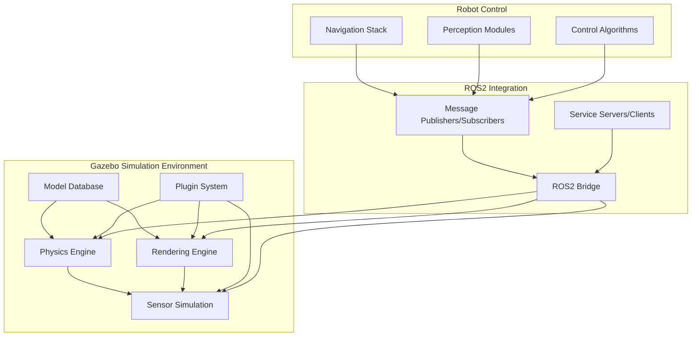
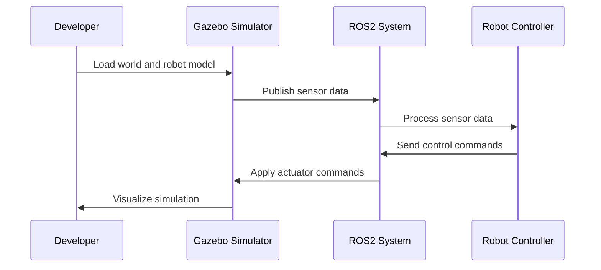

# Introduction to Gazebo Simulation

## Learning Objectives

By the end of this chapter, you will be able to:
- Explain the role of simulation in robotics development and testing
- Describe the architecture and components of Gazebo simulation
- Set up and configure a basic Gazebo simulation environment
- Create and load simple robot models in Gazebo
- Understand the physics engine and sensor simulation capabilities
- Evaluate the advantages and limitations of simulation vs. real-world testing

## Introduction

Gazebo is a powerful, open-source robotics simulator that provides realistic 3D environments for simulating robots and their interactions with the world. It's an essential tool in robotics development, allowing researchers and engineers to test algorithms, validate designs, and train AI models before deploying to physical robots.

Simulation plays a critical role in robotics development by providing a safe, cost-effective, and repeatable environment for testing. Gazebo enables rapid prototyping and iteration, which is particularly valuable in the development of complex systems like humanoid robots where physical testing can be expensive and time-consuming.

## Core Concepts

### What is Gazebo?

Gazebo is a 3D simulation environment that provides:
- Realistic physics simulation using ODE, Bullet, or DART engines
- High-quality rendering with support for various graphics APIs
- Extensive sensor simulation (cameras, LIDAR, IMU, GPS, etc.)
- Plugin architecture for custom functionality
- Integration with ROS/ROS2 for seamless simulation workflows

### Key Components of Gazebo

1. **Physics Engine**: Handles collision detection, dynamics, and joint constraints
2. **Rendering Engine**: Provides visual rendering and graphics capabilities
3. **Sensor Simulation**: Emulates real-world sensors with realistic noise models
4. **Model Database**: Repository of pre-built robot and environment models
5. **Plugins**: Extensible architecture for custom behaviors and interfaces

### Simulation vs. Reality

While simulation provides many advantages, it's important to understand the reality gap:
- **Advantages**: Safe testing, repeatability, cost-effectiveness, controlled environments
- **Limitations**: Approximation of real physics, sensor noise modeling, computational constraints
- **Best Practices**: Sim-to-real transfer techniques, domain randomization, validation with real robots

## Architecture Diagram



## Flow Diagram



## Code Example: Simple Gazebo Model (URDF)

Here's a basic robot model in URDF format that can be used in Gazebo:

```xml
<?xml version="1.0"?>
<robot name="simple_robot" xmlns:xacro="http://www.ros.org/wiki/xacro">
  <!-- Base link -->
  <link name="base_link">
    <visual>
      <geometry>
        <box size="0.5 0.5 0.2"/>
      </geometry>
      <material name="blue">
        <color rgba="0 0 1 0.8"/>
      </material>
    </visual>
    <collision>
      <geometry>
        <box size="0.5 0.5 0.2"/>
      </geometry>
    </collision>
    <inertial>
      <mass value="1.0"/>
      <inertia ixx="0.083" ixy="0" ixz="0" iyy="0.083" iyz="0" izz="0.167"/>
    </inertial>
  </link>

  <!-- Sensor link -->
  <link name="sensor_link">
    <visual>
      <geometry>
        <cylinder radius="0.02" length="0.04"/>
      </geometry>
      <material name="red">
        <color rgba="1 0 0 0.8"/>
      </material>
    </visual>
    <collision>
      <geometry>
        <cylinder radius="0.02" length="0.04"/>
      </geometry>
    </collision>
    <inertial>
      <mass value="0.1"/>
      <inertia ixx="0.0001" ixy="0" ixz="0" iyy="0.0001" iyz="0" izz="0.00005"/>
    </inertial>
  </link>

  <!-- Joint connecting base and sensor -->
  <joint name="sensor_joint" type="fixed">
    <parent link="base_link"/>
    <child link="sensor_link"/>
    <origin xyz="0.2 0 0.15" rpy="0 0 0"/>
  </joint>

  <!-- Gazebo plugin for ROS control -->
  <gazebo>
    <plugin name="gazebo_ros_control" filename="libgazebo_ros_control.so">
      <robotNamespace>/simple_robot</robotNamespace>
    </plugin>
  </gazebo>

  <!-- Gazebo material definition -->
  <gazebo reference="base_link">
    <material>Gazebo/Blue</material>
  </gazebo>

  <gazebo reference="sensor_link">
    <material>Gazebo/Red</material>
  </gazebo>
</robot>
```

## Code Example: Launching Gazebo with ROS2

Here's a launch file to start Gazebo with a robot model:

```python
from launch import LaunchDescription
from launch.actions import DeclareLaunchArgument, IncludeLaunchDescription
from launch.launch_description_sources import PythonLaunchDescriptionSource
from launch.substitutions import LaunchConfiguration, PathJoinSubstitution
from launch_ros.actions import Node
from launch_ros.substitutions import FindPackageShare


def generate_launch_description():
    # Declare launch arguments
    use_sim_time = LaunchConfiguration('use_sim_time', default='true')
    robot_model = LaunchConfiguration('robot_model', default='simple_robot')

    # Path to robot description
    robot_description_path = PathJoinSubstitution([
        FindPackageShare('my_robot_description'),
        'urdf',
        LaunchConfiguration('robot_model')
    ])

    return LaunchDescription([
        # Declare launch arguments
        DeclareLaunchArgument(
            'use_sim_time',
            default_value='true',
            description='Use simulation (Gazebo) clock if true'),

        DeclareLaunchArgument(
            'robot_model',
            default_value='simple_robot.urdf',
            description='Robot model to load'),

        # Robot state publisher
        Node(
            package='robot_state_publisher',
            executable='robot_state_publisher',
            name='robot_state_publisher',
            output='screen',
            parameters=[{
                'use_sim_time': use_sim_time,
                'robot_description': robot_description_path
            }]),

        # Gazebo server
        IncludeLaunchDescription(
            PythonLaunchDescriptionSource([
                PathJoinSubstitution([
                    FindPackageShare('gazebo_ros'),
                    'launch',
                    'gazebo.launch.py'
                ])
            ]),
            launch_arguments={
                'verbose': 'false',
                'pause_on_startup': 'false'
            }.items()
        ),

        # Spawn robot in Gazebo
        Node(
            package='gazebo_ros',
            executable='spawn_entity.py',
            arguments=[
                '-topic', 'robot_description',
                '-entity', 'simple_robot',
                '-x', '0', '-y', '0', '-z', '0.1'
            ],
            output='screen'),
    ])
```

## Step-by-Step Practical Tutorial

### Setting up a Basic Gazebo Simulation

1. **Install Gazebo Garden (or Citadel/Harmonic)**:
   ```bash
   sudo apt install ros-humble-gazebo-ros-pkgs
   sudo apt install gazebo
   ```

2. **Create a robot description package**:
   ```bash
   cd ~/ros2_ws/src
   ros2 pkg create --build-type ament_cmake my_robot_description
   ```

3. **Create the URDF directory structure**:
   ```bash
   cd my_robot_description
   mkdir urdf
   ```

4. **Create the robot URDF file** (`urdf/simple_robot.urdf`):
   ```xml
   <!-- Use the URDF example above -->
   ```

5. **Create a launch directory**:
   ```bash
   mkdir launch
   ```

6. **Create a launch file** (`launch/gazebo_sim.launch.py`):
   ```python
   # Use the launch file example above
   ```

7. **Update CMakeLists.txt** to install the URDF files:
   ```cmake
   install(DIRECTORY
     urdf
     DESTINATION share/${PROJECT_NAME}
   )
   ```

8. **Build the package**:
   ```bash
   cd ~/ros2_ws
   colcon build --packages-select my_robot_description
   ```

9. **Source the workspace**:
   ```bash
   source install/setup.bash
   ```

10. **Launch the simulation**:
    ```bash
    ros2 launch my_robot_description gazebo_sim.launch.py
    ```

11. **In a new terminal, check the topics**:
    ```bash
    ros2 topic list
    ```

## Summary

This chapter introduced Gazebo simulation, a critical tool for robotics development. We covered the architecture of Gazebo, its key components, and how it integrates with ROS2. Simulation provides a safe and cost-effective environment for testing robotic algorithms before deployment on physical hardware.

Understanding simulation is crucial for developing robust robotic systems, as it allows for rapid iteration and testing of complex behaviors that would be difficult or dangerous to test on real robots.

## Mini-Quiz

1. What is the primary purpose of Gazebo in robotics development?
   - A) To create robot hardware
   - B) To provide a 3D simulation environment for testing robots
   - C) To write robot control code
   - D) To manufacture robot parts

2. Which physics engines does Gazebo support?
   - A) ODE only
   - B) Bullet only
   - C) ODE, Bullet, and DART
   - D) Custom physics engine only

3. What is the "reality gap" in simulation?
   - A) The physical gap between robots
   - B) The difference between simulated and real-world physics
   - C) The time delay in simulation
   - D) The cost difference between simulation and reality

4. Which ROS2 package is commonly used for ROS-Gazebo integration?
   - A) gazebo_ros
   - B) ros_gazebo
   - C) gazebo_control
   - D) sim_ros

5. What is a key advantage of using simulation for robotics development?
   - A) It's always perfectly accurate
   - B) It provides safe testing without risk to hardware
   - C) It's faster than real-world testing in all cases
   - D) It requires no computational resources

**Answers**: 1-B, 2-C, 3-B, 4-A, 5-B