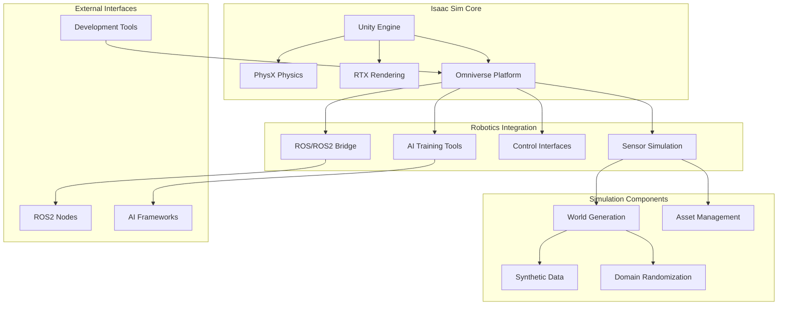
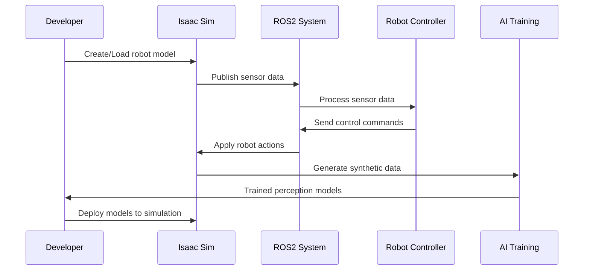

# Unity Isaac Sim Basics

## Learning Objectives

By the end of this chapter, you will be able to:
- Explain the Unity Isaac Sim platform and its role in robotics simulation
- Understand the architecture and components of Isaac Sim
- Set up and configure Isaac Sim for robotics applications
- Create and import robot models into Isaac Sim
- Implement basic sensor simulation and physics in Isaac Sim
- Compare Isaac Sim with other simulation platforms like Gazebo

## Introduction

Unity Isaac Sim is NVIDIA's advanced robotics simulation platform built on the Unity engine. It provides high-fidelity physics simulation, photorealistic rendering, and comprehensive tooling for developing, training, and testing AI-powered robots. Isaac Sim is particularly powerful for vision-based robotics applications and AI training due to its advanced rendering capabilities.

Isaac Sim combines the power of the Unity game engine with robotics-specific tools and interfaces, making it ideal for developing complex robotic systems that require high-quality visual simulation. It's especially valuable for training perception systems, testing navigation algorithms, and developing AI models that need to operate in visually rich environments.

## Core Concepts

### Isaac Sim Architecture

Isaac Sim is built on several key components:
- **Omniverse Platform**: NVIDIA's simulation and collaboration platform
- **PhysX Physics Engine**: High-performance physics simulation
- **RTX Rendering**: Real-time ray tracing and photorealistic rendering
- **ROS/ROS2 Bridge**: Seamless integration with ROS/ROS2 ecosystems
- **Synthetic Data Generation**: Tools for creating labeled training data

### Key Features

- **Photorealistic Rendering**: High-quality visuals for training perception systems
- **Large-Scale Environments**: Support for complex, realistic worlds
- **Sensor Simulation**: Advanced simulation of cameras, LIDAR, IMU, and other sensors
- **AI Training Integration**: Direct integration with reinforcement learning frameworks
- **Domain Randomization**: Tools for creating varied training environments

### Isaac Sim vs. Other Platforms

Compared to Gazebo:
- **Rendering Quality**: Isaac Sim provides photorealistic rendering vs. Gazebo's more basic rendering
- **Physics**: Both use quality physics engines but with different strengths
- **Use Cases**: Isaac Sim excels at vision-based tasks; Gazebo is more general-purpose
- **Performance**: Gazebo may be faster for simple simulations; Isaac Sim for complex visual scenes

## Architecture Diagram



## Flow Diagram



## Code Example: Isaac Sim Robot Configuration

Here's an example of configuring a robot in Isaac Sim using USD (Universal Scene Description):

```
# Example USD file for a simple robot (robot.usd)
# This is a simplified representation of how Isaac Sim handles robot models

from pxr import Usd, UsdGeom, UsdPhysics, UsdShade, Sdf, Gf, Vt

def create_robot_stage(file_path):
    # Create a new USD stage
    stage = Usd.Stage.CreateNew(file_path)

    # Create the root robot prim
    robot_prim = UsdGeom.Xform.Define(stage, "/Robot")

    # Create the base link
    base_link = UsdGeom.Cylinder.Define(stage, "/Robot/BaseLink")
    base_link.GetRadiusAttr().Set(0.2)
    base_link.GetHeightAttr().Set(0.15)

    # Set materials
    material = UsdShade.Material.Define(stage, "/Robot/Materials/BaseMaterial")
    pbr_shader = UsdShade.Shader.Define(stage, "/Robot/Materials/BaseMaterial/PBRShader")
    pbr_shader.CreateIdAttr("OmniPBR")
    pbr_shader.CreateInput("diffuse_color", Sdf.ValueTypeNames.Color3f).Set((0, 0, 1))  # Blue
    material.CreateSurfaceOutput().ConnectToSource(pbr_shader.ConnectableAPI(), "out")

    # Apply material to base link
    UsdShade.MaterialBindingAPI(base_link).Bind(material)

    # Add physics properties
    UsdPhysics.RigidBodyAPI.Apply(base_link.GetPrim())
    mass_api = UsdPhysics.MassAPI.Apply(base_link.GetPrim())
    mass_api.CreateMassAttr().Set(10.0)

    # Create a camera sensor
    camera_link = UsdGeom.Xform.Define(stage, "/Robot/CameraLink")
    camera_link.AddTranslateOp().Set(Gf.Vec3d(0.15, 0, 0.1))  # Position relative to base

    # Define camera properties
    camera = UsdGeom.Camera.Define(stage, "/Robot/CameraLink/Camera")
    camera.GetFocalLengthAttr().Set(24.0)
    camera.GetHorizontalApertureAttr().Set(20.955)
    camera.GetVerticalApertureAttr().Set(15.2908)

    # Create a LIDAR sensor (conceptual - actual implementation varies)
    lidar_link = UsdGeom.Xform.Define(stage, "/Robot/LidarLink")
    lidar_link.AddTranslateOp().Set(Gf.Vec3d(0.15, 0, 0.1))

    stage.GetRootLayer().Save()
    return stage

# Usage
if __name__ == "__main__":
    stage = create_robot_stage("./robot.usd")
    print("Robot USD file created successfully")
```

## Isaac Sim Python API Example

Here's an example of using Isaac Sim's Python API to control a robot:

```python
import omni
from omni.isaac.core import World
from omni.isaac.core.utils.nucleus import get_assets_root_path
from omni.isaac.core.utils.stage import add_reference_to_stage
from omni.isaac.core.utils.viewports import set_camera_view
import numpy as np

# Initialize Isaac Sim
omni.kit.commands.execute("ChangeStageLighting", lighting_kit="Default Light Kit")

# Create a world instance
world = World(stage_units_in_meters=1.0)

# Get the assets root path
assets_root_path = get_assets_root_path()

# Add a robot to the stage (using a sample robot from Isaac Sim)
if assets_root_path is not None:
    # Add a simple robot (replace with your robot's path)
    add_reference_to_stage(
        usd_path=assets_root_path + "/Isaac/Robots/Franka/franka.usd",
        prim_path="/World/Robot"
    )

# Set up the camera view
set_camera_view(eye=np.array([2, 2, 2]), target=np.array([0, 0, 0]))

# Reset the world
world.reset()

# Example of controlling the robot (simplified)
for i in range(1000):
    # Step the world simulation
    world.step(render=True)

    # Add your robot control logic here
    # For example, you might get sensor data and send commands
    if i == 0:
        print("Simulation started, robot added to stage")

    # Example: print simulation time every 100 steps
    if i % 100 == 0:
        print(f"Simulation step: {i}, Time: {world.current_time_step_index * world.get_physics_dt():.3f}s")

# Clean up
world.clear()
```

## Isaac Sim Launch Configuration

Here's an example launch file for integrating Isaac Sim with ROS2:

```python
from launch import LaunchDescription
from launch.actions import DeclareLaunchArgument, ExecuteProcess
from launch.substitutions import LaunchConfiguration, PathJoinSubstitution
from launch_ros.actions import Node
from launch_ros.substitutions import FindPackageShare
import os


def generate_launch_description():
    # Declare launch arguments
    use_sim_time = LaunchConfiguration('use_sim_time', default='true')
    robot_model = LaunchConfiguration('robot_model', default='my_robot')

    # Isaac Sim executable path (this would be configured based on your installation)
    isaac_sim_path = "/path/to/isaac-sim/python.sh"  # Update with actual path

    # Path to simulation script
    sim_script_path = PathJoinSubstitution([
        FindPackageShare('isaac_sim_examples'),
        'scripts',
        'robot_simulation.py'
    ])

    return LaunchDescription([
        # Declare launch arguments
        DeclareLaunchArgument(
            'use_sim_time',
            default_value='true',
            description='Use simulation (Isaac Sim) clock if true'),

        DeclareLaunchArgument(
            'robot_model',
            default_value='my_robot',
            description='Robot model to load in Isaac Sim'),

        # Launch Isaac Sim with robot configuration
        ExecuteProcess(
            cmd=[isaac_sim_path, sim_script_path],
            output='screen',
            name='isaac_sim'
        ),

        # ROS2 bridge node (example - actual implementation may vary)
        Node(
            package='isaac_ros_bridges',
            executable='isaac_ros_bridge',
            name='isaac_ros_bridge',
            parameters=[{
                'use_sim_time': use_sim_time,
                'robot_model': robot_model
            }],
            output='screen'
        )
    ])
```

## Step-by-Step Practical Tutorial

### Setting up Isaac Sim for Robotics Simulation

1. **Install Isaac Sim**:
   - Download Isaac Sim from NVIDIA Developer website
   - Follow the installation instructions for your platform
   - Ensure your system meets the hardware requirements (GPU with RT cores)

2. **Verify Installation**:
   ```bash
   cd /path/to/isaac-sim
   ./python.sh -c "import omni; print('Isaac Sim installed successfully')"
   ```

3. **Create a new ROS2 package for Isaac Sim examples**:
   ```bash
   cd ~/ros2_ws/src
   ros2 pkg create --build-type ament_python isaac_sim_examples --dependencies rclpy std_msgs sensor_msgs geometry_msgs
   ```

4. **Navigate to the package directory**:
   ```bash
   cd isaac_sim_examples
   ```

5. **Create the main module directory**:
   ```bash
   mkdir isaac_sim_examples
   touch isaac_sim_examples/__init__.py
   ```

6. **Create a simple Isaac Sim control script** (`scripts/robot_control.py`):
   ```python
   #!/usr/bin/env python3

   """
   Example script to demonstrate Isaac Sim control
   Note: This is a conceptual example - actual implementation requires Isaac Sim installation
   """

   import sys
   import time
   import rclpy
   from rclpy.node import Node
   from geometry_msgs.msg import Twist
   from sensor_msgs.msg import LaserScan, Image, Imu
   import numpy as np


   class IsaacSimController(Node):
       def __init__(self):
           super().__init__('isaac_sim_controller')

           # Create publishers for robot commands
           self.cmd_vel_pub = self.create_publisher(Twist, '/cmd_vel', 10)

           # Create subscribers for sensor data
           self.laser_sub = self.create_subscription(
               LaserScan, '/scan', self.laser_callback, 10)
           self.image_sub = self.create_subscription(
               Image, '/camera/image_raw', self.image_callback, 10)
           self.imu_sub = self.create_subscription(
               Imu, '/imu/data', self.imu_callback, 10)

           # Create timer for control loop
           self.control_timer = self.create_timer(0.1, self.control_loop)

           self.get_logger().info('Isaac Sim Controller initialized')

       def laser_callback(self, msg):
           self.get_logger().info(f'Laser scan received: {len(msg.ranges)} ranges')

       def image_callback(self, msg):
           self.get_logger().info(f'Image received: {msg.width}x{msg.height}')

       def imu_callback(self, msg):
           self.get_logger().info(f'IMU data: linear_acceleration=({msg.linear_acceleration.x:.2f}, {msg.linear_acceleration.y:.2f}, {msg.linear_acceleration.z:.2f})')

       def control_loop(self):
           # Simple control logic - move forward
           cmd = Twist()
           cmd.linear.x = 0.5  # Move forward at 0.5 m/s
           cmd.angular.z = 0.0  # No rotation
           self.cmd_vel_pub.publish(cmd)


   def main(args=None):
       rclpy.init(args=args)
       controller = IsaacSimController()

       try:
           rclpy.spin(controller)
       except KeyboardInterrupt:
           pass
       finally:
           controller.destroy_node()
           rclpy.shutdown()


   if __name__ == '__main__':
       main()
   ```

7. **Create a launch directory and file**:
   ```bash
   mkdir launch
   ```

8. **Create a launch file** (`launch/isaac_sim_example.launch.py`):
   ```python
   from launch import LaunchDescription
   from launch.actions import DeclareLaunchArgument
   from launch.substitutions import LaunchConfiguration
   from launch_ros.actions import Node
   from ament_index_python.packages import get_package_share_directory
   import os


   def generate_launch_description():
       # Declare launch arguments
       use_sim_time = LaunchConfiguration('use_sim_time', default='true')

       return LaunchDescription([
           # Declare launch arguments
           DeclareLaunchArgument(
               'use_sim_time',
               default_value='true',
               description='Use simulation time if true'),

           # Isaac Sim controller node
           Node(
               package='isaac_sim_examples',
               executable='isaac_sim_examples.robot_control',
               name='isaac_sim_controller',
               parameters=[{'use_sim_time': use_sim_time}],
               output='screen'
           )
       ])
   ```

9. **Update setup.py**:
   ```python
   from setuptools import setup
   import os
   from glob import glob

   package_name = 'isaac_sim_examples'

   setup(
       name=package_name,
       version='0.0.0',
       packages=[package_name],
       data_files=[
           ('share/ament_index/resource_index/packages',
               ['resource/' + package_name]),
           ('share/' + package_name, ['package.xml']),
           (os.path.join('share', package_name, 'launch'), glob('launch/*.py')),
           (os.path.join('share', package_name, 'scripts'), glob('scripts/*.py')),
       ],
       install_requires=['setuptools'],
       zip_safe=True,
       maintainer='User',
       maintainer_email='user@example.com',
       description='Package for Isaac Sim examples',
       license='Apache-2.0',
       tests_require=['pytest'],
       entry_points={
           'console_scripts': [
               'robot_control = isaac_sim_examples.robot_control:main',
           ],
       },
   )
   ```

10. **Make the script executable**:
    ```bash
    chmod +x scripts/robot_control.py
    ```

11. **Build the package**:
    ```bash
    cd ~/ros2_ws
    colcon build --packages-select isaac_sim_examples
    ```

12. **Source the workspace**:
    ```bash
    source install/setup.bash
    ```

13. **Launch the Isaac Sim example** (requires Isaac Sim installation):
    ```bash
    # Note: Actual Isaac Sim integration requires the full Isaac Sim installation
    ros2 launch isaac_sim_examples isaac_sim_example.launch.py
    ```

## Summary

This chapter introduced Unity Isaac Sim, NVIDIA's advanced robotics simulation platform. We explored its architecture, key features, and how it differs from other simulation platforms like Gazebo. Isaac Sim excels at photorealistic rendering and AI training applications, making it ideal for vision-based robotics and perception system development.

Isaac Sim provides powerful tools for creating realistic simulation environments with high-fidelity physics and rendering. Its integration with the ROS/ROS2 ecosystem makes it a valuable tool for robotics development and AI training.

## Mini-Quiz

1. What is the primary advantage of Isaac Sim over traditional simulators like Gazebo?
   - A) Faster simulation speed
   - B) Photorealistic rendering and advanced visualization
   - C) Simpler user interface
   - D) Lower computational requirements

2. Which physics engine is commonly used in Isaac Sim?
   - A) ODE
   - B) Bullet
   - C) PhysX
   - D) DART

3. What is the main use case where Isaac Sim excels compared to other simulators?
   - A) Simple mobile robot navigation
   - B) Vision-based robotics and perception training
   - C) Basic kinematic simulation
   - D) Low-cost applications

4. What platform is Isaac Sim built on?
   - A) Unreal Engine
   - B) Unity Engine
   - C) Custom engine
   - D) OpenSceneGraph

5. What is domain randomization in Isaac Sim used for?
   - A) Randomizing robot hardware
   - B) Creating varied training environments for AI
   - C) Randomizing physics parameters only
   - D) Randomizing network connections

**Answers**: 1-B, 2-C, 3-B, 4-B, 5-B