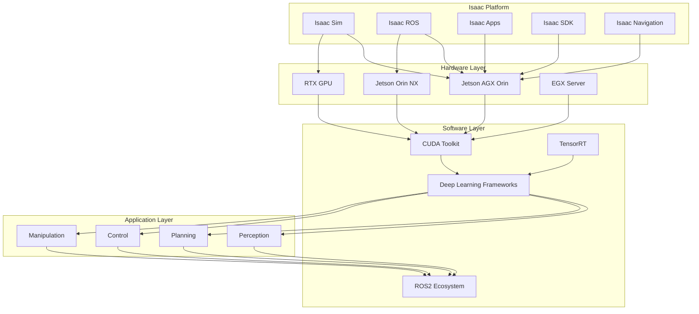
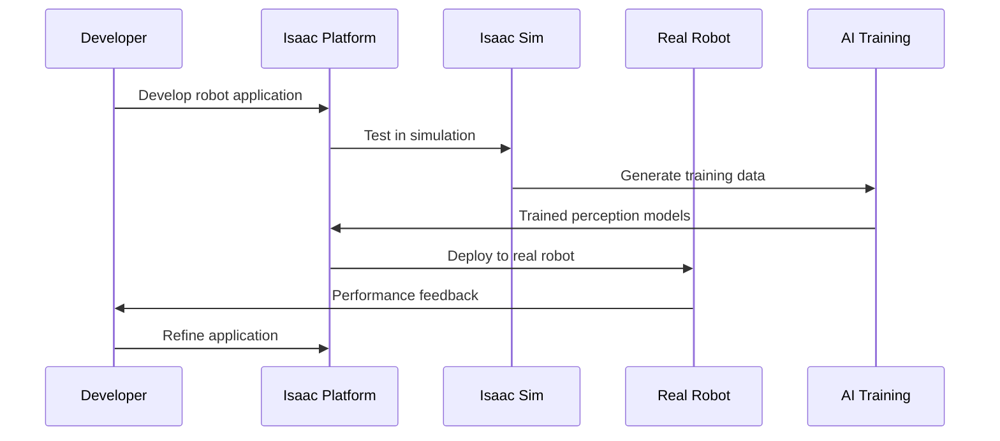

# Introduction to NVIDIA Isaac

## Learning Objectives

By the end of this chapter, you will be able to:
- Define the NVIDIA Isaac platform and its role in robotics development
- Understand the architecture and components of the Isaac ecosystem
- Identify the key technologies and tools within the Isaac platform
- Explain how Isaac integrates with ROS/ROS2 and other robotics frameworks
- Evaluate the advantages of using Isaac for AI-powered robotics applications
- Set up the basic Isaac development environment

## Introduction

NVIDIA Isaac is a comprehensive robotics platform designed to accelerate the development and deployment of AI-powered robots. It combines NVIDIA's expertise in GPU computing, AI, and simulation with specialized tools for robotics development. The platform provides everything needed to build, train, and deploy intelligent robots, from simulation and perception to navigation and manipulation.

Isaac leverages NVIDIA's powerful GPU computing capabilities to enable complex AI algorithms to run efficiently on robots. This makes it particularly valuable for applications requiring real-time perception, planning, and control using deep learning and other AI techniques. The platform is especially well-suited for developing humanoid robots and other complex robotic systems that require sophisticated AI capabilities.

## Core Concepts

### Isaac Platform Components

The NVIDIA Isaac platform consists of several key components:
- **Isaac Sim**: High-fidelity simulation environment built on Omniverse
- **Isaac ROS**: ROS2 packages for perception, navigation, and manipulation
- **Isaac Apps**: Reference applications and demonstrations
- **Isaac SDK**: Software development kit for custom applications
- **Isaac Navigation**: Autonomous navigation stack optimized for NVIDIA hardware

### AI and Robotics Integration

Isaac uniquely combines:
- **GPU Acceleration**: Leverages CUDA and TensorRT for AI inference
- **Deep Learning**: Integration with NVIDIA's AI frameworks
- **Simulation**: Photorealistic training environments
- **Real-time Processing**: Optimized for embedded robotics platforms

### Hardware Integration

Isaac is designed to work with NVIDIA's robotics hardware:
- **Jetson Platform**: Edge AI computing for robotics
- **EGX Platform**: Edge computing for robot fleets
- **RTX GPUs**: High-performance computing for simulation and training

### Isaac vs Traditional Robotics Frameworks

Compared to traditional robotics frameworks, Isaac provides:
- **AI-First Design**: Built around AI and deep learning workflows
- **GPU Acceleration**: Native support for parallel computing
- **Simulation Integration**: Seamless sim-to-real transfer
- **Perception Tools**: Specialized tools for computer vision and sensing

## Architecture Diagram



## Flow Diagram



## Code Example: Isaac ROS Node

Here's an example of an Isaac ROS node that performs perception using GPU acceleration:

```python
import rclpy
from rclpy.node import Node
from sensor_msgs.msg import Image
from geometry_msgs.msg import Point
from std_msgs.msg import Header
from cv_bridge import CvBridge
import numpy as np
import cv2
import torch
import torchvision.transforms as transforms


class IsaacPerceptionNode(Node):
    """
    Example Isaac ROS node for perception using GPU acceleration
    """

    def __init__(self):
        super().__init__('isaac_perception_node')

        # Initialize CV bridge
        self.bridge = CvBridge()

        # Load pre-trained model (example using PyTorch)
        try:
            # Check if CUDA is available
            self.device = torch.device('cuda' if torch.cuda.is_available() else 'cpu')
            self.get_logger().info(f'Using device: {self.device}')

            # Example: Load a segmentation model
            self.model = torch.hub.load('pytorch/vision:v0.10.0', 'deeplabv3_resnet50', pretrained=True)
            self.model.to(self.device)
            self.model.eval()

            self.get_logger().info('Model loaded successfully')
        except Exception as e:
            self.get_logger().error(f'Failed to load model: {e}')
            self.model = None

        # Create image subscriber
        self.image_sub = self.create_subscription(
            Image,
            '/camera/image_raw',
            self.image_callback,
            10
        )

        # Create perception result publisher
        self.result_pub = self.create_publisher(
            Point,  # Simplified output - in practice this would be a custom message
            '/perception/result',
            10
        )

        # Preprocessing transform
        self.transform = transforms.Compose([
            transforms.ToTensor(),
            transforms.Normalize(mean=[0.485, 0.456, 0.406], std=[0.229, 0.224, 0.225])
        ])

        self.get_logger().info('Isaac Perception Node initialized')

    def image_callback(self, msg):
        """
        Process incoming image and perform perception
        """
        try:
            # Convert ROS image to OpenCV
            cv_image = self.bridge.imgmsg_to_cv2(msg, desired_encoding='bgr8')

            # Preprocess image for model
            input_tensor = self.transform(cv_image).unsqueeze(0).to(self.device)

            # Perform inference if model is available
            if self.model is not None:
                with torch.no_grad():
                    output = self.model(input_tensor)

                    # Process output (simplified example)
                    # In a real application, you would parse the segmentation mask
                    # or detection results based on your specific task
                    result = self.process_model_output(output, cv_image)

                    # Publish result
                    point_msg = Point()
                    point_msg.x = float(result['center_x'])
                    point_msg.y = float(result['center_y'])
                    point_msg.z = float(result['confidence'])

                    self.result_pub.publish(point_msg)

                    self.get_logger().info(f'Perception result: ({result["center_x"]:.2f}, {result["center_y"]:.2f})')

        except Exception as e:
            self.get_logger().error(f'Error in image processing: {e}')

    def process_model_output(self, output, original_image):
        """
        Process the model output and extract relevant information
        """
        # This is a simplified example - real implementation would depend on the model
        # For segmentation, we might find the center of the largest object
        # For detection, we might extract bounding boxes

        # Convert output to numpy for processing
        if torch.is_tensor(output):
            output_np = output.cpu().numpy()
        else:
            # Handle dictionary outputs from some models
            output_np = output['out'].cpu().numpy() if 'out' in output else list(output.values())[0].cpu().numpy()

        # Find center of mass of the most confident region (simplified)
        if output_np.ndim > 2:
            # Take the first channel as an example
            confidence_map = output_np[0, 0, :, :] if output_np.shape[0] > 0 else output_np[0, :, :]
            confidence_map = np.abs(confidence_map)  # Take absolute value to ensure positive

            # Normalize to [0, 1]
            if confidence_map.max() != 0:
                confidence_map = confidence_map / confidence_map.max()

            # Find center of mass
            rows, cols = np.ogrid[:confidence_map.shape[0], :confidence_map.shape[1]]
            center_y = np.sum(rows * confidence_map) / np.sum(confidence_map)
            center_x = np.sum(cols * confidence_map) / np.sum(confidence_map)

            # Scale back to original image coordinates
            scale_x = original_image.shape[1] / confidence_map.shape[1]
            scale_y = original_image.shape[0] / confidence_map.shape[0]

            center_x *= scale_x
            center_y *= scale_y

            confidence = np.mean(confidence_map)
        else:
            # Fallback for simpler outputs
            center_x, center_y = original_image.shape[1] // 2, original_image.shape[0] // 2
            confidence = 0.5

        return {
            'center_x': center_x,
            'center_y': center_y,
            'confidence': confidence
        }


def main(args=None):
    rclpy.init(args=args)
    perception_node = IsaacPerceptionNode()

    try:
        rclpy.spin(perception_node)
    except KeyboardInterrupt:
        pass
    finally:
        perception_node.destroy_node()
        rclpy.shutdown()


if __name__ == '__main__':
    main()
```

## Isaac ROS Package Example

Here's an example of how to structure an Isaac ROS package:

```xml
<!-- package.xml -->
<?xml version="1.0"?>
<?xml-model href="http://download.ros.org/schema/package_format3.xsd" schematypens="http://www.w3.org/2001/XMLSchema"?>
<package format="3">
  <name>isaac_perception_examples</name>
  <version>0.0.0</version>
  <description>Examples for Isaac perception with GPU acceleration</description>
  <maintainer email="user@example.com">User</maintainer>
  <license>Apache-2.0</license>

  <buildtool_depend>ament_cmake</buildtool_depend>
  <buildtool_depend>ament_cmake_python</buildtool_depend>

  <depend>rclpy</depend>
  <depend>std_msgs</depend>
  <depend>sensor_msgs</depend>
  <depend>geometry_msgs</depend>
  <depend>cv_bridge</depend>
  <depend>isaac_ros_common</depend>
  <depend>isaac_ros_image_pipeline</depend>

  <exec_depend>python3-opencv</exec_depend>
  <exec_depend>python3-torch</exec_depend>
  <exec_depend>python3-torchvision</exec_depend>

  <export>
    <build_type>ament_cmake</build_type>
  </export>
</package>
```

## Step-by-Step Practical Tutorial

### Setting up Isaac for Robotics Development

1. **Install NVIDIA Isaac Platform**:
   - Download Isaac ROS from NVIDIA Developer website
   - Install prerequisites (Docker, NVIDIA Container Toolkit)
   - Follow the installation guide for your platform

2. **Verify CUDA Installation**:
   ```bash
   nvidia-smi
   nvcc --version
   ```

3. **Create an Isaac ROS workspace**:
   ```bash
   mkdir -p ~/isaac_ws/src
   cd ~/isaac_ws/src
   git clone https://github.com/NVIDIA-ISAAC-ROS/isaac_ros_common.git
   git clone https://github.com/NVIDIA-ISAAC-ROS/isaac_ros_image_pipeline.git
   # Add other Isaac ROS packages as needed
   ```

4. **Create a custom perception package**:
   ```bash
   cd ~/isaac_ws/src
   ros2 pkg create --build-type ament_python isaac_perception_examples --dependencies rclpy std_msgs sensor_msgs geometry_msgs cv_bridge
   ```

5. **Navigate to the package directory**:
   ```bash
   cd isaac_perception_examples
   ```

6. **Create the main module directory**:
   ```bash
   mkdir isaac_perception_examples
   touch isaac_perception_examples/__init__.py
   ```

7. **Create the perception node** (`isaac_perception_examples/perception_node.py`):
   ```python
   # Use the Isaac perception node code example above
   ```

8. **Update setup.py**:
   ```python
   from setuptools import setup
   import os
   from glob import glob

   package_name = 'isaac_perception_examples'

   setup(
       name=package_name,
       version='0.0.0',
       packages=[package_name],
       data_files=[
           ('share/ament_index/resource_index/packages',
               ['resource/' + package_name]),
           ('share/' + package_name, ['package.xml']),
       ],
       install_requires=['setuptools'],
       zip_safe=True,
       maintainer='User',
       maintainer_email='user@example.com',
       description='Isaac perception examples with GPU acceleration',
       license='Apache-2.0',
       tests_require=['pytest'],
       entry_points={
           'console_scripts': [
               'perception_node = isaac_perception_examples.perception_node:main',
           ],
       },
   )
   ```

9. **Create a launch file** (`launch/isaac_perception.launch.py`):
   ```python
   from launch import LaunchDescription
   from launch.actions import DeclareLaunchArgument
   from launch.substitutions import LaunchConfiguration
   from launch_ros.actions import Node
   from ament_index_python.packages import get_package_share_directory
   import os


   def generate_launch_description():
       # Declare launch arguments
       use_sim_time = LaunchConfiguration('use_sim_time', default='false')

       return LaunchDescription([
           # Declare launch arguments
           DeclareLaunchArgument(
               'use_sim_time',
               default_value='false',
               description='Use simulation time if true'),

           # Isaac perception node
           Node(
               package='isaac_perception_examples',
               executable='perception_node',
               name='isaac_perception_node',
               parameters=[{'use_sim_time': use_sim_time}],
               output='screen'
           )
       ])
   ```

10. **Create launch directory and update setup.py to install launch files**:
    ```bash
    mkdir launch
    cp launch/isaac_perception.launch.py launch/
    ```

11. **Update setup.py to include launch files**:
    ```python
    from setuptools import setup
    import os
    from glob import glob

    package_name = 'isaac_perception_examples'

    setup(
        name=package_name,
        version='0.0.0',
        packages=[package_name],
        data_files=[
            ('share/ament_index/resource_index/packages',
                ['resource/' + package_name]),
            ('share/' + package_name, ['package.xml']),
            (os.path.join('share', package_name, 'launch'), glob('launch/*.py')),
        ],
        install_requires=['setuptools'],
        zip_safe=True,
        maintainer='User',
        maintainer_email='user@example.com',
        description='Isaac perception examples with GPU acceleration',
        license='Apache-2.0',
        tests_require=['pytest'],
        entry_points={
            'console_scripts': [
                'perception_node = isaac_perception_examples.perception_node:main',
            ],
        },
    )
    ```

12. **Build the package**:
    ```bash
    cd ~/isaac_ws
    colcon build --packages-select isaac_perception_examples
    ```

13. **Source the workspace**:
    ```bash
    source install/setup.bash
    ```

14. **Run the Isaac perception node** (requires CUDA-enabled GPU):
    ```bash
    ros2 launch isaac_perception_examples isaac_perception.launch.py
    ```

## Summary

This chapter introduced the NVIDIA Isaac platform, a comprehensive robotics platform designed to accelerate AI-powered robot development. We explored its architecture, components, and how it integrates GPU acceleration with robotics applications.

Isaac provides a unique combination of simulation, perception, navigation, and manipulation tools optimized for AI workloads. Its integration with NVIDIA's hardware platforms makes it particularly powerful for developing sophisticated robotic systems that require real-time AI processing.

## Mini-Quiz

1. What is the primary advantage of NVIDIA Isaac over traditional robotics frameworks?
   - A) Lower cost
   - B) AI-first design with GPU acceleration
   - C) Simpler programming interface
   - D) Better documentation

2. Which hardware platforms is Isaac designed to work with?
   - A) Jetson platform
   - B) RTX GPUs
   - C) EGX servers
   - D) All of the above

3. What is Isaac Sim used for?
   - A) Hardware control only
   - B) High-fidelity simulation and training
   - C) Network communication
   - D) Data logging only

4. Which Isaac component provides ROS2 packages for robotics applications?
   - A) Isaac Apps
   - B) Isaac SDK
   - C) Isaac ROS
   - D) Isaac Navigation

5. What is the main benefit of GPU acceleration in robotics applications?
   - A) Lower power consumption
   - B) Faster AI inference and processing
   - C) Simpler code
   - D) Reduced memory usage

**Answers**: 1-B, 2-D, 3-B, 4-C, 5-B