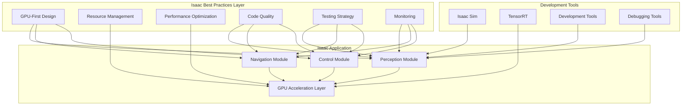
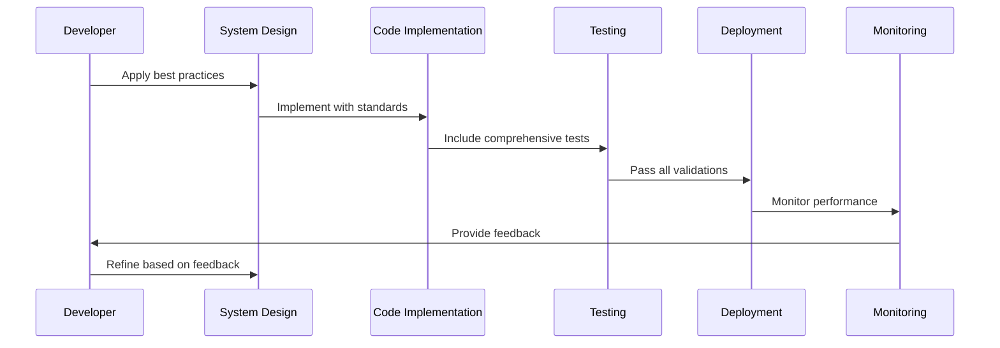

# Isaac Best Practices

## Learning Objectives

By the end of this chapter, you will be able to:
- Apply software engineering best practices to Isaac robotics development
- Design efficient and maintainable Isaac-based robotic systems
- Implement proper error handling and optimization strategies
- Follow Isaac community standards and conventions
- Optimize Isaac applications for performance and reliability
- Debug and profile Isaac applications effectively

## Introduction

Isaac best practices encompass the accumulated knowledge and experience of the robotics community in developing robust, maintainable, and efficient robotic systems using NVIDIA's Isaac platform. These practices span from code organization and architecture to performance optimization and debugging techniques, all tailored to leverage Isaac's unique GPU-accelerated capabilities.

Following best practices is essential for creating production-ready Isaac applications that can be maintained, extended, and deployed reliably. This chapter consolidates the most important practices for Isaac development based on real-world experience with the platform.

## Core Concepts

### Isaac-Specific Design Principles

- **GPU-First Architecture**: Design algorithms with GPU acceleration in mind from the start
- **Resource Management**: Efficiently manage GPU memory and computational resources
- **Modular Design**: Create independent components that can be reused and tested separately
- **Standard Interfaces**: Use standard ROS messages and interfaces for interoperability

### Performance Optimization

- **Memory Management**: Efficiently allocate and reuse GPU memory
- **Batch Processing**: Process data in batches to maximize GPU utilization
- **Pipeline Optimization**: Minimize data transfers between CPU and GPU
- **Model Optimization**: Use TensorRT for optimized inference

### Code Quality Standards

- **Documentation**: Document Isaac-specific optimizations and configurations
- **Testing**: Implement unit tests for both CPU and GPU components
- **Monitoring**: Include performance and resource usage monitoring
- **Configuration**: Use parameter servers for runtime configuration

### Development Workflow

- **Simulation-First**: Develop and test in simulation before deployment
- **Progressive Complexity**: Start with simple scenarios and increase complexity
- **Version Control**: Track both code and model versions
- **Continuous Integration**: Automate testing for Isaac applications

## Architecture Diagram



## Flow Diagram



## Code Example: Isaac Best Practices Implementation

Here's an example of an Isaac node following best practices:

```python
import rclpy
from rclpy.node import Node
from rclpy.qos import QoSProfile, ReliabilityPolicy, HistoryPolicy
from sensor_msgs.msg import Image, CameraInfo
from std_msgs.msg import String, Header
from geometry_msgs.msg import Point, Pose
from cv_bridge import CvBridge
from tf2_ros import TransformBroadcaster
import numpy as np
import cv2
import torch
import time
from typing import Optional, Dict, Any
import threading
from dataclasses import dataclass
from enum import Enum


class IsaacModuleState(Enum):
    """Enumeration for Isaac module states"""
    INITIALIZING = "initializing"
    RUNNING = "running"
    ERROR = "error"
    SHUTDOWN = "shutdown"


@dataclass
class IsaacPerformanceMetrics:
    """Data class for Isaac performance metrics"""
    processing_time: float = 0.0
    gpu_utilization: float = 0.0
    memory_usage: float = 0.0
    frame_rate: float = 0.0
    timestamp: float = 0.0


class IsaacBestPracticeNode(Node):
    """
    Example Isaac node demonstrating best practices for GPU-accelerated robotics.

    This node follows Isaac best practices including:
    - Proper parameter declaration and validation
    - Error handling and logging
    - Efficient GPU memory management
    - Performance monitoring
    - Clear documentation
    - Resource cleanup
    """

    def __init__(self):
        super().__init__('isaac_best_practice_node')

        # 1. Parameter declaration with validation and documentation
        self.declare_parameters(
            namespace='',
            parameters=[
                ('processing_rate', 10.0, rclpy.ParameterDescriptor(
                    description='Rate at which to process images (Hz)')),
                ('enable_gpu_acceleration', True, rclpy.ParameterDescriptor(
                    description='Enable GPU acceleration for processing')),
                ('gpu_memory_fraction', 0.8, rclpy.ParameterDescriptor(
                    description='Fraction of GPU memory to use (0.0 to 1.0)')),
                ('min_features', 100, rclpy.ParameterDescriptor(
                    description='Minimum number of features to detect')),
                ('debug_mode', False, rclpy.ParameterDescriptor(
                    description='Enable debug output and visualization')),
                ('max_processing_latency', 0.1, rclpy.ParameterDescriptor(
                    description='Maximum acceptable processing latency (seconds)')),
            ]
        )

        # 2. Get parameters with type safety and validation
        self.processing_rate = self.get_parameter('processing_rate').value
        self.enable_gpu_acceleration = self.get_parameter('enable_gpu_acceleration').value
        self.gpu_memory_fraction = self.get_parameter('gpu_memory_fraction').value
        self.min_features = self.get_parameter('min_features').value
        self.debug_mode = self.get_parameter('debug_mode').value
        self.max_processing_latency = self.get_parameter('max_processing_latency').value

        # Validate parameters
        if not 0.0 < self.gpu_memory_fraction <= 1.0:
            self.get_logger().error('Invalid gpu_memory_fraction, using default of 0.8')
            self.gpu_memory_fraction = 0.8

        if self.processing_rate <= 0:
            self.get_logger().error('Invalid processing_rate, using default of 10.0')
            self.processing_rate = 10.0

        # 3. Initialize GPU resources safely
        self.device = self._initialize_gpu_resources()

        # 4. Initialize CV bridge and other utilities
        self.bridge = CvBridge()
        self.tf_broadcaster = TransformBroadcaster(self)

        # 5. Initialize state variables
        self.state = IsaacModuleState.INITIALIZING
        self.performance_metrics = IsaacPerformanceMetrics()
        self.image_queue = []
        self.processing_lock = threading.Lock()

        # 6. Setup QoS profiles for different data types
        reliable_qos = QoSProfile(
            depth=10,
            reliability=ReliabilityPolicy.RELIABLE,
            history=HistoryPolicy.KEEP_LAST
        )

        best_effort_qos = QoSProfile(
            depth=5,
            reliability=ReliabilityPolicy.BEST_EFFORT,
            history=HistoryPolicy.KEEP_LAST
        )

        # 7. Create publishers with appropriate QoS
        self.result_pub = self.create_publisher(
            Point, '/isaac_best_practice/result', reliable_qos)

        self.status_pub = self.create_publisher(
            String, '/isaac_best_practice/status', best_effort_qos)

        self.debug_image_pub = self.create_publisher(
            Image, '/isaac_best_practice/debug_image', best_effort_qos)

        # 8. Create subscribers
        self.image_sub = self.create_subscription(
            Image, '/camera/image_raw', self.image_callback, 10)

        self.camera_info_sub = self.create_subscription(
            CameraInfo, '/camera/camera_info', self.camera_info_callback, 10)

        # 9. Create timers with proper rates
        self.processing_timer = self.create_timer(
            1.0 / self.processing_rate, self.process_timer_callback)

        self.monitoring_timer = self.create_timer(
            1.0, self.monitoring_timer_callback)  # Every second

        # 10. Initialize Isaac components
        self._initialize_isaac_components()

        # 11. Update state
        self.state = IsaacModuleState.RUNNING
        self.get_logger().info(
            f'Isaac Best Practice Node initialized. GPU acceleration: {self.enable_gpu_acceleration}')

    def _initialize_gpu_resources(self) -> torch.device:
        """
        Initialize GPU resources with proper error handling.

        Returns:
            torch.device: Configured device (cuda or cpu)
        """
        try:
            if self.enable_gpu_acceleration and torch.cuda.is_available():
                # Set memory fraction
                torch.cuda.set_per_process_memory_fraction(self.gpu_memory_fraction)

                # Get device info for logging
                gpu_name = torch.cuda.get_device_name(0)
                total_memory = torch.cuda.get_device_properties(0).total_memory / 1e9  # GB

                self.get_logger().info(
                    f'Using GPU: {gpu_name}, Memory: {total_memory:.2f}GB, '
                    f'Fraction: {self.gpu_memory_fraction}')

                return torch.device('cuda')
            else:
                self.get_logger().info('Using CPU for processing')
                return torch.device('cpu')

        except Exception as e:
            self.get_logger().error(f'GPU initialization failed: {e}, falling back to CPU')
            return torch.device('cpu')

    def _initialize_isaac_components(self):
        """
        Initialize Isaac-specific components with proper error handling.
        """
        try:
            # Initialize feature detector
            self.feature_detector = cv2.ORB_create(nfeatures=int(self.min_features * 2))

            # Initialize any Isaac-specific models here
            # For example, load a TensorRT optimized model
            self.isaac_model = None  # Placeholder for actual Isaac model

            self.get_logger().info('Isaac components initialized successfully')

        except Exception as e:
            self.get_logger().error(f'Failed to initialize Isaac components: {e}')
            self.state = IsaacModuleState.ERROR

    def camera_info_callback(self, msg: CameraInfo):
        """
        Handle camera calibration information.

        Args:
            msg: CameraInfo message with calibration parameters
        """
        try:
            self.camera_matrix = np.array(msg.k).reshape(3, 3)
            self.distortion_coeffs = np.array(msg.d)

            if self.debug_mode:
                self.get_logger().debug('Camera calibration updated')

        except Exception as e:
            self.get_logger().error(f'Error in camera info callback: {e}')

    def image_callback(self, msg: Image):
        """
        Handle incoming image messages with proper error handling.

        Args:
            msg: Image message from camera
        """
        try:
            # Validate message
            if msg.height == 0 or msg.width == 0:
                self.get_logger().warning('Received invalid image dimensions')
                return

            # Convert ROS image to OpenCV
            cv_image = self.bridge.imgmsg_to_cv2(msg, desired_encoding='bgr8')

            # Add to processing queue with timestamp
            with self.processing_lock:
                self.image_queue.append((cv_image, msg.header.stamp))

                # Limit queue size to prevent memory buildup
                if len(self.image_queue) > 5:
                    self.image_queue.pop(0)  # Remove oldest item

            if self.debug_mode:
                self.get_logger().debug(f'Image received: {msg.width}x{msg.height}')

        except Exception as e:
            self.get_logger().error(f'Error in image callback: {e}')

    def process_timer_callback(self):
        """
        Timer callback for processing images with Isaac optimizations.
        """
        try:
            start_time = time.time()

            with self.processing_lock:
                if not self.image_queue:
                    return

                # Process the latest image
                cv_image, timestamp = self.image_queue[-1]
                self.image_queue.clear()  # Clear queue to avoid backlog

            # Perform Isaac-optimized processing
            result = self._isaac_process_image(cv_image)

            if result is not None:
                # Publish results
                result_msg = Point()
                result_msg.x = float(result['center_x'])
                result_msg.y = float(result['center_y'])
                result_msg.z = float(result['confidence'])

                self.result_pub.publish(result_msg)

                # Update performance metrics
                processing_time = time.time() - start_time
                self.performance_metrics = IsaacPerformanceMetrics(
                    processing_time=processing_time,
                    gpu_utilization=self._get_gpu_utilization(),
                    memory_usage=self._get_gpu_memory_usage(),
                    frame_rate=self.processing_rate,
                    timestamp=time.time()
                )

                # Check for performance issues
                if processing_time > self.max_processing_latency:
                    self.get_logger().warn(
                        f'Processing latency exceeded threshold: {processing_time:.3f}s > {self.max_processing_latency}s')

        except Exception as e:
            self.get_logger().error(f'Error in processing timer: {e}')
            self.state = IsaacModuleState.ERROR

    def _isaac_process_image(self, image):
        """
        Perform Isaac-optimized image processing.

        Args:
            image: Input image in OpenCV format

        Returns:
            dict: Processing result or None if processing failed
        """
        try:
            # Example Isaac-style processing
            # 1. Feature detection using optimized algorithms
            gray = cv2.cvtColor(image, cv2.COLOR_BGR2GRAY)
            keypoints, descriptors = self.feature_detector.detectAndCompute(gray, None)

            if keypoints is None or len(keypoints) < self.min_features:
                if self.debug_mode:
                    self.get_logger().info(f'Insufficient features detected: {len(keypoints) if keypoints else 0}')
                return None

            # 2. GPU-accelerated processing (simulated)
            if self.enable_gpu_acceleration:
                # Convert to tensor for GPU processing
                tensor = torch.from_numpy(gray).float().to(self.device)

                # Perform GPU-accelerated operations
                # In a real Isaac implementation, this would use Isaac's optimized kernels
                processed_tensor = self._gpu_process(tensor)

                # Convert back to numpy if needed
                if processed_tensor.is_cuda:
                    processed_array = processed_tensor.cpu().numpy()
                else:
                    processed_array = processed_tensor.numpy()
            else:
                # CPU fallback
                processed_array = gray

            # 3. Extract meaningful information
            # Find center of feature cluster
            if keypoints:
                centers_x = [kp.pt[0] for kp in keypoints]
                centers_y = [kp.pt[1] for kp in keypoints]

                center_x = sum(centers_x) / len(centers_x)
                center_y = sum(centers_y) / len(centers_y)

                # Calculate confidence based on number of features
                confidence = min(1.0, len(keypoints) / (self.min_features * 5))

                result = {
                    'center_x': center_x,
                    'center_y': center_y,
                    'confidence': confidence,
                    'feature_count': len(keypoints)
                }

                # Publish debug visualization if enabled
                if self.debug_mode:
                    debug_image = self._create_debug_visualization(image, keypoints)
                    debug_msg = self.bridge.cv2_to_imgmsg(debug_image, encoding='bgr8')
                    debug_msg.header.stamp = self.get_clock().now().to_msg()
                    self.debug_image_pub.publish(debug_msg)

                return result

            return None

        except Exception as e:
            self.get_logger().error(f'Error in Isaac image processing: {e}')
            return None

    def _gpu_process(self, tensor):
        """
        Simulate GPU-accelerated processing.

        Args:
            tensor: Input tensor to process

        Returns:
            torch.Tensor: Processed tensor
        """
        # In a real Isaac implementation, this would use Isaac's optimized kernels
        # For simulation, we'll apply a simple GPU operation
        if self.device.type == 'cuda':
            # Apply a simple filter using GPU
            result = torch.nn.functional.avg_pool2d(
                tensor.unsqueeze(0).unsqueeze(0),
                kernel_size=3,
                stride=1,
                padding=1
            ).squeeze()
            return result
        else:
            # CPU fallback
            return tensor

    def _create_debug_visualization(self, image, keypoints):
        """
        Create debug visualization for processed image.

        Args:
            image: Original image
            keypoints: Detected keypoints

        Returns:
            numpy.ndarray: Image with debug visualization
        """
        debug_image = image.copy()

        # Draw keypoints
        for kp in keypoints:
            x, y = int(kp.pt[0]), int(kp.pt[1])
            cv2.circle(debug_image, (x, y), 3, (0, 255, 0), -1)

        # Add performance info
        cv2.putText(
            debug_image,
            f'Features: {len(keypoints)}',
            (10, 30),
            cv2.FONT_HERSHEY_SIMPLEX,
            0.7,
            (255, 255, 255),
            2
        )

        return debug_image

    def _get_gpu_utilization(self) -> float:
        """
        Get current GPU utilization percentage.

        Returns:
            float: GPU utilization (0.0 to 100.0) or 0.0 if not available
        """
        try:
            if self.device.type == 'cuda':
                # This is a simplified approach; in practice, you might use nvidia-ml-py
                # or other GPU monitoring tools
                import subprocess
                result = subprocess.run(['nvidia-smi', '--query-gpu=utilization.gpu', '--format=csv,noheader,nounits'],
                                      capture_output=True, text=True)
                if result.returncode == 0:
                    utilization = float(result.stdout.strip())
                    return utilization
            return 0.0
        except:
            return 0.0

    def _get_gpu_memory_usage(self) -> float:
        """
        Get current GPU memory usage percentage.

        Returns:
            float: GPU memory usage (0.0 to 100.0) or 0.0 if not available
        """
        try:
            if self.device.type == 'cuda':
                memory_allocated = torch.cuda.memory_allocated(self.device)
                memory_reserved = torch.cuda.memory_reserved(self.device)
                total_memory = torch.cuda.get_device_properties(self.device).total_memory

                return (memory_reserved / total_memory) * 100.0
            return 0.0
        except:
            return 0.0

    def monitoring_timer_callback(self):
        """
        Timer callback for system monitoring and health checks.
        """
        try:
            # Publish system status
            status_msg = String()
            status_msg.data = f'State: {self.state.value}, GPU: {self._get_gpu_utilization():.1f}%, ' \
                             f'Mem: {self._get_gpu_memory_usage():.1f}%, ' \
                             f'ProcTime: {self.performance_metrics.processing_time*1000:.1f}ms'

            self.status_pub.publish(status_msg)

            # Log performance metrics periodically
            if self.performance_metrics.processing_time > 0:
                self.get_logger().info(
                    f'Performance - Processing: {self.performance_metrics.processing_time*1000:.1f}ms, '
                    f'GPU Util: {self.performance_metrics.gpu_utilization:.1f}%, '
                    f'Mem: {self.performance_metrics.memory_usage:.1f}%'
                )

            # Health check
            if self.state == IsaacModuleState.ERROR:
                self.get_logger().error('System in error state, attempting recovery...')
                self._attempt_recovery()

        except Exception as e:
            self.get_logger().error(f'Error in monitoring timer: {e}')

    def _attempt_recovery(self):
        """
        Attempt to recover from error state.
        """
        try:
            # Reset state and reinitialize components
            self.state = IsaacModuleState.INITIALIZING
            self._initialize_isaac_components()
            self.state = IsaacModuleState.RUNNING

            self.get_logger().info('Recovery successful')
        except Exception as e:
            self.get_logger().error(f'Recovery failed: {e}')
            self.state = IsaacModuleState.ERROR

    def destroy_node(self):
        """
        Properly clean up resources when node is destroyed.
        """
        self.get_logger().info('Cleaning up Isaac Best Practice Node resources')

        # Clear GPU cache
        if self.device.type == 'cuda':
            torch.cuda.empty_cache()

        # Reset state
        self.state = IsaacModuleState.SHUTDOWN

        super().destroy_node()


def main(args=None):
    """
    Main function with proper exception handling.
    """
    rclpy.init(args=args)

    try:
        best_practice_node = IsaacBestPracticeNode()
        rclpy.spin(best_practice_node)
    except KeyboardInterrupt:
        print('Interrupted by user')
    except Exception as e:
        print(f'Error during execution: {e}')
    finally:
        # Always clean up
        if 'best_practice_node' in locals():
            best_practice_node.destroy_node()
        rclpy.shutdown()


if __name__ == '__main__':
    main()
```

## Isaac Launch File Best Practices

Here's an example of a well-structured Isaac launch file:

```python
from launch import LaunchDescription
from launch.actions import DeclareLaunchArgument, SetEnvironmentVariable, RegisterEventHandler
from launch.conditions import IfCondition
from launch.substitutions import LaunchConfiguration, PythonExpression
from launch_ros.actions import Node
from launch_ros.substitutions import FindPackageShare
from ament_index_python.packages import get_package_share_directory
from launch.event_handlers import OnProcessExit
import os


def generate_launch_description():
    # Get package share directory
    pkg_share = get_package_share_directory('isaac_best_practices_examples')

    # Declare launch arguments with descriptions
    debug_mode_arg = DeclareLaunchArgument(
        'debug_mode',
        default_value='false',
        description='Enable debug output and tools'
    )

    use_sim_time_arg = DeclareLaunchArgument(
        'use_sim_time',
        default_value='false',
        description='Use simulation time'
    )

    enable_gpu_arg = DeclareLaunchArgument(
        'enable_gpu',
        default_value='true',
        description='Enable GPU acceleration'
    )

    # Get launch configurations
    debug_mode = LaunchConfiguration('debug_mode')
    use_sim_time = LaunchConfiguration('use_sim_time')
    enable_gpu = LaunchConfiguration('enable_gpu')

    # Define the Isaac best practice node with proper configuration
    isaac_best_practice_node = Node(
        package='isaac_best_practices_examples',
        executable='isaac_best_practices_examples.best_practice_node',
        name='isaac_best_practice_node',
        parameters=[
            os.path.join(pkg_share, 'config', 'best_practices_config.yaml'),
            {'use_sim_time': use_sim_time},
            {'debug_mode': debug_mode},
            {'enable_gpu_acceleration': enable_gpu}
        ],
        output='screen',
        # Restart if the node dies
        respawn=True,
        respawn_delay=2.0,
        # Set environment variables for Isaac
        additional_env={
            'CUDA_VISIBLE_DEVICES': '0',
            'RCUTILS_COLORIZED_OUTPUT': '1',
            'PYTHONUNBUFFERED': '1'  # Ensure logs appear immediately
        }
    )

    # Conditional debug tools (only run if debug mode is enabled)
    rviz_node = Node(
        package='rviz2',
        executable='rviz2',
        name='isaac_rviz',
        arguments=['-d', os.path.join(pkg_share, 'rviz', 'isaac_best_practices.rviz')],
        condition=IfCondition(debug_mode),
        parameters=[{'use_sim_time': use_sim_time}]
    )

    return LaunchDescription([
        # Launch arguments
        debug_mode_arg,
        use_sim_time_arg,
        enable_gpu_arg,

        # Environment setup
        SetEnvironmentVariable(name='RCUTILS_LOGGING_SEVERITY_THRESHOLD', value='INFO'),

        # Nodes
        isaac_best_practice_node,
        rviz_node,
    ])
```

## Isaac Configuration Best Practices

Here's an example of Isaac configuration following best practices:

```yaml
# best_practices_config.yaml
isaac_best_practice_node:
  ros__parameters:
    # Processing parameters
    processing_rate: 10.0
    enable_gpu_acceleration: true
    gpu_memory_fraction: 0.8
    min_features: 100
    max_processing_latency: 0.1

    # Isaac-specific parameters
    use_tensorrt: true
    tensorrt_precision: "FP16"
    batch_size: 1
    enable_profiling: false

    # Resource management
    max_memory_usage: 80.0  # Percentage
    cpu_affinity: [0, 1, 2, 3]
    gpu_power_mode: "MAX"  # or "DEFAULT"

    # Performance monitoring
    enable_performance_monitoring: true
    log_performance_metrics: true
    performance_report_interval: 5.0  # seconds

    # Debug parameters
    debug_mode: false
    enable_visualization: false
    publish_intermediate_results: false
    log_level: "INFO"

    # Safety and reliability
    enable_safety_checks: true
    max_retry_attempts: 3
    error_recovery_timeout: 5.0
    health_check_interval: 1.0

    # Isaac platform specific
    platform: "jetson"  # or "x86-64"
    compute_capability: "7.5"  # GPU compute capability
    cuda_architecture: "7.5"  # Target CUDA architecture
```

## Step-by-Step Practical Tutorial

### Implementing Isaac Best Practices in a Complete Example

1. **Create a best practices package**:
   ```bash
   cd ~/ros2_ws/src
   ros2 pkg create --build-type ament_python isaac_best_practices_examples --dependencies rclpy std_msgs sensor_msgs geometry_msgs cv_bridge tf2_ros
   ```

2. **Navigate to the package directory**:
   ```bash
   cd isaac_best_practices_examples
   ```

3. **Create the main module directory**:
   ```bash
   mkdir isaac_best_practices_examples
   touch isaac_best_practices_examples/__init__.py
   ```

4. **Create the best practices node** (`isaac_best_practices_examples/best_practice_node.py`):
   ```python
   # Use the Isaac best practices node code example above
   ```

5. **Create config and launch directories**:
   ```bash
   mkdir config launch rviz
   ```

6. **Create a configuration file** (`config/best_practices_config.yaml`):
   ```yaml
   # Use the configuration example above
   ```

7. **Create a basic RViz config** (`rviz/isaac_best_practices.rviz`):
   ```yaml
   Panels:
     - Class: rviz_common/Displays
       Help Height: 78
       Name: Displays
       Property Tree Widget:
         Expanded:
           - /Global Options1
           - /Status1
         Splitter Ratio: 0.5
       Tree Height: 617
     - Class: rviz_common/Selection
       Name: Selection
     - Class: rviz_common/Tool Properties
       Expanded:
         - /2D Goal Pose1
         - /Publish Point1
       Name: Tool Properties
       Splitter Ratio: 0.5886790156364441
   Visualization Manager:
     Class: ""
     Displays:
       - Alpha: 0.5
         Cell Size: 1
         Class: rviz_default_plugins/Grid
         Color: 160; 160; 164
         Enabled: true
         Line Style:
           Line Width: 0.029999999329447746
           Value: Lines
         Name: Grid
         Normal Cell Count: 0
         Offset:
           X: 0
           Y: 0
           Z: 0
         Plane: XY
         Plane Cell Count: 10
         Reference Frame: <Fixed Frame>
         Value: true
     Enabled: true
     Global Options:
       Background Color: 48; 48; 48
       Fixed Frame: map
       Frame Rate: 30
     Name: root
     Tools:
       - Class: rviz_default_plugins/Interact
         Hide Inactive Objects: true
       - Class: rviz_default_plugins/MoveCamera
       - Class: rviz_default_plugins/Select
       - Class: rviz_default_plugins/FocusCamera
       - Class: rviz_default_plugins/Measure
       - Class: rviz_default_plugins/SetInitialPose
       - Class: rviz_default_plugins/SetGoal
       - Class: rviz_default_plugins/PublishPoint
     Transformation:
       Current:
         Class: rviz_default_plugins/TF
     Value: true
     Views:
       Current:
         Class: rviz_default_plugins/Orbit
         Name: Current View
         Target Frame: <Fixed Frame>
         Value: Orbit (rviz)
       Saved: ~
   Window Geometry:
     Displays:
       collapsed: false
     Height: 846
     Hide Left Dock: false
     Hide Right Dock: false
     QMainWindow State: 000000ff00000000fd000000040000000000000156000002f4fc0200000008fb0000001200530065006c0065006300740069006f006e00000001e10000009b0000005c00fffffffb0000001e0054006f006f006c002000500072006f007000650072007400690065007302000001ed000001df00000185000000a3fb000000120056006900650077007300200054006f006f02000001df000002110000018500000122fb000000200054006f006f006c002000500072006f0070006500720074006900650073003203000002880000011d000002210000017afb000000100044006900730070006c006100790073010000003d000002f4000000c900fffffffb0000002000730065006c0065006300740069006f006e00200062007500660066006500720200000138000000aa000025a9000002a0fb00000014005700690064006500530074006500720065006f02000000e6000000d2000003ee0000030bfb0000000c004b0069006e0065006300740200000186000001060000030c00000261000000010000010f000002f4fc0200000003fb0000001e0054006f006f006c002000500072006f00700065007200740069006500730100000041000000780000000000000000fb0000000a00560069006500770073000000003d000002f4000000a400fffffffb0000001200530065006c0065006300740069006f006e010000025a000000b200000000000000000000000200000490000000a9fc0100000001fb0000000a00560069006500770073030000004e00000080000002e10000019700000003000004420000003efc0100000002fb0000000800540069006d00650100000000000004420000000000000000fb0000000800540069006d00650100000000000004500000000000000000000003a0000002f400000004000000040000000800000008fc0000000100000002000000010000000a0054006f006f006c00730100000000ffffffff0000000000000000
     Width: 1200
     X: 72
     Y: 60
   ```

8. **Create the launch file** (`launch/isaac_best_practices_launch.py`):
   ```python
   # Use the launch file example above
   ```

9. **Update setup.py**:
   ```python
   from setuptools import setup
   import os
   from glob import glob

   package_name = 'isaac_best_practices_examples'

   setup(
       name=package_name,
       version='0.0.0',
       packages=[package_name],
       data_files=[
           ('share/ament_index/resource_index/packages',
               ['resource/' + package_name]),
           ('share/' + package_name, ['package.xml']),
           (os.path.join('share', package_name, 'launch'), glob('launch/*.py')),
           (os.path.join('share', package_name, 'config'), glob('config/*.yaml')),
           (os.path.join('share', package_name, 'rviz'), glob('rviz/*.rviz')),
       ],
       install_requires=['setuptools'],
       zip_safe=True,
       maintainer='User',
       maintainer_email='user@example.com',
       description='Isaac best practices examples',
       license='Apache-2.0',
       tests_require=['pytest'],
       entry_points={
           'console_scripts': [
               'best_practice_node = isaac_best_practices_examples.best_practice_node:main',
           ],
       },
   )
   ```

10. **Build the package**:
    ```bash
    cd ~/ros2_ws
    colcon build --packages-select isaac_best_practices_examples
    ```

11. **Source the workspace**:
    ```bash
    source install/setup.bash
    ```

12. **Run the best practices example**:
    ```bash
    ros2 launch isaac_best_practices_examples isaac_best_practices_launch.py debug_mode:=true enable_gpu:=true
    ```

13. **Monitor the system status**:
    ```bash
    ros2 topic echo /isaac_best_practice/status
    ```

## Summary

This chapter covered essential Isaac best practices that should be followed when developing robotics applications with NVIDIA's Isaac platform. These practices include GPU-first design, efficient resource management, proper error handling, and performance optimization techniques.

Following these best practices results in more maintainable, reliable, and efficient Isaac applications. They help ensure that your Isaac applications can be deployed in production environments and maintained over time while taking full advantage of NVIDIA's GPU acceleration capabilities.

## Mini-Quiz

1. What is the primary principle of GPU-first architecture in Isaac?
   - A) Use GPU for all computations
   - B) Design algorithms with GPU acceleration in mind from the start
   - C) Only use NVIDIA hardware
   - D) Avoid CPU processing entirely

2. What should you do when initializing GPU resources in Isaac?
   - A) Allocate maximum memory immediately
   - B) Set memory fraction and handle errors gracefully
   - C) Use only default settings
   - D) Skip initialization to save time

3. Which of these is a recommended Isaac development workflow?
   - A) Deploy directly to hardware
   - B) Simulation-first approach
   - C) Skip testing phases
   - D) Hardware-only development

4. What is the purpose of performance monitoring in Isaac applications?
   - A) To make applications run slower
   - B) To track resource usage and identify bottlenecks
   - C) To increase memory usage
   - D) To reduce GPU utilization

5. Why is it important to validate parameters in Isaac nodes?
   - A) To make code longer
   - B) To prevent runtime errors and ensure safe operation
   - C) To reduce performance
   - D) To increase complexity

**Answers**: 1-B, 2-B, 3-B, 4-B, 5-B