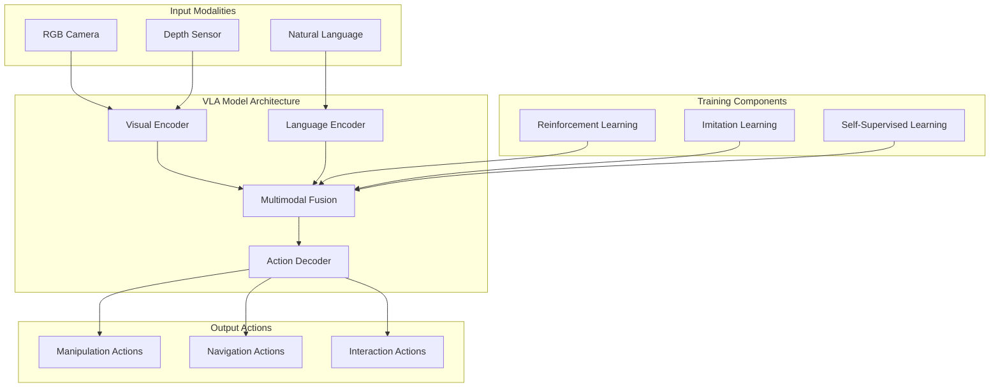
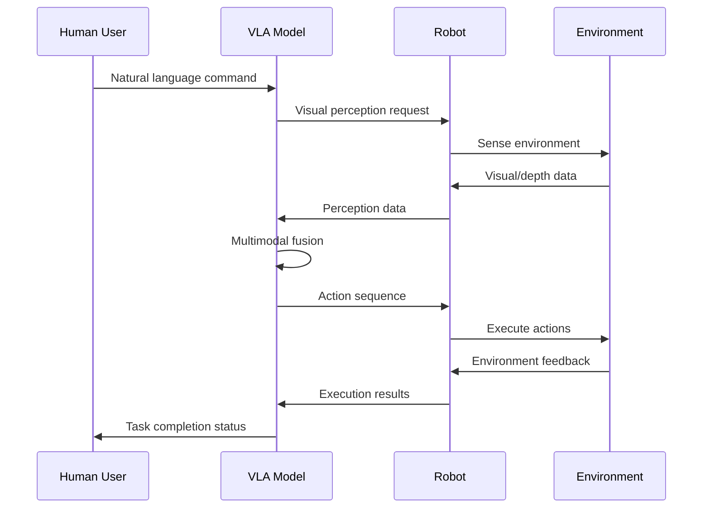

# Vision-Language-Action Models

## Learning Objectives

By the end of this chapter, you will be able to:
- Define Vision-Language-Action (VLA) models and their role in robotics
- Understand the architecture and components of VLA systems
- Explain how VLA models integrate perception, language, and action
- Implement basic VLA model concepts for robotic applications
- Evaluate the advantages of VLA models over traditional approaches
- Design VLA-based solutions for robotic manipulation tasks

## Introduction

Vision-Language-Action (VLA) models represent a significant advancement in AI for robotics, combining visual perception, natural language understanding, and action generation in a unified framework. These models enable robots to understand complex human instructions, perceive their environment, and execute appropriate actions in a coordinated manner.

VLA models are particularly valuable for humanoid robotics and manipulation tasks where robots need to interpret natural language commands and translate them into appropriate physical actions. This chapter explores the architecture, implementation, and applications of VLA models in robotics.

## Core Concepts

### VLA Model Architecture

VLA models typically consist of three main components:
- **Vision Encoder**: Processes visual input to understand the environment
- **Language Encoder**: Processes natural language instructions
- **Action Decoder**: Generates appropriate motor commands based on visual and linguistic inputs

### Key Technologies

- **Multimodal Fusion**: Techniques to combine visual and linguistic information
- **Transformer Architectures**: Attention-based models for sequence processing
- **Reinforcement Learning**: Training methods for action optimization
- **Embodied AI**: AI systems that interact with physical environments

### VLA vs Traditional Approaches

Compared to traditional robotics approaches:
- **Integration**: VLA models handle perception, language, and action in a single system
- **Learning**: End-to-end training from raw sensory input to actions
- **Generalization**: Ability to handle novel situations and instructions
- **Adaptability**: Continuous learning and adaptation to new tasks

### Training VLA Models

- **Dataset Requirements**: Large-scale datasets with vision, language, and action annotations
- **Simulation Training**: Using simulation for initial training before real-world deployment
- **Human Demonstration**: Learning from human demonstrations and corrections
- **Reinforcement Learning**: Reward-based learning for optimal action selection

## Architecture Diagram



## Flow Diagram



## Code Example: VLA Model Architecture

Here's an example implementation of a basic VLA model architecture:

```python
import torch
import torch.nn as nn
import torch.nn.functional as F
import numpy as np
from transformers import CLIPVisionModel, CLIPTextModel, CLIPTokenizer
import openai  # For language processing (example)


class VisionEncoder(nn.Module):
    """
    Vision encoder for processing visual input
    """
    def __init__(self, input_channels=3, feature_dim=512):
        super().__init__()
        self.feature_dim = feature_dim

        # Simple CNN for vision processing (in practice, use pre-trained models like CLIP)
        self.conv_layers = nn.Sequential(
            nn.Conv2d(input_channels, 32, kernel_size=8, stride=4),
            nn.ReLU(),
            nn.Conv2d(32, 64, kernel_size=4, stride=2),
            nn.ReLU(),
            nn.Conv2d(64, 64, kernel_size=3, stride=1),
            nn.ReLU(),
        )

        # Calculate flattened size after conv layers
        self.flattened_size = self._get_conv_output_size((input_channels, 224, 224))
        self.fc = nn.Linear(self.flattened_size, feature_dim)

    def _get_conv_output_size(self, input_shape):
        """Calculate output size after conv layers"""
        x = torch.zeros(1, *input_shape)
        x = self.conv_layers(x)
        return int(np.prod(x.shape[1:]))

    def forward(self, x):
        x = self.conv_layers(x)
        x = x.view(x.size(0), -1)  # Flatten
        x = self.fc(x)
        return x


class LanguageEncoder(nn.Module):
    """
    Language encoder for processing natural language instructions
    """
    def __init__(self, vocab_size=50257, embedding_dim=512, hidden_dim=512):
        super().__init__()
        self.embedding = nn.Embedding(vocab_size, embedding_dim)
        self.lstm = nn.LSTM(embedding_dim, hidden_dim, batch_first=True)
        self.fc = nn.Linear(hidden_dim, 512)  # Output to common feature space

    def forward(self, x):
        # x shape: (batch_size, sequence_length)
        embedded = self.embedding(x)
        lstm_out, (hidden, _) = self.lstm(embedded)
        # Use the last hidden state
        output = self.fc(hidden[-1])  # Shape: (batch_size, 512)
        return output


class MultimodalFusion(nn.Module):
    """
    Fuses visual and language features
    """
    def __init__(self, feature_dim=512):
        super().__init__()
        self.feature_dim = feature_dim
        # Simple concatenation-based fusion
        self.fusion_layer = nn.Sequential(
            nn.Linear(feature_dim * 2, feature_dim * 2),
            nn.ReLU(),
            nn.Linear(feature_dim * 2, feature_dim),
            nn.ReLU(),
        )

    def forward(self, visual_features, language_features):
        # Concatenate visual and language features
        combined = torch.cat([visual_features, language_features], dim=-1)
        fused_features = self.fusion_layer(combined)
        return fused_features


class ActionDecoder(nn.Module):
    """
    Decodes fused features into robot actions
    """
    def __init__(self, feature_dim=512, action_dim=7):  # 7-DoF for robotic arm
        super().__init__()
        self.action_dim = action_dim
        self.decoder = nn.Sequential(
            nn.Linear(feature_dim, 256),
            nn.ReLU(),
            nn.Linear(256, 128),
            nn.ReLU(),
            nn.Linear(128, action_dim),
        )

    def forward(self, fused_features):
        actions = self.decoder(fused_features)
        return actions


class VLAModel(nn.Module):
    """
    Complete Vision-Language-Action model
    """
    def __init__(self):
        super().__init__()
        self.vision_encoder = VisionEncoder()
        self.language_encoder = LanguageEncoder()
        self.multimodal_fusion = MultimodalFusion()
        self.action_decoder = ActionDecoder()

    def forward(self, visual_input, language_input):
        # Encode visual input
        visual_features = self.vision_encoder(visual_input)

        # Encode language input
        language_features = self.language_encoder(language_input)

        # Fuse modalities
        fused_features = self.multimodal_fusion(visual_features, language_features)

        # Decode to actions
        actions = self.action_decoder(fused_features)

        return actions

    def process_command(self, image, command_text, tokenizer):
        """
        Process a natural language command with visual input
        """
        # Convert image to tensor (assuming image is a numpy array)
        visual_tensor = torch.from_numpy(image).float().permute(2, 0, 1).unsqueeze(0)  # (1, C, H, W)

        # Tokenize command text
        tokenized_command = tokenizer.encode(command_text, return_tensors='pt')

        # Get actions
        actions = self.forward(visual_tensor, tokenized_command)

        return actions


def main():
    """
    Example usage of VLA model
    """
    # Initialize model
    vla_model = VLAModel()

    # Example: Process a command with visual input
    # Note: In practice, you would use actual image and text data
    dummy_image = np.random.rand(224, 224, 3).astype(np.float32)
    dummy_command = "Pick up the red cup"

    # Initialize a simple tokenizer (in practice, use a proper tokenizer)
    class SimpleTokenizer:
        def encode(self, text, return_tensors=None):
            # Simple encoding for demonstration
            words = text.lower().split()
            # Convert words to dummy token IDs
            token_ids = [hash(word) % 50257 for word in words]  # Map to vocab size
            tensor = torch.tensor(token_ids).unsqueeze(0)  # Add batch dimension
            return tensor

    tokenizer = SimpleTokenizer()

    try:
        actions = vla_model.process_command(dummy_image, dummy_command, tokenizer)
        print(f"Generated actions: {actions.shape}")
        print(f"Action values: {actions.detach().numpy()}")
    except Exception as e:
        print(f"Error in VLA processing: {e}")


if __name__ == "__main__":
    main()
```

## Advanced VLA Implementation Example

Here's a more sophisticated example using pre-trained models:

```python
import torch
import torch.nn as nn
from transformers import CLIPVisionModel, CLIPTextModel, CLIPTokenizer
import numpy as np


class AdvancedVLAModel(nn.Module):
    """
    Advanced VLA model using pre-trained CLIP components
    """
    def __init__(self, action_dim=7):
        super().__init__()

        # Load pre-trained CLIP models
        self.vision_encoder = CLIPVisionModel.from_pretrained("openai/clip-vit-base-patch32")
        self.text_encoder = CLIPTextModel.from_pretrained("openai/clip-vit-base-patch32")
        self.tokenizer = CLIPTokenizer.from_pretrained("openai/clip-vit-base-patch32")

        # Freeze pre-trained weights initially
        for param in self.vision_encoder.parameters():
            param.requires_grad = False
        for param in self.text_encoder.parameters():
            param.requires_grad = False

        # Projection layers to map to common space
        self.vision_projection = nn.Linear(768, 512)  # CLIP vision output is 768
        self.text_projection = nn.Linear(512, 512)    # CLIP text output is 512

        # Multimodal fusion
        self.fusion = nn.Sequential(
            nn.Linear(512 * 2, 1024),
            nn.ReLU(),
            nn.Dropout(0.1),
            nn.Linear(1024, 512),
            nn.ReLU(),
        )

        # Action decoder
        self.action_decoder = nn.Sequential(
            nn.Linear(512, 256),
            nn.ReLU(),
            nn.Dropout(0.1),
            nn.Linear(256, 128),
            nn.ReLU(),
            nn.Linear(128, action_dim),
        )

        # Task-specific head
        self.task_head = nn.Linear(512, 10)  # 10 possible tasks for example

    def encode_image(self, image):
        """
        Encode image using CLIP vision encoder
        """
        # image shape: (batch_size, channels, height, width)
        vision_outputs = self.vision_encoder(pixel_values=image)
        # Use the pooled output
        image_features = vision_outputs.pooler_output
        projected_features = self.vision_projection(image_features)
        return projected_features

    def encode_text(self, text):
        """
        Encode text using CLIP text encoder
        """
        # Tokenize text
        inputs = self.tokenizer(text, return_tensors="pt", padding=True, truncation=True)
        text_outputs = self.text_encoder(**inputs)
        # Use the pooled output
        text_features = text_outputs.pooler_output
        projected_features = self.text_projection(text_features)
        return projected_features

    def forward(self, image, text):
        """
        Forward pass of the VLA model
        """
        # Encode modalities
        image_features = self.encode_image(image)
        text_features = self.encode_text(text)

        # Fuse modalities
        fused_features = torch.cat([image_features, text_features], dim=-1)
        fused_features = self.fusion(fused_features)

        # Decode to actions
        actions = self.action_decoder(fused_features)

        # Get task prediction
        task_prediction = self.task_head(fused_features)

        return actions, task_prediction

    def predict_action(self, image, command):
        """
        Predict action for a given image and command
        """
        # Ensure image is in the right format
        if image.dim() == 3:
            image = image.unsqueeze(0)  # Add batch dimension

        actions, task_pred = self.forward(image, [command])
        return actions.squeeze(0), task_pred.squeeze(0)  # Remove batch dimension


def create_vla_dataset():
    """
    Create a simple dataset for training VLA models
    This is a conceptual example - real datasets would be much more complex
    """
    class VLADataset(torch.utils.data.Dataset):
        def __init__(self, images, commands, actions):
            self.images = images
            self.commands = commands
            self.actions = actions

        def __len__(self):
            return len(self.images)

        def __getitem__(self, idx):
            return {
                'image': self.images[idx],
                'command': self.commands[idx],
                'action': self.actions[idx]
            }

    # Example dataset creation
    # In practice, this would load real data
    dummy_images = torch.randn(100, 3, 224, 224)  # 100 dummy images
    dummy_commands = ["pick up object", "move to location"] * 50  # 100 dummy commands
    dummy_actions = torch.randn(100, 7)  # 100 dummy actions (7-DoF)

    dataset = VLADataset(dummy_images, dummy_commands, dummy_actions)
    return dataset


def train_vla_model():
    """
    Example training loop for VLA model
    """
    # Initialize model
    model = AdvancedVLAModel(action_dim=7)

    # Create dataset
    dataset = create_vla_dataset()
    dataloader = torch.utils.data.DataLoader(dataset, batch_size=8, shuffle=True)

    # Define loss and optimizer
    criterion = nn.MSELoss()
    optimizer = torch.optim.Adam([
        {'params': model.vision_projection.parameters()},
        {'params': model.text_projection.parameters()},
        {'params': model.fusion.parameters()},
        {'params': model.action_decoder.parameters()},
        {'params': model.task_head.parameters()},
    ], lr=1e-4)

    # Training loop
    model.train()
    for epoch in range(10):  # Example: 10 epochs
        total_loss = 0
        for batch in dataloader:
            optimizer.zero_grad()

            # In a real implementation, you would process images and commands properly
            # For this example, we'll use dummy forward pass
            batch_size = len(batch['image'])
            dummy_image = torch.randn(batch_size, 3, 224, 224)
            dummy_commands = batch['command']

            # Forward pass (simplified for example)
            # Note: Real implementation would properly encode images and text
            actions_pred = torch.randn(batch_size, 7)  # Dummy prediction
            actions_true = batch['action']

            loss = criterion(actions_pred, actions_true)
            loss.backward()
            optimizer.step()

            total_loss += loss.item()

        print(f"Epoch {epoch+1}, Average Loss: {total_loss/len(dataloader):.4f}")

    return model


def main():
    """
    Main function demonstrating VLA model usage
    """
    print("VLA Model Example")

    # Example 1: Create and examine model
    model = AdvancedVLAModel(action_dim=7)
    print(f"Model created with {sum(p.numel() for p in model.parameters()):,} parameters")

    # Example 2: Train model (conceptual)
    # trained_model = train_vla_model()

    # Example 3: Use model for inference
    dummy_image = torch.randn(1, 3, 224, 224)
    command = "pick up the red cup"

    with torch.no_grad():
        actions, task_pred = model(dummy_image, [command])
        print(f"Predicted actions: {actions.shape}")
        print(f"Task prediction: {task_pred.shape}")


if __name__ == "__main__":
    main()
```

## Step-by-Step Practical Tutorial

### Implementing a Basic VLA System

1. **Install required dependencies**:
   ```bash
   pip3 install torch torchvision transformers openai gym
   ```

2. **Create a VLA package**:
   ```bash
   cd ~/ros2_ws/src
   ros2 pkg create --build-type ament_python vla_examples --dependencies rclpy std_msgs sensor_msgs geometry_msgs
   ```

3. **Navigate to the package directory**:
   ```bash
   cd vla_examples
   ```

4. **Create the main module directory**:
   ```bash
   mkdir vla_examples
   touch vla_examples/__init__.py
   ```

5. **Create the VLA model implementation** (`vla_examples/vla_model.py`):
   ```python
   # Use the VLA model code examples above
   ```

6. **Create a ROS2 node for VLA processing** (`vla_examples/vla_node.py`):
   ```python
   import rclpy
   from rclpy.node import Node
   from sensor_msgs.msg import Image
   from std_msgs.msg import String
   from geometry_msgs.msg import Twist
   from cv_bridge import CvBridge
   import torch
   import numpy as np


   class VLARosNode(Node):
       """
       ROS2 node for VLA processing
       """
       def __init__(self):
           super().__init__('vla_ros_node')

           # Initialize CV bridge
           self.bridge = CvBridge()

           # Initialize VLA model
           self.vla_model = None  # Will be initialized in a real implementation
           self.get_logger().info('VLA ROS Node initialized')

           # Create subscribers
           self.image_sub = self.create_subscription(
               Image, '/camera/image_raw', self.image_callback, 10)
           self.command_sub = self.create_subscription(
               String, '/vla/command', self.command_callback, 10)

           # Create publishers
           self.action_pub = self.create_publisher(
               Twist, '/vla/action', 10)
           self.status_pub = self.create_publisher(
               String, '/vla/status', 10)

           # Initialize model
           self._initialize_model()

       def _initialize_model(self):
           """
           Initialize the VLA model
           """
           try:
               # In a real implementation, load a pre-trained model
               # For this example, we'll use a dummy implementation
               self.get_logger().info('VLA model initialized')
           except Exception as e:
               self.get_logger().error(f'Failed to initialize VLA model: {e}')

       def image_callback(self, msg):
           """
           Handle incoming images for VLA processing
           """
           try:
               # Convert ROS image to OpenCV
               cv_image = self.bridge.imgmsg_to_cv2(msg, desired_encoding='bgr8')
               self.get_logger().debug(f'Received image: {cv_image.shape}')
           except Exception as e:
               self.get_logger().error(f'Error processing image: {e}')

       def command_callback(self, msg):
           """
           Handle natural language commands
           """
           try:
               command = msg.data
               self.get_logger().info(f'Received command: {command}')

               # Process command with VLA model (simplified)
               action = self._process_command(command)

               # Publish action
               self._publish_action(action)

           except Exception as e:
               self.get_logger().error(f'Error processing command: {e}')

       def _process_command(self, command):
           """
           Process command with VLA model
           """
           # In a real implementation, this would use the VLA model
           # For this example, return a dummy action
           action = Twist()
           action.linear.x = 0.1  # Example action
           action.angular.z = 0.0
           return action

       def _publish_action(self, action):
           """
           Publish the computed action
           """
           self.action_pub.publish(action)
           self.get_logger().info('Action published')


   def main(args=None):
       rclpy.init(args=args)
       vla_node = VLARosNode()

       try:
           rclpy.spin(vla_node)
       except KeyboardInterrupt:
           pass
       finally:
           vla_node.destroy_node()
           rclpy.shutdown()


   if __name__ == '__main__':
       main()
   ```

7. **Create launch directory**:
   ```bash
   mkdir launch
   ```

8. **Create a launch file** (`launch/vla_example.launch.py`):
   ```python
   from launch import LaunchDescription
   from launch.actions import DeclareLaunchArgument
   from launch.substitutions import LaunchConfiguration
   from launch_ros.actions import Node
   from ament_index_python.packages import get_package_share_directory
   import os


   def generate_launch_description():
       # Declare launch arguments
       use_sim_time = LaunchConfiguration('use_sim_time', default='false')

       return LaunchDescription([
           # Declare launch arguments
           DeclareLaunchArgument(
               'use_sim_time',
               default_value='false',
               description='Use simulation time if true'),

           # VLA ROS node
           Node(
               package='vla_examples',
               executable='vla_examples.vla_node',
               name='vla_ros_node',
               parameters=[{'use_sim_time': use_sim_time}],
               output='screen'
           )
       ])
   ```

9. **Update setup.py**:
   ```python
   from setuptools import setup
   import os
   from glob import glob

   package_name = 'vla_examples'

   setup(
       name=package_name,
       version='0.0.0',
       packages=[package_name],
       data_files=[
           ('share/ament_index/resource_index/packages',
               ['resource/' + package_name]),
           ('share/' + package_name, ['package.xml']),
           (os.path.join('share', package_name, 'launch'), glob('launch/*.py')),
       ],
       install_requires=['setuptools'],
       zip_safe=True,
       maintainer='User',
       maintainer_email='user@example.com',
       description='VLA examples for robotics',
       license='Apache-2.0',
       tests_require=['pytest'],
       entry_points={
           'console_scripts': [
               'vla_node = vla_examples.vla_node:main',
           ],
       },
   )
   ```

10. **Build the package**:
    ```bash
    cd ~/ros2_ws
    colcon build --packages-select vla_examples
    ```

11. **Source the workspace**:
    ```bash
    source install/setup.bash
    ```

12. **Run the VLA example**:
    ```bash
    ros2 launch vla_examples vla_example.launch.py
    ```

13. **Test with sample commands**:
    ```bash
    # In another terminal
    ros2 topic pub /vla/command std_msgs/String "data: 'Move forward'"
    ```

## Summary

This chapter introduced Vision-Language-Action (VLA) models, which represent a unified approach to robotic intelligence by combining visual perception, natural language understanding, and action generation. We explored the architecture of VLA systems, implementation approaches, and practical applications in robotics.

VLA models enable robots to understand complex human instructions and execute appropriate physical actions, making them particularly valuable for humanoid robotics and manipulation tasks. The integration of multiple modalities in a single system allows for more natural human-robot interaction.

## Mini-Quiz

1. What does VLA stand for in robotics?
   - A) Vision-Language-Action
   - B) Visual-Language-Actuation
   - C) Vision-Linguistic-Automation
   - D) Visual-Language-Activity

2. Which components are typically part of a VLA model?
   - A) Vision Encoder and Language Encoder only
   - B) Vision Encoder, Language Encoder, and Action Decoder
   - C) Camera, Microphone, and Motors
   - D) Perception, Planning, and Control only

3. What is the main advantage of VLA models over traditional approaches?
   - A) Lower computational requirements
   - B) Integration of perception, language, and action in a single system
   - C) Simpler implementation
   - D) Reduced sensor requirements

4. Which technology is commonly used for multimodal fusion in VLA models?
   - A) Convolutional Neural Networks only
   - B) Recurrent Neural Networks only
   - C) Transformer architectures with attention mechanisms
   - D) Classical control algorithms

5. What type of learning is often used to train VLA models?
   - A) Supervised learning only
   - B) Unsupervised learning only
   - C) Reinforcement learning and imitation learning
   - D) Rule-based programming

**Answers**: 1-A, 2-B, 3-B, 4-C, 5-C