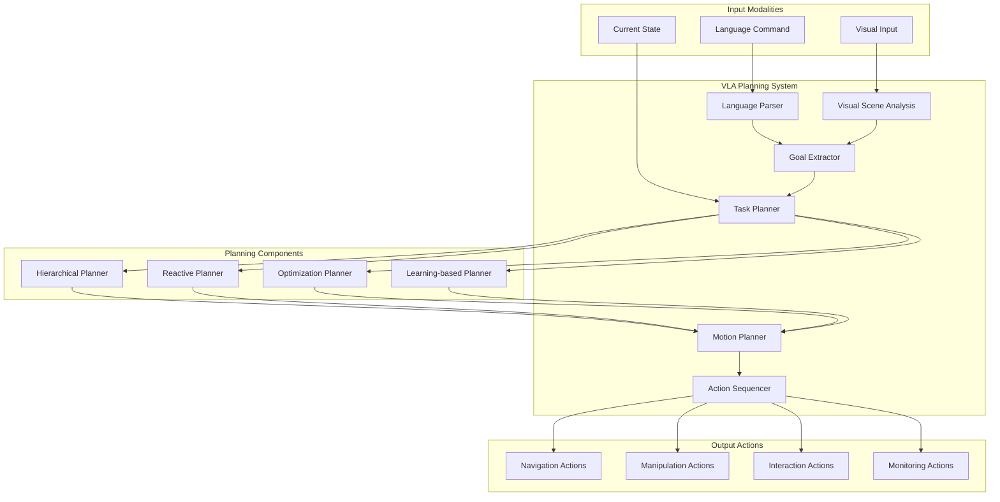
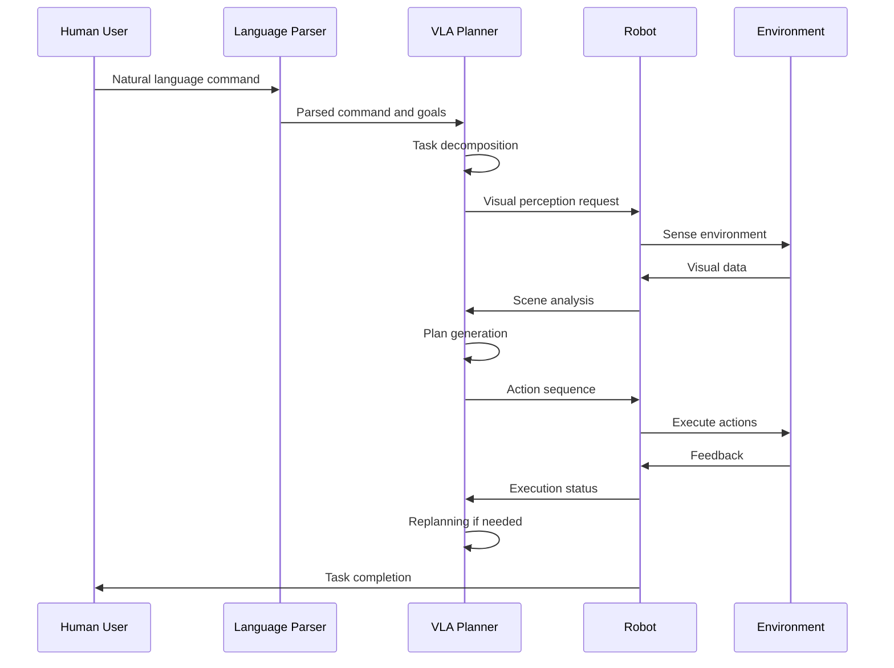

# VLA Planning Algorithms

## Learning Objectives

By the end of this chapter, you will be able to:
- Understand how VLA models integrate with robotic planning systems
- Implement planning algorithms that incorporate vision and language inputs
- Design hierarchical planning approaches for complex VLA tasks
- Evaluate the effectiveness of different VLA planning strategies
- Optimize planning algorithms for real-time robotic applications
- Apply VLA planning to manipulation and navigation tasks

## Introduction

VLA (Vision-Language-Action) planning algorithms represent a sophisticated approach to robotic task planning that incorporates visual perception and natural language understanding into the planning process. Unlike traditional planning approaches that operate on symbolic representations, VLA planning algorithms work with raw sensory inputs and natural language commands to generate executable action sequences.

The integration of vision and language into planning enables robots to understand complex, high-level instructions and execute them in dynamic, real-world environments. This chapter explores various approaches to VLA planning, from hierarchical task networks to neural planning architectures.

## Core Concepts

### VLA Planning Architecture

VLA planning typically involves multiple levels:
- **Task Planning**: High-level task decomposition based on language commands
- **Motion Planning**: Path planning considering visual obstacles and goals
- **Action Sequencing**: Low-level action execution based on visual feedback
- **Replanning**: Dynamic adaptation to environmental changes

### Planning Approaches

- **Symbolic Planning**: Traditional approaches adapted for VLA contexts
- **Neural Planning**: End-to-end learning of planning policies
- **Hybrid Approaches**: Combining symbolic and neural methods
- **Reinforcement Learning**: Learning planning strategies through interaction

### Language-Guided Planning

- **Command Interpretation**: Converting natural language to planning goals
- **Semantic Understanding**: Extracting object properties and spatial relations
- **Temporal Reasoning**: Understanding sequential and temporal aspects of commands
- **Context Awareness**: Incorporating environmental context into planning

### Visual-Guided Planning

- **Scene Understanding**: Interpreting visual input for planning
- **Object Detection**: Identifying relevant objects for task execution
- **Spatial Reasoning**: Understanding spatial relationships between objects
- **Dynamic Adaptation**: Adjusting plans based on visual feedback

## Architecture Diagram



## Flow Diagram



## Code Example: VLA Planning Algorithm

Here's an example implementation of a VLA planning algorithm:

```python
import numpy as np
import torch
import torch.nn as nn
from typing import List, Dict, Tuple, Any, Optional
import heapq
from dataclasses import dataclass
from enum import Enum


class Action(Enum):
    """Robot actions for VLA planning"""
    MOVE_FORWARD = "move_forward"
    MOVE_BACKWARD = "move_backward"
    TURN_LEFT = "turn_left"
    TURN_RIGHT = "turn_right"
    GRASP = "grasp"
    RELEASE = "release"
    APPROACH_OBJECT = "approach_object"
    AVOID_OBSTACLE = "avoid_obstacle"


@dataclass
class PlanningState:
    """State representation for VLA planning"""
    position: np.ndarray  # Robot position [x, y, theta]
    objects: Dict[str, np.ndarray]  # Object positions {name: [x, y]}
    goal: Optional[str] = None  # Goal object or location
    language_command: str = ""  # Original command
    executed_actions: List[Action] = None

    def __post_init__(self):
        if self.executed_actions is None:
            self.executed_actions = []


@dataclass
class PlanStep:
    """Represents a step in the plan"""
    action: Action
    cost: float
    heuristic: float
    state: PlanningState

    def __lt__(self, other):
        return (self.cost + self.heuristic) < (other.cost + other.heuristic)


class LanguageParser:
    """
    Parses natural language commands into structured goals
    """
    def __init__(self):
        self.object_keywords = {
            'red', 'blue', 'green', 'cup', 'box', 'ball', 'table', 'chair'
        }
        self.action_keywords = {
            'pick', 'grasp', 'take', 'move', 'go', 'approach', 'place', 'put'
        }
        self.spatial_keywords = {
            'left', 'right', 'front', 'back', 'near', 'far', 'between', 'next_to'
        }

    def parse_command(self, command: str) -> Dict[str, Any]:
        """
        Parse natural language command into structured representation
        """
        command_lower = command.lower()
        tokens = command_lower.split()

        # Extract objects
        objects = [token for token in tokens if token in self.object_keywords]

        # Extract actions
        actions = [token for token in tokens if token in self.action_keywords]

        # Extract spatial relations
        spatial = [token for token in tokens if token in self.spatial_keywords]

        # Determine goal based on command
        goal = self._determine_goal(command_lower, objects, actions)

        return {
            'command': command,
            'objects': objects,
            'actions': actions,
            'spatial': spatial,
            'goal': goal,
            'raw_tokens': tokens
        }

    def _determine_goal(self, command: str, objects: List[str], actions: List[str]) -> str:
        """
        Determine the planning goal from the command
        """
        if 'pick' in actions or 'grasp' in actions or 'take' in actions:
            if objects:
                return f"grasp_{objects[0]}"
        elif 'move' in actions or 'go' in actions or 'approach' in actions:
            if objects:
                return f"approach_{objects[0]}"
        elif 'place' in actions or 'put' in actions:
            if objects:
                return f"place_{objects[0]}"

        return "navigate"


class VisualSceneAnalyzer:
    """
    Analyzes visual input to extract scene information
    """
    def __init__(self):
        # In a real implementation, this would use computer vision models
        pass

    def analyze_scene(self, visual_input: np.ndarray) -> Dict[str, np.ndarray]:
        """
        Analyze visual input to identify objects and their positions
        """
        # This is a simplified simulation
        # In practice, this would use object detection and pose estimation
        objects = {
            'red_cup': np.array([1.0, 0.5]),
            'blue_box': np.array([2.0, 1.0]),
            'green_ball': np.array([0.5, 1.5]),
            'table': np.array([1.5, 0.0])
        }
        return objects


class VLAPlanner:
    """
    VLA planning algorithm that integrates vision and language
    """
    def __init__(self, world_size: Tuple[float, float] = (5.0, 5.0)):
        self.world_size = world_size
        self.language_parser = LanguageParser()
        self.visual_analyzer = VisualSceneAnalyzer()
        self.grid_resolution = 0.1  # 10cm resolution

    def plan(self,
             initial_state: PlanningState,
             language_command: str,
             max_steps: int = 100) -> Optional[List[Action]]:
        """
        Plan a sequence of actions to achieve the goal specified by the language command
        """
        # Parse the language command
        parsed_command = self.language_parser.parse_command(language_command)

        # Update state with parsed information
        initial_state.language_command = language_command
        initial_state.goal = parsed_command['goal']

        # Use A* search for planning
        open_set = []
        closed_set = set()

        # Calculate initial heuristic
        initial_heuristic = self._calculate_heuristic(initial_state, parsed_command['goal'])

        initial_step = PlanStep(
            action=None,
            cost=0.0,
            heuristic=initial_heuristic,
            state=initial_state
        )

        heapq.heappush(open_set, initial_step)

        step_count = 0
        while open_set and step_count < max_steps:
            current_step = heapq.heappop(open_set)

            # Check if goal is reached
            if self._is_goal_reached(current_step.state, parsed_command['goal']):
                return self._reconstruct_plan(current_step)

            closed_set.add(self._state_key(current_step.state))

            # Generate possible next states
            for action in self._get_possible_actions(current_step.state):
                new_state = self._apply_action(current_step.state, action)
                state_key = self._state_key(new_state)

                if state_key in closed_set:
                    continue

                new_cost = current_step.cost + self._action_cost(action)
                new_heuristic = self._calculate_heuristic(new_state, parsed_command['goal'])

                new_step = PlanStep(
                    action=action,
                    cost=new_cost,
                    heuristic=new_heuristic,
                    state=new_state
                )

                heapq.heappush(open_set, new_step)

            step_count += 1

        return None  # No plan found

    def _get_possible_actions(self, state: PlanningState) -> List[Action]:
        """
        Get possible actions from the current state
        """
        # For now, return all possible actions
        # In practice, this would depend on the current context
        return [
            Action.MOVE_FORWARD,
            Action.MOVE_BACKWARD,
            Action.TURN_LEFT,
            Action.TURN_RIGHT,
            Action.GRASP,
            Action.RELEASE,
            Action.APPROACH_OBJECT,
            Action.AVOID_OBSTACLE
        ]

    def _apply_action(self, state: PlanningState, action: Action) -> PlanningState:
        """
        Apply an action to the current state to get a new state
        """
        new_state = PlanningState(
            position=state.position.copy(),
            objects={k: v.copy() for k, v in state.objects.items()},
            goal=state.goal,
            language_command=state.language_command,
            executed_actions=state.executed_actions + [action]
        )

        # Update position based on action
        if action == Action.MOVE_FORWARD:
            # Move forward 10cm
            new_state.position[0] += 0.1 * np.cos(new_state.position[2])
            new_state.position[1] += 0.1 * np.sin(new_state.position[2])
        elif action == Action.MOVE_BACKWARD:
            # Move backward 10cm
            new_state.position[0] -= 0.1 * np.cos(new_state.position[2])
            new_state.position[1] -= 0.1 * np.sin(new_state.position[2])
        elif action == Action.TURN_LEFT:
            # Turn left 15 degrees
            new_state.position[2] += np.radians(15)
        elif action == Action.TURN_RIGHT:
            # Turn right 15 degrees
            new_state.position[2] -= np.radians(15)
        elif action == Action.APPROACH_OBJECT:
            # Find the closest object and move toward it
            if state.goal and state.goal.startswith("approach_"):
                obj_name = state.goal.replace("approach_", "")
                if obj_name in new_state.objects:
                    obj_pos = new_state.objects[obj_name]
                    robot_pos = new_state.position[:2]

                    # Move halfway toward the object
                    direction = obj_pos - robot_pos
                    distance = np.linalg.norm(direction)
                    if distance > 0.1:  # If not already close
                        new_pos = robot_pos + 0.5 * direction * min(0.1, distance) / distance
                        new_state.position[0] = new_pos[0]
                        new_state.position[1] = new_pos[1]

        return new_state

    def _action_cost(self, action: Action) -> float:
        """
        Return the cost of performing an action
        """
        cost_map = {
            Action.MOVE_FORWARD: 1.0,
            Action.MOVE_BACKWARD: 1.2,  # Slightly more expensive
            Action.TURN_LEFT: 0.8,
            Action.TURN_RIGHT: 0.8,
            Action.GRASP: 2.0,
            Action.RELEASE: 1.5,
            Action.APPROACH_OBJECT: 1.0,
            Action.AVOID_OBSTACLE: 1.5
        }
        return cost_map.get(action, 1.0)

    def _calculate_heuristic(self, state: PlanningState, goal: str) -> float:
        """
        Calculate heuristic distance to goal
        """
        if not goal:
            return 0.0

        if goal.startswith("approach_") or goal.startswith("grasp_"):
            obj_name = goal.replace("approach_", "").replace("grasp_", "")
            if obj_name in state.objects:
                obj_pos = state.objects[obj_name]
                robot_pos = state.position[:2]
                distance = np.linalg.norm(obj_pos - robot_pos)
                return distance

        # Default heuristic
        return 1.0

    def _is_goal_reached(self, state: PlanningState, goal: str) -> bool:
        """
        Check if the goal has been reached
        """
        if not goal:
            return True

        if goal.startswith("approach_"):
            obj_name = goal.replace("approach_", "")
            if obj_name in state.objects:
                obj_pos = state.objects[obj_name]
                robot_pos = state.position[:2]
                distance = np.linalg.norm(obj_pos - robot_pos)
                return distance < 0.2  # Within 20cm

        elif goal.startswith("grasp_"):
            # This is simplified - in reality, grasping involves more complex conditions
            obj_name = goal.replace("grasp_", "")
            if obj_name in state.objects:
                obj_pos = state.objects[obj_name]
                robot_pos = state.position[:2]
                distance = np.linalg.norm(obj_pos - robot_pos)
                return distance < 0.1  # Within 10cm for grasping

        return False

    def _state_key(self, state: PlanningState) -> str:
        """
        Create a unique key for the state (for duplicate detection)
        """
        pos_str = f"{state.position[0]:.2f}_{state.position[1]:.2f}_{state.position[2]:.2f}"
        obj_str = "_".join([f"{name}_{pos[0]:.2f}_{pos[1]:.2f}" for name, pos in state.objects.items()])
        return f"{pos_str}_{obj_str}_{state.goal}"

    def _reconstruct_plan(self, final_step: PlanStep) -> List[Action]:
        """
        Reconstruct the plan from the final step
        """
        # For this simple implementation, we return the executed actions
        # In a real A* implementation, we would backtrack through parent pointers
        return [action for action in final_step.state.executed_actions if action is not None]


class HierarchicalVLAPlanner:
    """
    Hierarchical VLA planner that breaks down complex tasks
    """
    def __init__(self):
        self.low_level_planner = VLAPlanner()
        self.language_parser = LanguageParser()

    def plan_hierarchical(self,
                         initial_state: PlanningState,
                         language_command: str) -> Optional[List[Action]]:
        """
        Plan using hierarchical approach
        """
        # Parse the high-level command
        parsed = self.language_parser.parse_command(language_command)

        # Break down into subtasks
        subtasks = self._decompose_task(parsed, initial_state)

        # Plan each subtask
        full_plan = []
        current_state = initial_state

        for subtask in subtasks:
            subtask_plan = self.low_level_planner.plan(current_state, subtask)
            if subtask_plan is None:
                return None  # Failed to plan for subtask

            full_plan.extend(subtask_plan)

            # Update state with execution of subtask plan
            for action in subtask_plan:
                current_state = self.low_level_planner._apply_action(current_state, action)

        return full_plan

    def _decompose_task(self, parsed_command: Dict, state: PlanningState) -> List[str]:
        """
        Decompose a high-level command into subtasks
        """
        subtasks = []

        if 'grasp' in parsed_command['actions'] or 'pick' in parsed_command['actions']:
            # Need to approach object first, then grasp
            if parsed_command['objects']:
                obj = parsed_command['objects'][0]
                subtasks.append(f"approach {obj}")
                subtasks.append(f"grasp {obj}")

        elif 'move' in parsed_command['actions'] or 'go' in parsed_command['actions']:
            # Direct navigation
            if parsed_command['objects']:
                obj = parsed_command['objects'][0]
                subtasks.append(f"approach {obj}")

        else:
            # Default: try to interpret as navigation
            subtasks.append(parsed_command['command'])

        return subtasks


def main():
    """
    Example usage of VLA planning
    """
    print("VLA Planning Example")

    # Initialize planner
    planner = VLAPlanner()

    # Create initial state
    initial_state = PlanningState(
        position=np.array([0.0, 0.0, 0.0]),  # x, y, theta
        objects={
            'red_cup': np.array([1.0, 0.5]),
            'blue_box': np.array([2.0, 1.0]),
            'green_ball': np.array([0.5, 1.5]),
            'table': np.array([1.5, 0.0])
        }
    )

    # Example command
    command = "approach the red cup"

    print(f"Planning for command: '{command}'")

    # Plan using VLA planner
    plan = planner.plan(initial_state, command)

    if plan:
        print(f"Plan found with {len(plan)} actions:")
        for i, action in enumerate(plan):
            print(f"  {i+1}. {action.value}")
    else:
        print("No plan found")

    # Example with hierarchical planner
    print("\nUsing hierarchical planner:")
    hplanner = HierarchicalVLAPlanner()
    hplan = hplanner.plan_hierarchical(initial_state, "pick up the red cup")

    if hplan:
        print(f"Hierarchical plan found with {len(hplan)} actions:")
        for i, action in enumerate(hplan):
            print(f"  {i+1}. {action.value}")
    else:
        print("No hierarchical plan found")


if __name__ == "__main__":
    main()
```

## Advanced VLA Planning with Neural Networks

Here's an example of a neural network-based VLA planning approach:

```python
import torch
import torch.nn as nn
import torch.nn.functional as F
import numpy as np
from typing import List, Tuple


class VLAPlanningNetwork(nn.Module):
    """
    Neural network for VLA planning
    """
    def __init__(self,
                 vision_dim: int = 512,
                 language_dim: int = 512,
                 state_dim: int = 10,
                 action_dim: int = 8,
                 hidden_dim: int = 256):
        super().__init__()

        self.vision_dim = vision_dim
        self.language_dim = language_dim
        self.state_dim = state_dim
        self.action_dim = action_dim
        self.hidden_dim = hidden_dim

        # Vision encoder (simplified)
        self.vision_encoder = nn.Sequential(
            nn.Linear(vision_dim, hidden_dim),
            nn.ReLU(),
            nn.Linear(hidden_dim, hidden_dim),
            nn.ReLU()
        )

        # Language encoder (simplified)
        self.language_encoder = nn.Sequential(
            nn.Linear(language_dim, hidden_dim),
            nn.ReLU(),
            nn.Linear(hidden_dim, hidden_dim),
            nn.ReLU()
        )

        # State encoder
        self.state_encoder = nn.Sequential(
            nn.Linear(state_dim, hidden_dim),
            nn.ReLU(),
            nn.Linear(hidden_dim, hidden_dim),
            nn.ReLU()
        )

        # Multimodal fusion
        self.fusion = nn.Sequential(
            nn.Linear(hidden_dim * 3, hidden_dim * 2),  # vision + language + state
            nn.ReLU(),
            nn.Linear(hidden_dim * 2, hidden_dim),
            nn.ReLU()
        )

        # Policy network for action selection
        self.policy = nn.Sequential(
            nn.Linear(hidden_dim, hidden_dim),
            nn.ReLU(),
            nn.Dropout(0.1),
            nn.Linear(hidden_dim, hidden_dim // 2),
            nn.ReLU(),
            nn.Linear(hidden_dim // 2, action_dim)
        )

        # Value network for planning
        self.value = nn.Sequential(
            nn.Linear(hidden_dim, hidden_dim),
            nn.ReLU(),
            nn.Linear(hidden_dim, 1)
        )

    def forward(self,
                vision_features: torch.Tensor,
                language_features: torch.Tensor,
                state_features: torch.Tensor) -> Tuple[torch.Tensor, torch.Tensor]:
        """
        Forward pass of the VLA planning network
        """
        # Encode each modality
        vision_out = self.vision_encoder(vision_features)
        language_out = self.language_encoder(language_features)
        state_out = self.state_encoder(state_features)

        # Fuse modalities
        fused = torch.cat([vision_out, language_out, state_out], dim=-1)
        fused = self.fusion(fused)

        # Get action logits and value
        action_logits = self.policy(fused)
        value = self.value(fused)

        return action_logits, value

    def plan_step(self,
                  vision_features: torch.Tensor,
                  language_features: torch.Tensor,
                  state_features: torch.Tensor,
                  temperature: float = 1.0) -> Tuple[torch.Tensor, torch.Tensor]:
        """
        Plan a single step
        """
        action_logits, value = self.forward(vision_features, language_features, state_features)

        # Apply temperature scaling
        action_probs = F.softmax(action_logits / temperature, dim=-1)

        # Sample action
        action_dist = torch.distributions.Categorical(action_probs)
        action = action_dist.sample()

        return action, value


class NeuralVLAPlanner:
    """
    Neural network-based VLA planner
    """
    def __init__(self, model_path: str = None):
        self.model = VLAPlanningNetwork()

        if model_path:
            # Load pre-trained model
            self.model.load_state_dict(torch.load(model_path))

        self.optimizer = torch.optim.Adam(self.model.parameters(), lr=1e-4)
        self.device = torch.device('cuda' if torch.cuda.is_available() else 'cpu')
        self.model.to(self.device)

    def plan_with_learning(self,
                          initial_state_features: torch.Tensor,
                          language_features: torch.Tensor,
                          vision_features: torch.Tensor,
                          max_steps: int = 20) -> List[int]:
        """
        Plan using the neural network with potential learning
        """
        plan = []
        current_state = initial_state_features.clone()

        for step in range(max_steps):
            # Get action and value
            action, value = self.model.plan_step(
                vision_features.unsqueeze(0),  # Add batch dimension
                language_features.unsqueeze(0),
                current_state.unsqueeze(0)
            )

            action_idx = action.item()
            plan.append(action_idx)

            # In a real implementation, you would update the state based on the action
            # For this example, we'll just continue with the same state
            # current_state = self._update_state(current_state, action_idx)

            # Check if goal is reached (simplified)
            if action_idx == 7:  # Assuming action 7 is "done"
                break

        return plan

    def train_step(self,
                   vision_batch: torch.Tensor,
                   language_batch: torch.Tensor,
                   state_batch: torch.Tensor,
                   action_batch: torch.Tensor,
                   target_values: torch.Tensor) -> float:
        """
        Train the model on a batch of data
        """
        self.model.train()
        self.optimizer.zero_grad()

        action_logits, values = self.model(vision_batch, language_batch, state_batch)

        # Compute loss: policy loss + value loss
        policy_loss = F.cross_entropy(action_logits, action_batch)
        value_loss = F.mse_loss(values.squeeze(), target_values)
        total_loss = policy_loss + 0.5 * value_loss

        total_loss.backward()
        self.optimizer.step()

        return total_loss.item()


def create_synthetic_dataset(num_samples: int = 1000) -> Tuple[torch.Tensor, ...]:
    """
    Create a synthetic dataset for training VLA planning networks
    """
    vision_dim, language_dim, state_dim, action_dim = 512, 512, 10, 8

    vision_features = torch.randn(num_samples, vision_dim)
    language_features = torch.randn(num_samples, language_dim)
    state_features = torch.randn(num_samples, state_dim)
    actions = torch.randint(0, action_dim, (num_samples,))
    values = torch.randn(num_samples)  # Target values for training

    return vision_features, language_features, state_features, actions, values


def train_neural_vla_planner():
    """
    Example training loop for neural VLA planner
    """
    # Create dataset
    vision_data, language_data, state_data, actions, values = create_synthetic_dataset(1000)

    # Initialize planner
    planner = NeuralVLAPlanner()

    # Training loop
    batch_size = 32
    num_epochs = 10

    for epoch in range(num_epochs):
        epoch_loss = 0
        num_batches = len(vision_data) // batch_size

        for i in range(num_batches):
            start_idx = i * batch_size
            end_idx = start_idx + batch_size

            batch_vision = vision_data[start_idx:end_idx].to(planner.device)
            batch_language = language_data[start_idx:end_idx].to(planner.device)
            batch_state = state_data[start_idx:end_idx].to(planner.device)
            batch_actions = actions[start_idx:end_idx].to(planner.device)
            batch_values = values[start_idx:end_idx].to(planner.device)

            loss = planner.train_step(
                batch_vision, batch_language, batch_state,
                batch_actions, batch_values
            )

            epoch_loss += loss

        avg_loss = epoch_loss / num_batches
        print(f"Epoch {epoch+1}/{num_epochs}, Average Loss: {avg_loss:.4f}")

    return planner


def main_neural():
    """
    Example usage of neural VLA planning
    """
    print("Neural VLA Planning Example")

    # Initialize planner
    planner = NeuralVLAPlanner()

    # Example planning
    vision_features = torch.randn(512).to(planner.device)
    language_features = torch.randn(512).to(planner.device)
    state_features = torch.randn(10).to(planner.device)

    plan = planner.plan_with_learning(
        state_features, language_features, vision_features
    )

    print(f"Neural plan: {plan}")

    # Example training (uncomment to run)
    # trained_planner = train_neural_vla_planner()
    # print("Training completed")


if __name__ == "__main__":
    main_neural()
```

## Step-by-Step Practical Tutorial

### Implementing VLA Planning Algorithms

1. **Install required dependencies**:
   ```bash
   pip3 install torch torchvision transformers numpy matplotlib
   ```

2. **Create a VLA planning package**:
   ```bash
   cd ~/ros2_ws/src
   ros2 pkg create --build-type ament_python vla_planning_examples --dependencies rclpy std_msgs sensor_msgs geometry_msgs
   ```

3. **Navigate to the package directory**:
   ```bash
   cd vla_planning_examples
   ```

4. **Create the main module directory**:
   ```bash
   mkdir vla_planning_examples
   touch vla_planning_examples/__init__.py
   ```

5. **Create the VLA planning implementation** (`vla_planning_examples/vla_planning.py`):
   ```python
   # Use the VLA planning algorithm code examples above
   ```

6. **Create a ROS2 node for VLA planning** (`vla_planning_examples/vla_planning_node.py`):
   ```python
   import rclpy
   from rclpy.node import Node
   from sensor_msgs.msg import Image
   from std_msgs.msg import String
   from geometry_msgs.msg import Twist, Pose
   from nav_msgs.msg import Odometry
   from cv_bridge import CvBridge
   import numpy as np
   import torch
   from typing import Optional


   class VLAPLanningNode(Node):
       """
       ROS2 node for VLA planning
       """
       def __init__(self):
           super().__init__('vla_planning_node')

           # Initialize CV bridge
           self.bridge = CvBridge()

           # Initialize planning components
           self.current_pose = np.array([0.0, 0.0, 0.0])  # x, y, theta
           self.object_positions = {}
           self.current_command = ""
           self.plan = []
           self.plan_index = 0

           # Initialize planners
           self.symbolic_planner = None  # Will be initialized
           self.neural_planner = None    # Will be initialized

           self.get_logger().info('VLA Planning Node initialized')

           # Create subscribers
           self.image_sub = self.create_subscription(
               Image, '/camera/image_raw', self.image_callback, 10)
           self.odom_sub = self.create_subscription(
               Odometry, '/odom', self.odom_callback, 10)
           self.command_sub = self.create_subscription(
               String, '/vla/command', self.command_callback, 10)

           # Create publishers
           self.action_pub = self.create_publisher(
               Twist, '/cmd_vel', 10)
           self.status_pub = self.create_publisher(
               String, '/vla_planning/status', 10)

           # Planning timer
           self.plan_timer = self.create_timer(0.1, self.execute_plan)

       def image_callback(self, msg):
           """
           Handle incoming images for scene analysis
           """
           try:
               # Convert ROS image to OpenCV
               cv_image = self.bridge.imgmsg_to_cv2(msg, desired_encoding='bgr8')
               self.get_logger().debug(f'Received image for analysis: {cv_image.shape}')

               # In a real implementation, analyze the scene
               # self.analyze_scene(cv_image)

           except Exception as e:
               self.get_logger().error(f'Error processing image: {e}')

       def odom_callback(self, msg):
           """
           Handle odometry updates
           """
           try:
               self.current_pose[0] = msg.pose.pose.position.x
               self.current_pose[1] = msg.pose.pose.position.y

               # Convert quaternion to euler for theta
               from tf_transformations import euler_from_quaternion
               orientation = msg.pose.pose.orientation
               _, _, self.current_pose[2] = euler_from_quaternion([
                   orientation.x, orientation.y, orientation.z, orientation.w
               ])

           except Exception as e:
               self.get_logger().error(f'Error processing odometry: {e}')

       def command_callback(self, msg):
           """
           Handle natural language commands and plan accordingly
           """
           try:
               command = msg.data
               self.get_logger().info(f'Received command: {command}')
               self.current_command = command

               # Plan based on command
               self.plan = self._plan_for_command(command)

               # Reset plan index
               self.plan_index = 0

               if self.plan:
                   self.get_logger().info(f'Generated plan with {len(self.plan)} steps')
                   status_msg = String()
                   status_msg.data = f'Planned {len(self.plan)} steps for: {command}'
                   self.status_pub.publish(status_msg)
               else:
                   self.get_logger().warn('No plan generated for command')

           except Exception as e:
               self.get_logger().error(f'Error processing command: {e}')

       def _plan_for_command(self, command: str) -> list:
           """
           Plan actions for the given command
           """
           # This is a simplified example
           # In a real implementation, you would use the VLA planning algorithms
           if 'approach' in command.lower() or 'go to' in command.lower():
               return [Twist() for _ in range(10)]  # Placeholder actions
           elif 'pick' in command.lower() or 'grasp' in command.lower():
               return [Twist() for _ in range(15)]  # Placeholder actions
           else:
               return [Twist() for _ in range(5)]   # Default plan

       def execute_plan(self):
           """
           Execute the current plan step by step
           """
           if not self.plan or self.plan_index >= len(self.plan):
               return

           # Get current action from plan
           current_action = self.plan[self.plan_index]

           # Publish action
           self.action_pub.publish(current_action)

           # Check if action is complete (simplified)
           self.plan_index += 1

           if self.plan_index >= len(self.plan):
               self.get_logger().info('Plan completed')
               status_msg = String()
               status_msg.data = 'Plan completed'
               self.status_pub.publish(status_msg)

       def destroy_node(self):
           """
           Clean up resources when node is destroyed
           """
           self.get_logger().info('Cleaning up VLA Planning Node')
           super().destroy_node()


   def main(args=None):
       rclpy.init(args=args)
       vla_planning_node = VLAPLanningNode()

       try:
           rclpy.spin(vla_planning_node)
       except KeyboardInterrupt:
           pass
       finally:
           vla_planning_node.destroy_node()
           rclpy.shutdown()


   if __name__ == '__main__':
       main()
   ```

7. **Create launch directory**:
   ```bash
   mkdir launch
   ```

8. **Create a launch file** (`launch/vla_planning_example.launch.py`):
   ```python
   from launch import LaunchDescription
   from launch.actions import DeclareLaunchArgument
   from launch.substitutions import LaunchConfiguration
   from launch_ros.actions import Node
   from ament_index_python.packages import get_package_share_directory
   import os


   def generate_launch_description():
       # Declare launch arguments
       use_sim_time = LaunchConfiguration('use_sim_time', default='false')

       return LaunchDescription([
           # Declare launch arguments
           DeclareLaunchArgument(
               'use_sim_time',
               default_value='false',
               description='Use simulation time if true'),

           # VLA planning node
           Node(
               package='vla_planning_examples',
               executable='vla_planning_examples.vla_planning_node',
               name='vla_planning_node',
               parameters=[{'use_sim_time': use_sim_time}],
               output='screen'
           )
       ])
   ```

9. **Update setup.py**:
   ```python
   from setuptools import setup
   import os
   from glob import glob

   package_name = 'vla_planning_examples'

   setup(
       name=package_name,
       version='0.0.0',
       packages=[package_name],
       data_files=[
           ('share/ament_index/resource_index/packages',
               ['resource/' + package_name]),
           ('share/' + package_name, ['package.xml']),
           (os.path.join('share', package_name, 'launch'), glob('launch/*.py')),
       ],
       install_requires=['setuptools'],
       zip_safe=True,
       maintainer='User',
       maintainer_email='user@example.com',
       description='VLA planning examples for robotics',
       license='Apache-2.0',
       tests_require=['pytest'],
       entry_points={
           'console_scripts': [
               'vla_planning_node = vla_planning_examples.vla_planning_node:main',
           ],
       },
   )
   ```

10. **Build the package**:
    ```bash
    cd ~/ros2_ws
    colcon build --packages-select vla_planning_examples
    ```

11. **Source the workspace**:
    ```bash
    source install/setup.bash
    ```

12. **Run the VLA planning example**:
    ```bash
    ros2 launch vla_planning_examples vla_planning_example.launch.py
    ```

13. **Test with sample commands**:
    ```bash
    # In another terminal
    ros2 topic pub /vla/command std_msgs/String "data: 'Approach the red cup'"
    ```

## Summary

This chapter covered VLA (Vision-Language-Action) planning algorithms, which integrate visual perception and natural language understanding into robotic planning systems. We explored both symbolic and neural approaches to VLA planning, implementation techniques, and practical applications.

VLA planning enables robots to understand complex, high-level instructions and execute them in dynamic environments by combining multiple sensory modalities with sophisticated planning algorithms. The integration of vision and language into planning represents a significant advancement in robotic autonomy.

## Mini-Quiz

1. What are the main components of VLA planning?
   - A) Vision and Language only
   - B) Vision, Language, and Action planning components
   - C) Perception and Control only
   - D) Navigation and Manipulation only

2. Which planning approach combines symbolic and neural methods?
   - A) Pure neural planning
   - B) Pure symbolic planning
   - C) Hybrid approaches
   - D) Rule-based planning

3. What is the purpose of hierarchical VLA planning?
   - A) To reduce computational requirements
   - B) To break down complex tasks into manageable subtasks
   - C) To increase planning speed only
   - D) To reduce sensor requirements

4. In neural VLA planning, what does the value network estimate?
   - A) Action probabilities only
   - B) The expected return or value of a state
   - C) Object positions
   - D) Language embeddings

5. What type of reasoning is important for language-guided planning?
   - A) Spatial reasoning only
   - B) Temporal reasoning only
   - C) Both spatial and temporal reasoning
   - D) Geometric reasoning only

**Answers**: 1-B, 2-C, 3-B, 4-B, 5-C